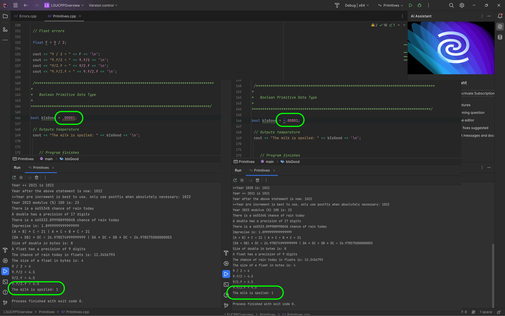
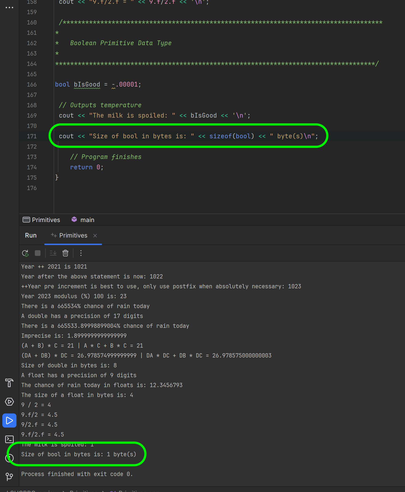
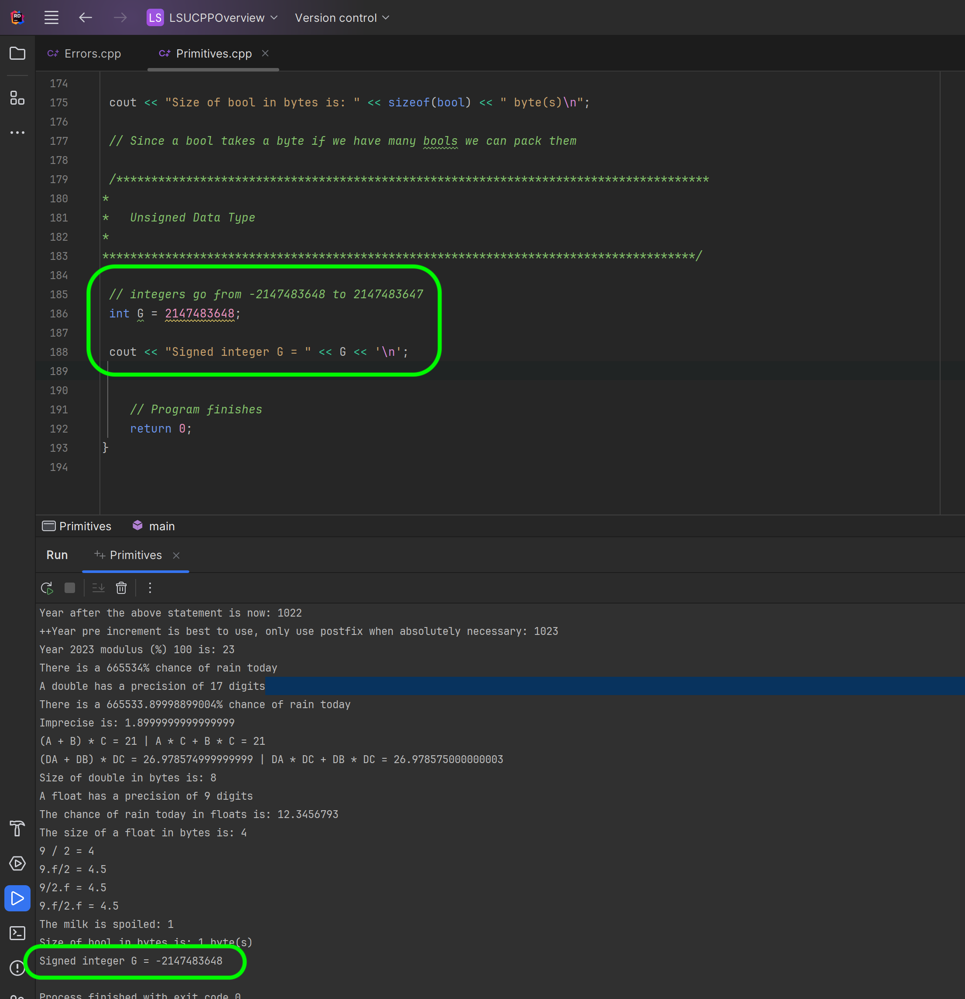
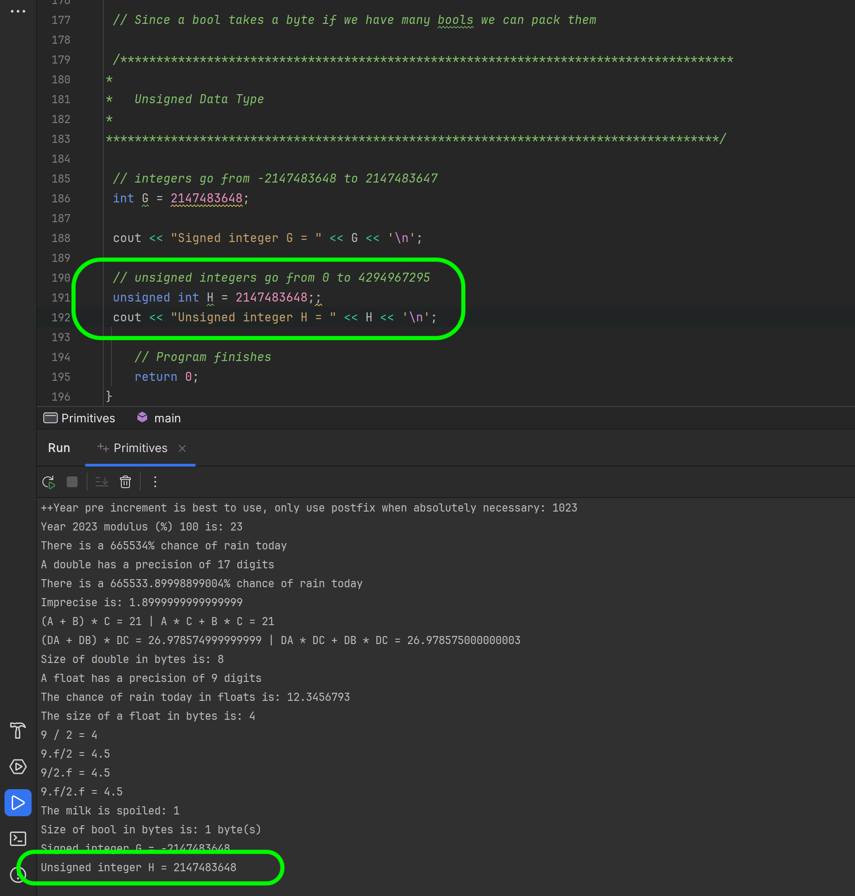

### Primitive Data Types - Bools and Unsigned Ints

[previous](../fractions/README.md#user-content-primitive-data-types---fractions) • [home](../README.md#user-content-ue5-cpp-overview) • [next](../)

Now lets look at the data type called [bool](https://www.geeksforgeeks.org/c-data-types/). 
> Boolean: Boolean data type is used for storing boolean or logical values. A boolean variable can store either true or false. Keyword used for boolean data type is bool.- [geeksforgeeks.org](https://www.geeksforgeeks.org/c-data-types/)

Now we can use the literal value `true` and `false` and a single bit is needed so we have `0` for `false` and `1` for true (or any non 0 value). 

The Unreal 4 coding standards say:
> Boolean variables must be prefixed by b (for example, bPendingDestruction, or bHasFadedIn).  - [Unreal Manual](https://docs.unrealengine.com/en-us/Programming/Development/CodingStandard)

Note, that even if a boolean is a single bit the smallest amount of memory we can access is a byte.  So a bool takes a byte which wastes 7 bits.  There are ways of masking other types to be more efficient and we will show you that in Unreal later.

In C++, the unsigned int data type is used to represent whole numbers (integers) that can only be positive or zero. The "unsigned" part means that it doesn't include negative values.

Imagine you have a variable of type `unsigned int`. This variable can hold non-negative whole numbers, including zero. It cannot store negative numbers.

For example, if you declare an `unsigned int` variable called `X` and assign it a value of `-5`, it means that X can only store positive whole numbers or zero. You can perform various arithmetic operations on x, such as addition, subtraction, multiplication, and division, just like you would with regular integers.

One key advantage of using unsigned int is that it allows you to represent larger positive numbers than a regular int data type. The unsigned int uses the same amount of memory as a regular int but can store larger values because it doesn't need to allocate space for negative numbers.

However, it's important to note that using unsigned int also has some limitations. Since it doesn't support negative numbers, operations like subtracting a larger number from a smaller number may result in unexpected behavior. In addition, division between two unsigned int values may truncate the decimal part, as it produces an integer result.

|Type|Typical Bit Width|Typical Range|
|:----|:----|:----|
|unsigned int|4bytes|0 to 4294967295|
|signed int|4bytes|-2147483648 to 2147483647|

 

---

##### `Step 1.`\|`CPPOVR`|:small_blue_diamond:

Add a comment for a bool section.  Add an appropriate title for this section. Then use the literal `true` to set the bool variable `bIsGood`.  Now when you output it to the stream it will not use the **string** `true` but will instead represent `true` with the **integer** `1`.

##### `Step 2.`\|`CPPOVR`|:small_blue_diamond: :small_blue_diamond: 

Now switch the value to `false` to represent the only other state of a boolean.  Notice that it outputs it to the console as **int** `0`.

##### `Step 3.`\|`CPPOVR`|:small_blue_diamond: :small_blue_diamond: :small_blue_diamond:

Now going from any numeric typ to **bool** any non zero value will resolve to `true` or `1` even negative numbers.  Try it and see fo for yourself.

##### `Step 4.`\|`CPPOVR`|:small_blue_diamond: :small_blue_diamond: :small_blue_diamond: :small_blue_diamond:

Even though a **bool** is only one bit (true or false), it takes an entire 8 bits or 1 byte of memory.  This is the smallest amount of memory you can access.

##### `Step 5.`\|`CPPOVR`| :small_orange_diamond:

|Type|Typical Bit Width|Typical Range|
|:----|:----|:----|
|unsigned int|4bytes|0 to 4294967295|
|signed int|4bytes|-2147483648 to 2147483647|

An unsigned integer doubles the range of positive numbers it can hold.  Lets prove it by putting in the maximum positive range for an unsigned integer into a signed int.  In this case we get a result we may not expect (it has wrapped around).

##### `Step 6.`\|`CPPOVR`| :small_orange_diamond: :small_blue_diamond:

Now when you assign `4294967295` to an **unsigned int** we get the result we expect.

##### `Step 7.`\|`CPPOVR`| :small_orange_diamond: :small_blue_diamond: :small_blue_diamond:

We have to be very careful that when using any data type that we don't go beyond the range.  If we add 1 to the largest number of an integer it wraps back to `0`.  This could cause major logic issues or even crash (divide by zero) - so you are cautioned.

<!--  -->

| [previous](../fractions/README.md#user-content-primitive-data-types---fractions)| [home](../README.md#user-content-ue5-cpp-overview) | [next](../)|
|---|---|---|
