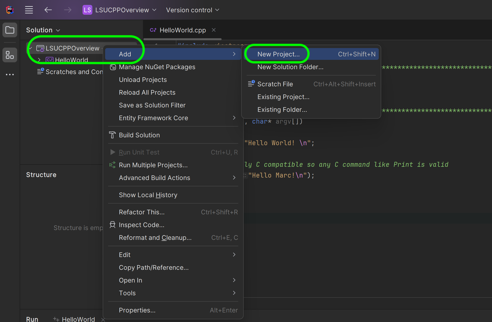
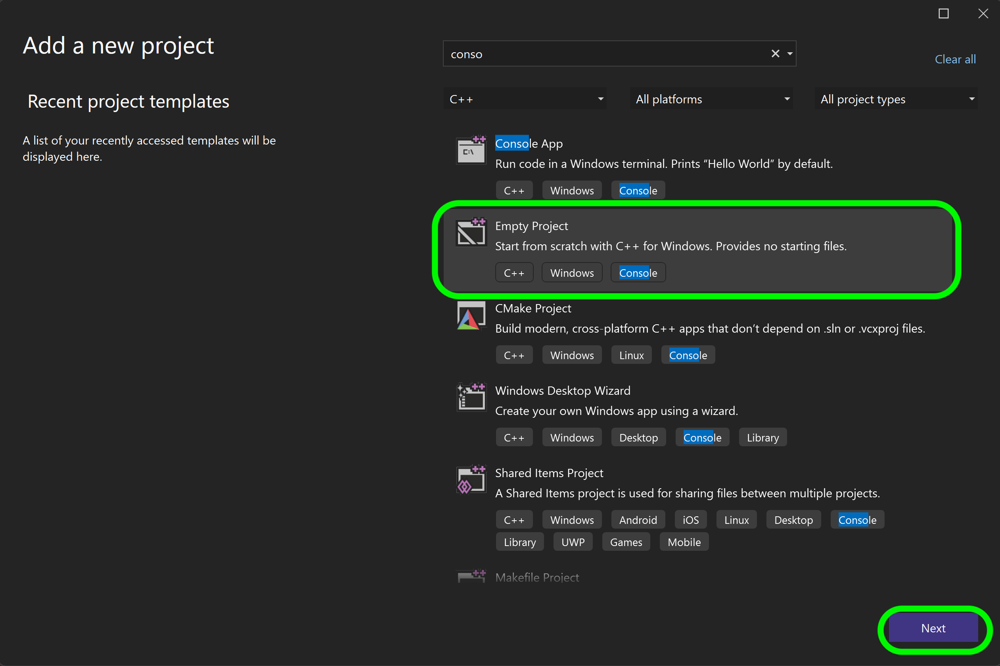
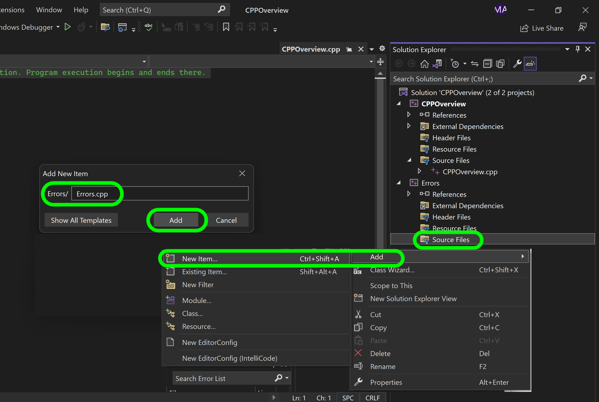
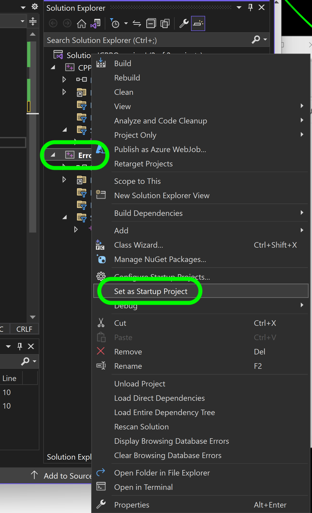
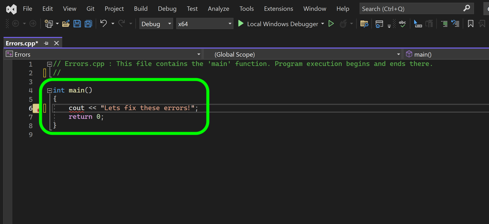
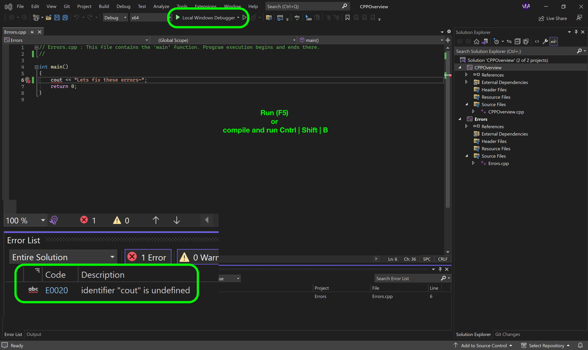
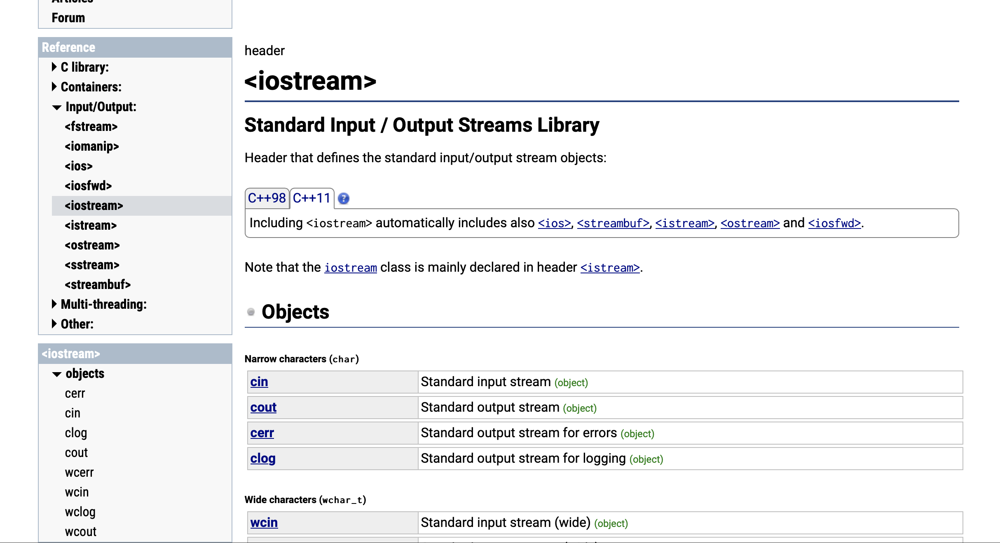
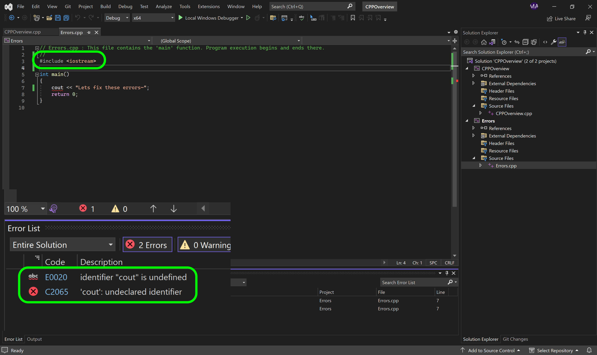
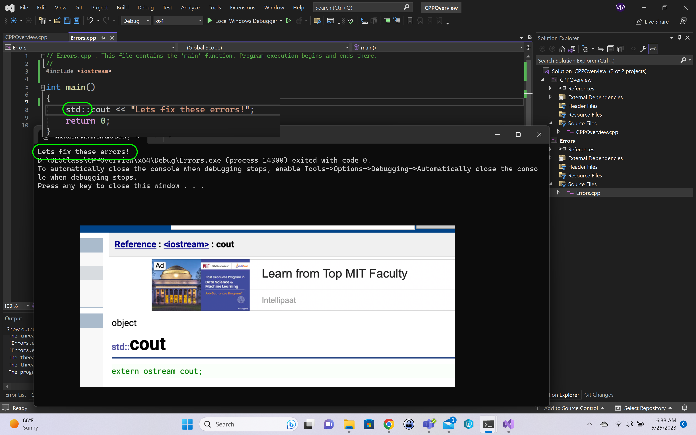
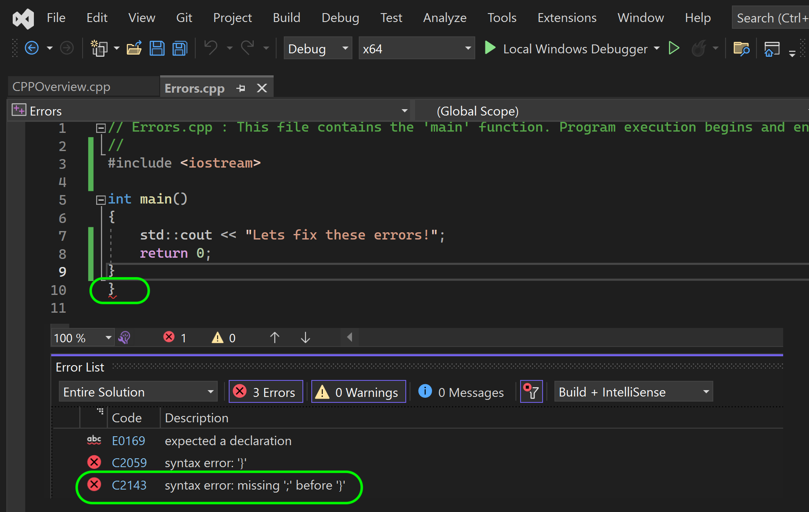

### Errors

[previous](../hello-world/README.md#user-content-hello-world) • [home](../README.md#user-content-ue5-cpp-overview) • [next](../)

Lets look at th emost common type of error.  When we mistype anything, it will usually create a syntax error and the program will not compile - thus not run. A syntax error is a grammatical error in the code that prevents the program from running. It mostly occurs when there is a mistake in the syntax such as missing a semicolon, using an incorrect keyword, or adding an extra closing bracket. These errors can be easily detected by the compiler and are shown as error messages that indicate the line of code that has the syntax error.

 

---

##### `Step 1.`\|`CPPOVR`|:small_blue_diamond:

A visual studio solution can contain more than one project (a program with a main function). Lets create a new project by right clicking on the solution and select **Add | New Project...**.

##### `Step 2.`\|`CPPOVR`|:small_blue_diamond: :small_blue_diamond: 

This time lets start the program from scratch, select a **C++ Empty Project**.  Press the <kbd>Next</kbd> button.

##### `Step 3.`\|`CPPOVR`|:small_blue_diamond: :small_blue_diamond: :small_blue_diamond:

Right click on the **Source** folder in the new **Errors** project and select **Add | New Item...**.  Call the new file `Errors.cpp`.  Press the <kbd>Add</kbd> button.

##### `Step 4.`\|`CPPOVR`|:small_blue_diamond: :small_blue_diamond: :small_blue_diamond: :small_blue_diamond:

Now right click on the **Errors** project and selet **Set as Startup Project**.  Otherwise the previous project's main function will continue to run.

##### `Step 5.`\|`CPPOVR`| :small_orange_diamond:
To have a working project we need a `main() { //code here }` function.  We will add a `cout` object to stream text to the console. In Unreal we will mostly be using c style printing like we did in the last page.  But lets go back to printing with `cout`. 

##### `Step 6.`\|`CPPOVR`| :small_orange_diamond: :small_blue_diamond:

Now we are getting the most basic type of error a syntax error.  The compiler cannot find the function **cout**.  It says "cout" is undefined.  WHy is this?

##### `Step 7.`\|`CPPOVR`| :small_orange_diamond: :small_blue_diamond: :small_blue_diamond:

Outside of the core language C++ doesn't natively come with a lot of functionality (like printing to console, graphics, playing audio etc...).  Everything must come from other code we create or import into the project.

In c++ when we `#include LIBRARYNAME` a library we inherit all of its objects associated with it.

Lets look at the [iostream](https://cplusplus.com/reference/iostream/) library that includes 4 other libraries and gets us access to an **Object** called **cout** (standard output). We will be getting into objects later on. But we can call the **Object** `cout` and pipe it into an output stream.

##### `Step 8.`\|`CPPOVR`| :small_orange_diamond: :small_blue_diamond: :small_blue_diamond: :small_blue_diamond:

Now we need to add an include to the top of the CPP (we don't use semi-colons at the end of those lines as they are NOT statements)

`#include <iostream>`

It will now inherit all of the objects that this library extendst to us. Now try compiling and running and you get more errors.  It says you have an "undeclared identifier".  

##### `Step 9.`\|`CPPOVR`| :small_orange_diamond: :small_blue_diamond: :small_blue_diamond: :small_blue_diamond: :small_blue_diamond:

Now when you are including other files it is good practice that their names are all in a given namespace.  This means that we can still create an object using `cout`, it will be within the context of this project.  

Most objects written to support the libraries are in the STL (Standard Template Libraries) and use the `std::` namespace.  So put this in front of `cout` and see if it compiles and runs.  In my case it does!

Now we see the message printing correctly to the console. 

##### `Step 10.`\|`CPPOVR`| :large_blue_diamond:

 Notice that we end the line with a `;` semicolon. Every line is a **statement** and has to be terminated by a semicolon. The compiler needs to know where one statement ends and the next begins.  Now the `<<` operator inserts the data that follows it into an [output stream](http://www.cplusplus.com/doc/tutorial/basic_io/) (which in our case will be the console displayed on the monitor).

##### `Step 11.`\|`CPPOVR`| :large_blue_diamond: :small_blue_diamond: 

If we remove the semi-colon and try and run the program the compiler will give us an error when we press run (when we run it, the program is compiled and it tries to run it).  Try this and read the error.  Sometimes the error messages are clear and sometimes they are hard to read and understand. This is a compiler error.  In a script any spelling mistake or typing error will result in a program error of some sort. Now it is underlying the `return 0` statement but the problem is above.  The message does not always accurately describe the error - just to the point where the compiler can't interpret the code due to a grammatical error.

##### `Step 12.`\|`CPPOVR`| :large_blue_diamond: :small_blue_diamond: :small_blue_diamond: 

If you add an extra closing bracket at the end and you compile - you will see that it says you are missing a `;` which is incorrect.  Be careful to this about the problem and don't apply the solution suggested by the compiler without thinking.  In this case every `{}` bracket needs to have a starting and closing bracket.  We need the same number of `{` as we have of `}`. 

<!--  -->

| [previous](../hello-world/README.md#user-content-hello-world)| [home](../README.md#user-content-ue5-cpp-overview) | [next](../)|
|---|---|---|
