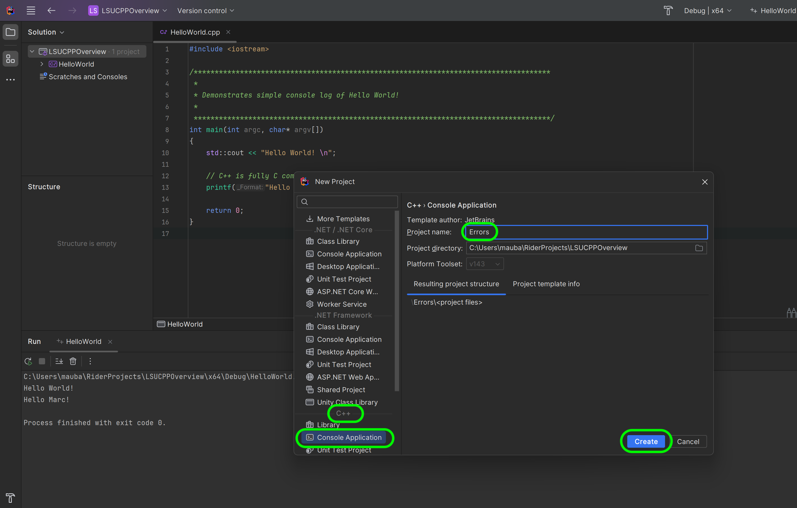
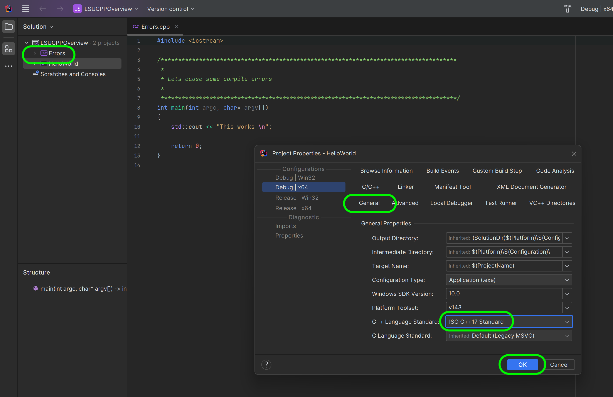
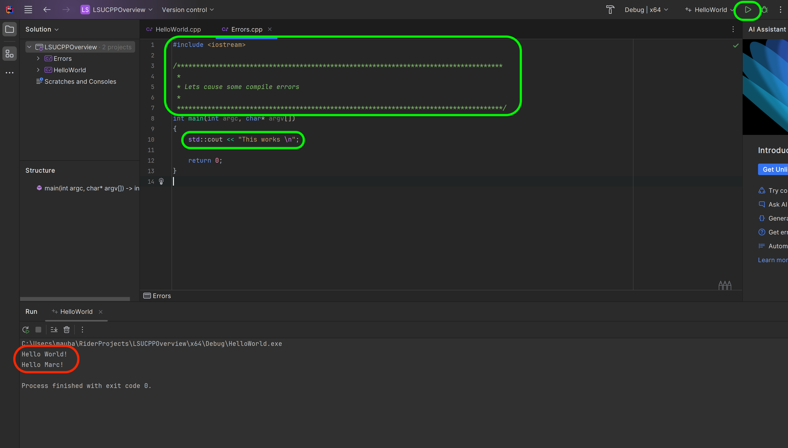
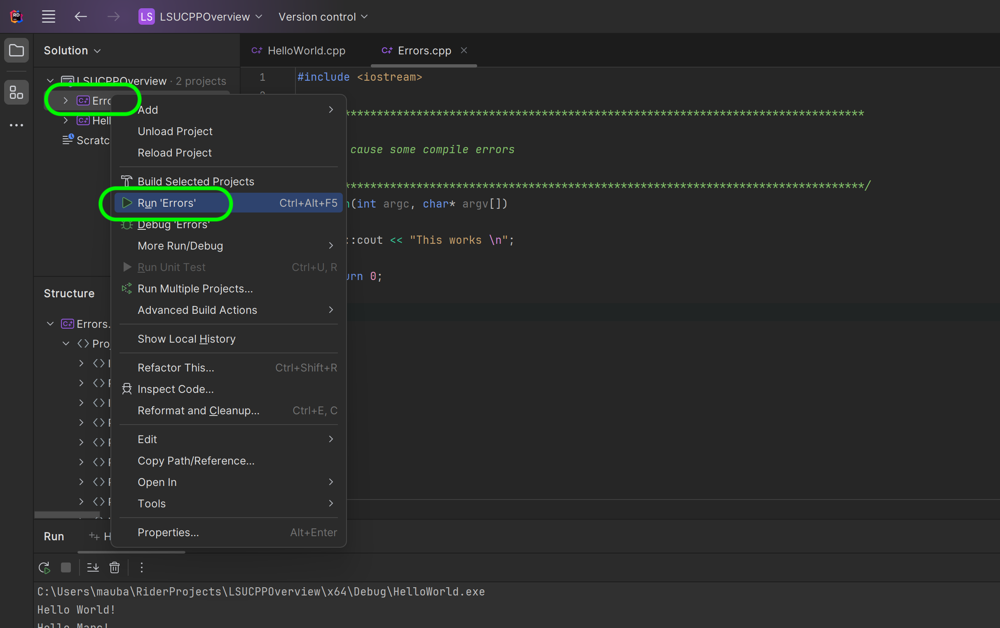
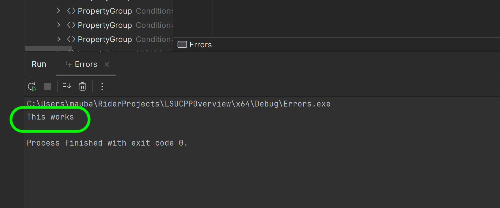
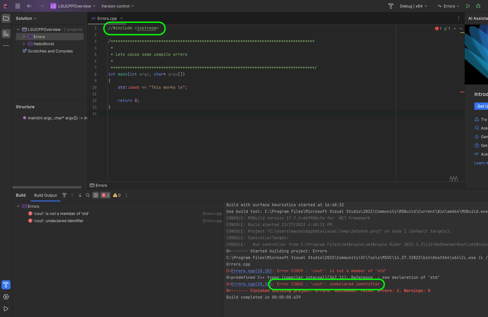
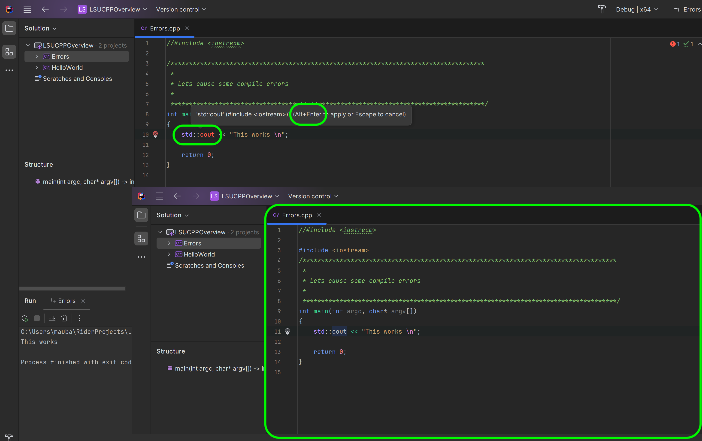
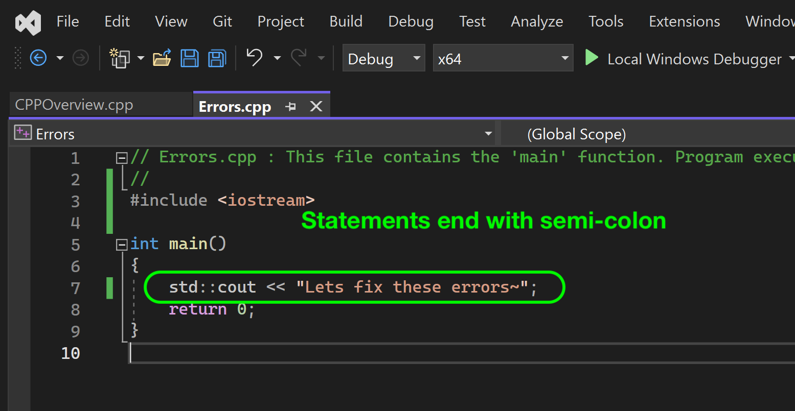
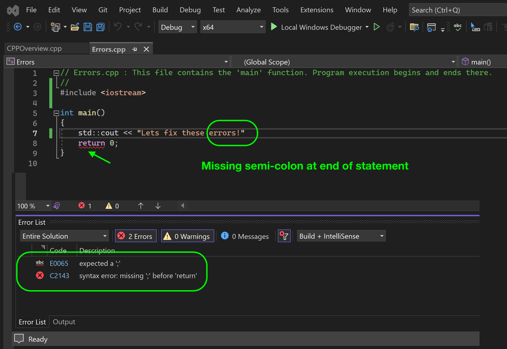

### Errors

[previous](../hello-world/README.md#user-content-hello-world) • [home](../README.md#user-content-ue5-cpp-overview) • [next](../integers/README.md#user-content-primitive-data-types---integers)

Lets look at the most common type of error.  When we mistype anything, it will usually create a syntax error and the program will not compile - thus not run. A syntax error is a grammatical error in the code that prevents the program from running. It mostly occurs when there is a mistake in the syntax such as missing a semicolon, using an incorrect keyword, or adding an extra closing bracket. These errors can be easily detected by the compiler and are shown as error messages that indicate the line of code that has the syntax error.

 

---

##### `Step 1.`\|`CPPOVR`|:small_blue_diamond:

A Rider solution can contain more than one project (a program with a main function). Lets create a new project by *right clicking* on the solution and select **Add | New Project...**.

##### `Step 2.`\|`CPPOVR`|:small_blue_diamond: :small_blue_diamond: 

We wil use the **C++ | Console Application** template again, and call it `Errors.  Press the <kbd>Create</kbd> button.

##### `Step 3.`\|`CPPOVR`|:small_blue_diamond: :small_blue_diamond: :small_blue_diamond:

Lets in the project's properties set the c++ language to `ISO C++ 17 Standard`.

##### `Step 4.`\|`CPPOVR`|:small_blue_diamond: :small_blue_diamond: :small_blue_diamond: :small_blue_diamond:

Lets include the libraries we need to printo the the screen so we will include `iostream` again.

Now add a description of the project `Let's cause some errors` at the top of the project file.

We will then output `"This works \n"`.  Press the <kbd>Run</kbd> button and notice that it is still running **Hello World** project.  How do we change this?

##### `Step 5.`\|`CPPOVR`| :small_orange_diamond:

Now right click on the **Errors** project and select **Run Errors**.  Otherwise the previous project's main function will continue to run.

##### `Step 6.`\|`CPPOVR`| :small_orange_diamond: :small_blue_diamond:

Now press <kbd>Run</kbd> again and it now is running the `main()` function in the **Errors.cpp** project.

##### `Step 7.`\|`CPPOVR`| :small_orange_diamond: :small_blue_diamond: :small_blue_diamond:

Lets cause our first error by commenting out the `#incldue` file.  This will create a linking error as it will not be able to find `std::cout`.  Now we do not need to run the program to compile we can save it with <kbd>ctrl s</kbd> and press <kbd>Shift Alt B</kbd> to compile.  We will notice an error.

##### `Step 8.`\|`CPPOVR`| :small_orange_diamond: :small_blue_diamond: :small_blue_diamond: :small_blue_diamond:

Outside of the core language C++ doesn't natively come with a lot of functionality (like printing to console, graphics, playing audio etc...).  Everything must come from other code we create or import into the project.

In c++ when we `#include LIBRARYNAME` a library we inherit all of its objects associated with it.

Lets look at the [iostream](https://cplusplus.com/reference/iostream/) library that includes 4 other libraries and gets us access to an **Object** called **cout** (standard output). We will be getting into objects later on. But we can call the **Object** `cout` and pipe it into an output stream.

##### `Step 9.`\|`CPPOVR`| :small_orange_diamond: :small_blue_diamond: :small_blue_diamond: :small_blue_diamond: :small_blue_diamond:

Rider has some useful advanced functionality.  It notices that we are including a library that we have access to. Notice it shows where it believes the errors to be in **red**.  You can press <kbd>alt</kbd> while the cursor is over the error and it will prompt you to press <kbd>Alt Enter</kbd> to add the header.  If you do it will add the `iostream` header for you.

Now press the <kbd>Run</kbd> button and it is working again!

##### `Step 10.`\|`CPPOVR`| :large_blue_diamond:

 Notice that we end the line with a `;` semicolon. Every line is a **statement** and has to be terminated by a semicolon. The compiler needs to know where one statement ends and the next begins.  Now the `<<` operator inserts the data that follows it into an [output stream](http://www.cplusplus.com/doc/tutorial/basic_io/) (which in our case will be the console displayed on the monitor).

##### `Step 11.`\|`CPPOVR`| :large_blue_diamond: :small_blue_diamond: 

If we remove the semi-colon and try and run the program the compiler will give us an error when we press run (when we run it, the program is compiled and it tries to run it).  Try this and read the error.  Sometimes the error messages are clear and sometimes they are hard to read and understand. This is a compiler error.  In a script any spelling mistake or typing error will result in a program error of some sort. Now it is underlying the `return 0` statement but the problem is above.  The message does not always accurately describe the error - just to the point where the compiler can't interpret the code due to a grammatical error.

##### `Step 12.`\|`CPPOVR`| :large_blue_diamond: :small_blue_diamond: :small_blue_diamond: 

If you add an extra closing bracket at the end and you compile - you will see that it says you are missing a `;` which is incorrect.  Be careful to think first and not apply the solution suggested by the compiler.  In this case every `{}` bracket needs to have a starting and closing bracket.  We need the same number of `{` as we have of `}`. In this case the error is an extra stray bracket.

Remove the error so it compiles and runs again. That's it for this quick walk through.

<!--  -->

| [previous](../hello-world/README.md#user-content-hello-world)| [home](../README.md#user-content-ue5-cpp-overview) | [next](../integers/README.md#user-content-primitive-data-types---integers)|
|---|---|---|
