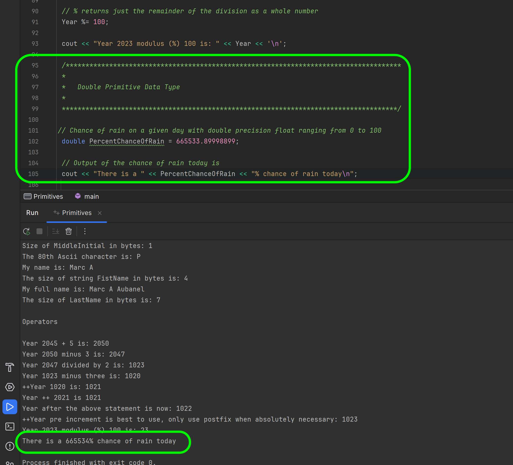
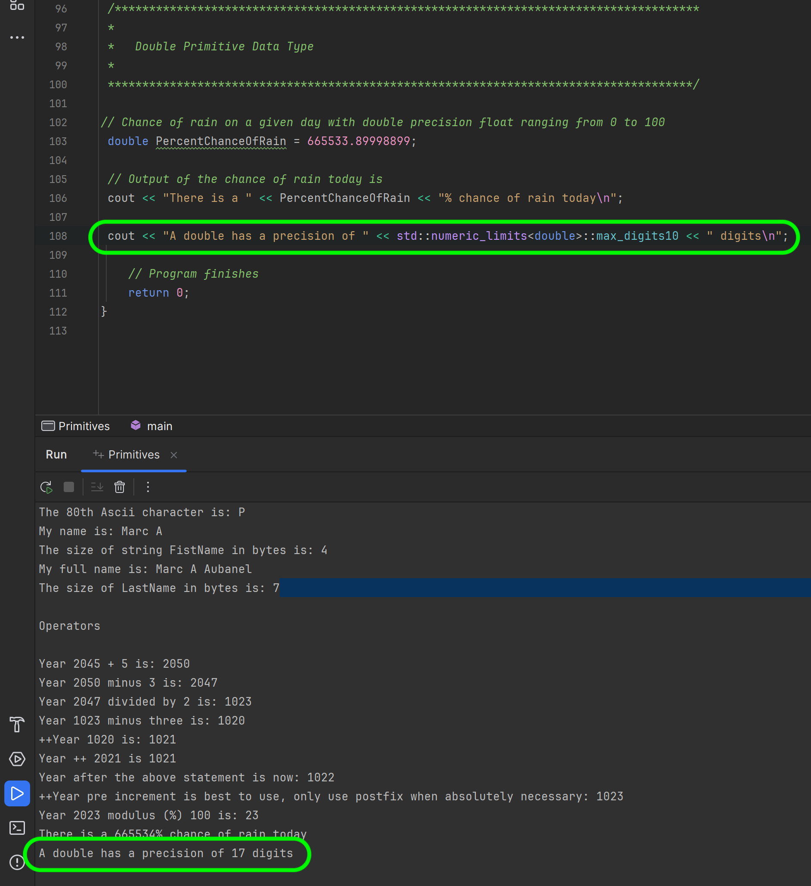
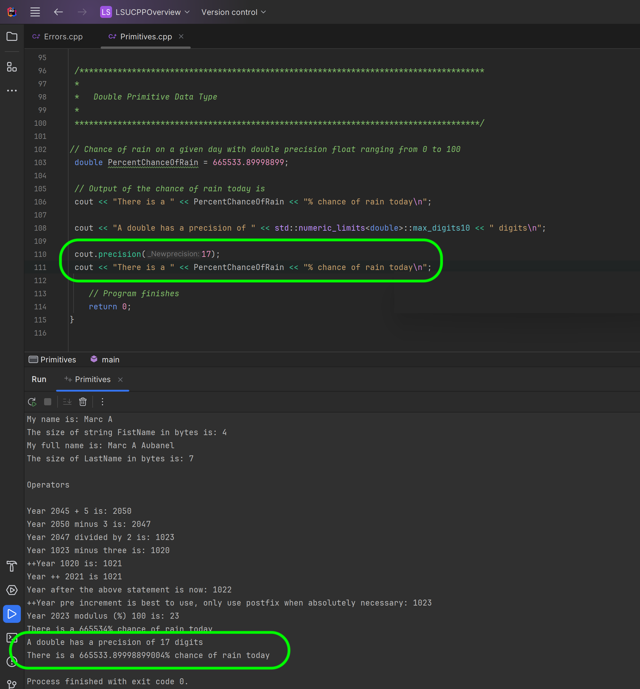

### Primitive Data Types - Fractions

[previous](../operators/README.md#user-content-arithmetic-operators) • [home](../README.md#user-content-ue5-cpp-overview) • [next](../)

We are going to introduce a new data type called a **double** floating point number.
> Double Floating Point: Double Floating Point data type is used for storing double precision floating point values or decimal values. Keyword used for double floating point data type is double. Double variables typically requires 8 bytes of memory space. - [geeksforgeeks.org](https://www.geeksforgeeks.org/cpp-data-types/?ref=gcse)

Notice that it says **typically**.  It is very important to understand that different platforms may have different sizes for the same named data types.  Always make sure you test your assumptions on ALL platforms you want to support.

What does 8 bytes mean?  A **byte** is 8 **bits**.  A bit is a single binary value (can be either `0` or `1`).  So if we have one **byte** it can store 8 **bits**.  So what does this mean in decimals?  We need to look at 2 to the power of 8 (2 ^ 8 or 2\*2\*2\*2\*2\*2\*2\*2).  Type `2 ^ 8` in a calculator and you will see that is **256**.  So a byte can hold an **integer** value of a number with **256** discrete values.  Now since 0 counts as a number a byte can hold any integer from `0` to `255`.  Why **255**?  Because 0 counts as a value.  We we have 256 discrete values.

So a double uses one bit for the sign (positive or negative), 11 bits for the exponent and 52 bits for the value (8 bytes =  8 \* 8 bits = 64 bits ). 

We are also going to introduce a new data type called [float](https://www.geeksforgeeks.org/cpp-data-types/?ref=gcse).
> Floating Point: Floating Point data type is used for storing single precision floating point values or decimal values. Keyword used for floating point data type is float. Float variables typically requires 4 byte of memory space. - [geeksforgeeks.org](https://www.geeksforgeeks.org/cpp-data-types/?ref=gcse)

Notice that it says **typically**.  It is very important to understand that different platforms may have different sizes for the same named data types.  

Now when do we use floats and when do we use doubles?  In games audio samples tend to use floats and in 3-D our points are usually stored in floats as well in **x, y, z Space** as there are so many of them.  The increase in precision is not offset by the huge size increase in RAM.  So floats are used when possible in games to save memory.

 

---

##### `Step 1.`\|`CPPOVR`|:small_blue_diamond:

So lets create a new variable of type `double PercentChanceOfRain` and lets give it a silly double literal of `664433.89998999;`.  Notice that when we print it out it rounds the number and doesn't show the entire decimal number stored.

##### `Step 2.`\|`CPPOVR`|:small_blue_diamond: :small_blue_diamond: 

Now based on the size of the double on my computer how many numbers can the scientific notation of a fractional [significand](https://en.wikipedia.org/wiki/Scientific_notation) hold?    

`245 E 23` with `245` being the `significand` and `23` being the `exponent`.

It can store only so many digits.  We can include the `<limits>` library to see how many total **base 10** digits this can hold.  Add to the after the first **include** `#include <limits>`.

##### `Step 3.`\|`CPPOVR`|:small_blue_diamond: :small_blue_diamond: :small_blue_diamond:

 We use `std::numeric_limits<double>::max_digits10` to find out how many significand values it can hold which will determine the precision of the number.  Notice that we can store `17` numbers.

##### `Step 4.`\|`CPPOVR`|:small_blue_diamond: :small_blue_diamond: :small_blue_diamond: :small_blue_diamond:

Now `cout` has a static function (will explain later) called `cout::set_precision(number_of_places)`.  This will show a floating point value with 17 numbers (not including the decimal `.` point). In this case we will show to the above precision.  Please notice that the last fractional parts are not identical to the number we set it to. To read more look at [Floating-point error mitigation](https://en.wikipedia.org/wiki/Floating-point_error_mitigation) 

##### `Step 5.`\|`CPPOVR`| :small_orange_diamond:

##### `Step 6.`\|`CPPOVR`| :small_orange_diamond: :small_blue_diamond:

##### `Step 7.`\|`CPPOVR`| :small_orange_diamond: :small_blue_diamond: :small_blue_diamond:

##### `Step 8.`\|`CPPOVR`| :small_orange_diamond: :small_blue_diamond: :small_blue_diamond: :small_blue_diamond:

##### `Step 9.`\|`CPPOVR`| :small_orange_diamond: :small_blue_diamond: :small_blue_diamond: :small_blue_diamond: :small_blue_diamond:

##### `Step 10.`\|`CPPOVR`| :large_blue_diamond:

##### `Step 11.`\|`CPPOVR`| :large_blue_diamond: :small_blue_diamond: 

##### `Step 12.`\|`CPPOVR`| :large_blue_diamond: :small_blue_diamond: :small_blue_diamond: 

##### `Step 13.`\|`CPPOVR`| :large_blue_diamond: :small_blue_diamond: :small_blue_diamond:  :small_blue_diamond: 

##### `Step 14.`\|`CPPOVR`| :large_blue_diamond: :small_blue_diamond: :small_blue_diamond: :small_blue_diamond:  :small_blue_diamond: 

##### `Step 15.`\|`CPPOVR`| :large_blue_diamond: :small_orange_diamond: 

##### `Step 16.`\|`CPPOVR`| :large_blue_diamond: :small_orange_diamond:   :small_blue_diamond: 

##### `Step 17.`\|`CPPOVR`| :large_blue_diamond: :small_orange_diamond: :small_blue_diamond: :small_blue_diamond:

##### `Step 18.`\|`CPPOVR`| :large_blue_diamond: :small_orange_diamond: :small_blue_diamond: :small_blue_diamond: :small_blue_diamond:

##### `Step 19.`\|`CPPOVR`| :large_blue_diamond: :small_orange_diamond: :small_blue_diamond: :small_blue_diamond: :small_blue_diamond: :small_blue_diamond:

##### `Step 20.`\|`CPPOVR`| :large_blue_diamond: :large_blue_diamond:

##### `Step 21.`\|`CPPOVR`| :large_blue_diamond: :large_blue_diamond: :small_blue_diamond:

<!--  -->

| [previous](../operators/README.md#user-content-arithmetic-operators)| [home](../README.md#user-content-ue5-cpp-overview) | [next](../)|
|---|---|---|
