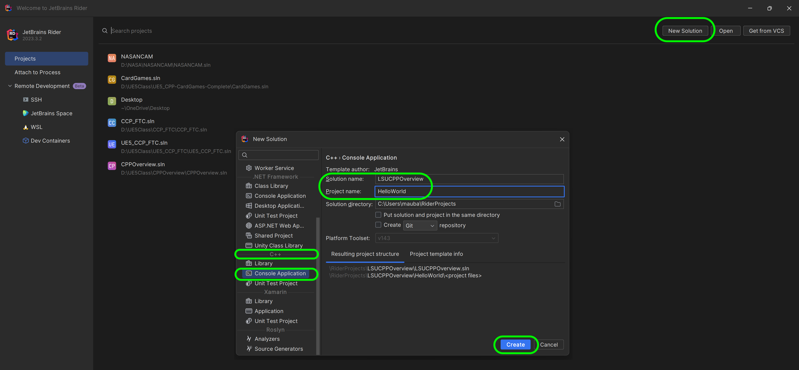
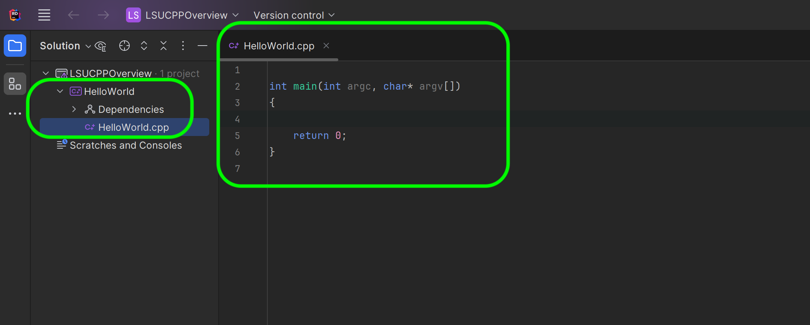
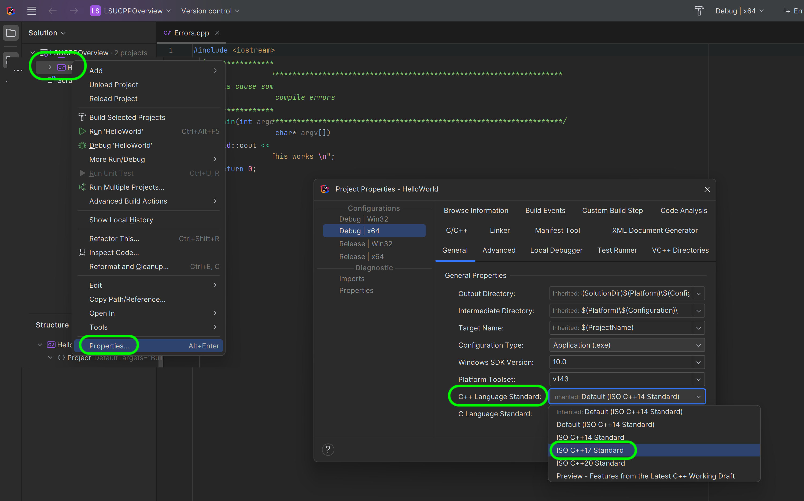
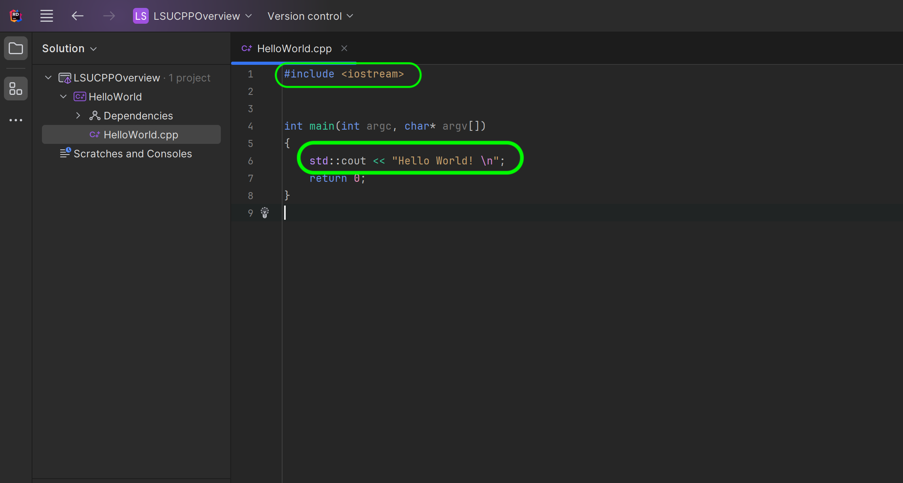
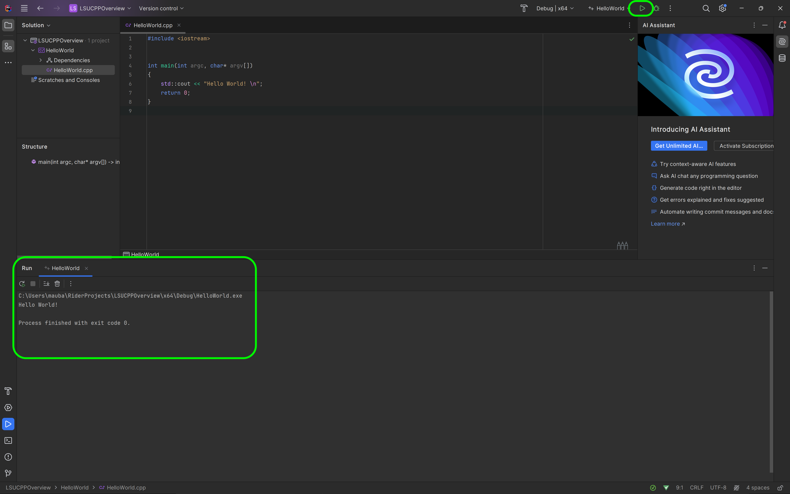
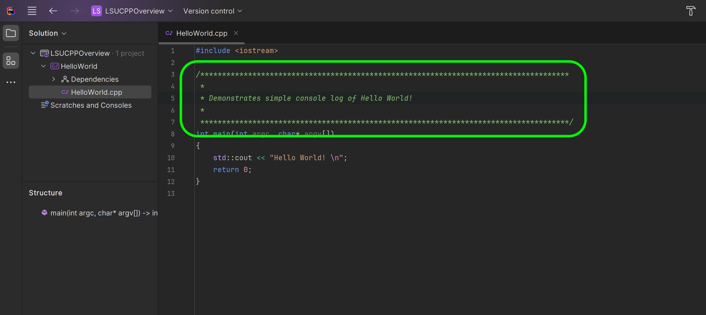
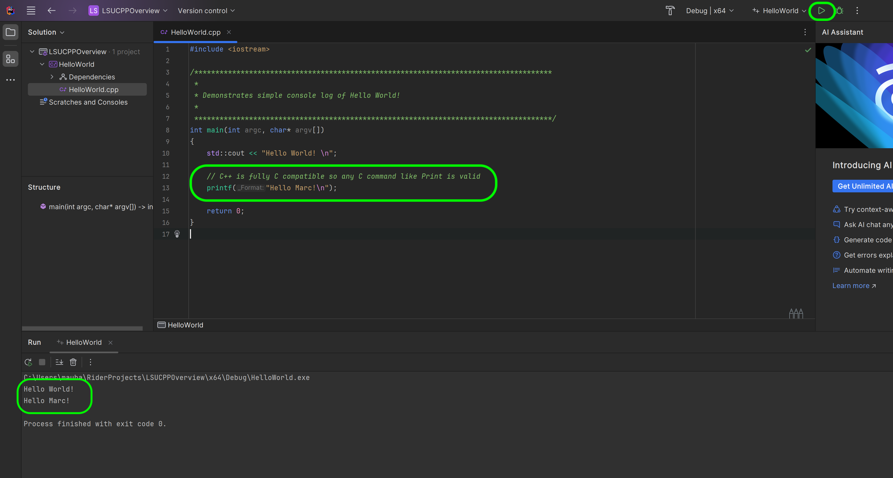
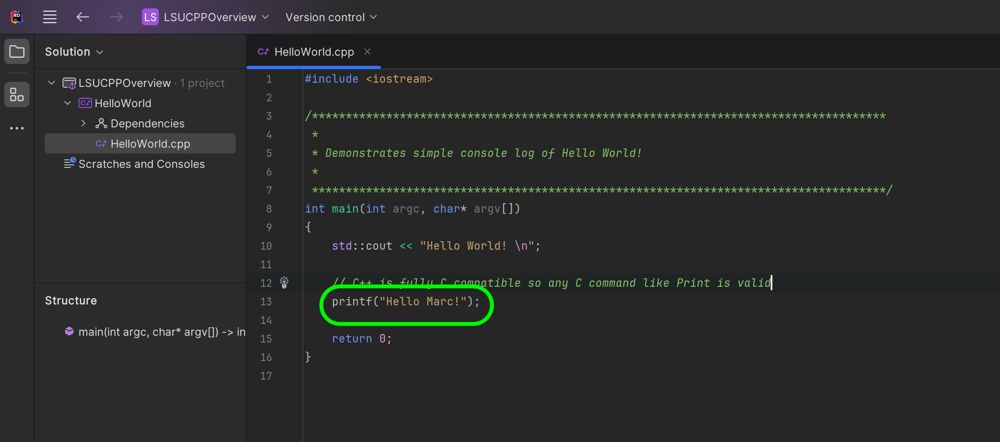
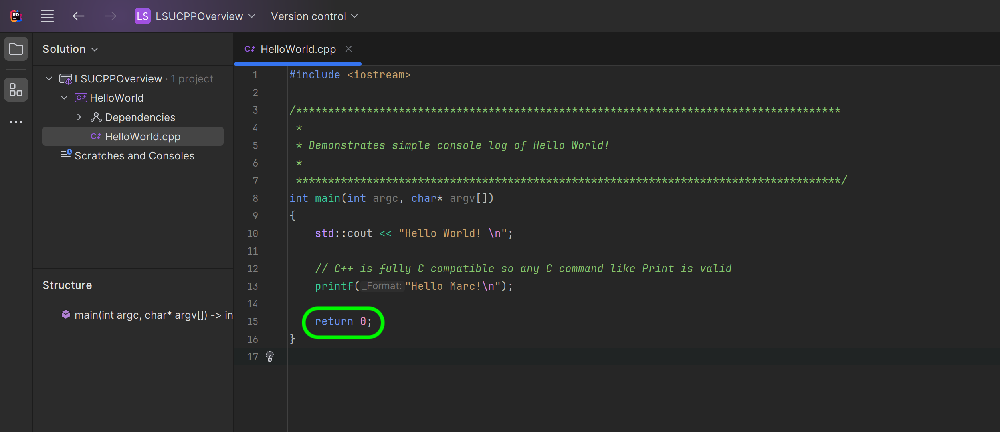

### Hello World

Print hello world to the console of visual studio.

[home](../README.md#user-content-ue5-cpp-overview) • [next](../errors/README.md#user-content-errors)

Chapter introduction here.

 

---

##### `Step 1.`\|`CPPOVR`| :small_blue_diamond:

## Why C++

Out of all the modern programming languages why do we still use C++ for games?

* *Performance*. C++ is a high-performance lower level programing languag.  Games are very performance oriented and c++ allows user to use computer hardware efficiently.  Often higher level scripting languages are used for game play scripting. [Unity](https://answers.unity.com/questions/9675/is-unity-engine-written-in-monoc-or-c.html) game engine is written in c++ but you write all the game scripts in c#.

* *Compiles*. C++ is a compiled programming language.

* *Low Level*. C++ gives developers low-level access to the computer hardware, allowing them greater control and optimize harware usage. It is used extensively in lower level systems like rendering, audio and physics

* *Memory Management*. Manual memory management which avoids any issues with higher level languages not freeing up memory, or freeing up so much that it affects the performance of the game.

* *Optimizable*. Easier to optimize heavily used routines

* *Portability*. There is a C++ compiler available for all platforms, so is beneficial if you want to support PC's, consoles and mobile.

* *Language features*.  C++ had advanced features such as templates, memory management and object-oriented programming.

* *Existing libraries*. Many libaries such as Havok or Scaleform are written in C++.

* *CPP 17*. We will be using C++ 17 as this is supported by Unreal.

* *Industry standard*. C++ is one of the most widely used programming languages in the game industry, so developers can benefit from a large community of resources, libraries, and tools to create their games.

> Modern C++ Language Syntax
Unreal Engine is built to be massively portable to many C++ compilers, so we are careful to use features that are compatible with the compilers we might be supporting. Sometimes features are so useful that we will wrap them up in macros and use them pervasively. However, we usually wait until all of the compilers we might be supporting are up to the latest standard.  Unreal Engine requires a minimum language version of C++17 to build, and we use many modern language features that are well-supported across modern compilers. In some cases, we can wrap up usage of these features in preprocessor conditionals. However, sometimes we decide to avoid certain language features entirely, for portability or other reasons.  Unless specified below, as a modern C++ compiler feature we are supporting, you should not use compiler-specific language features unless they are wrapped in preprocessor macros or conditionals and used sparingly. - [UE5 Documentation](https://docs.unrealengine.com/5.0/en-US/epic-cplusplus-coding-standard-for-unreal-engine/#modernc++languagesyntax)

##### `Step 2.`\|`CPPOVR`| :small_blue_diamond::small_blue_diamond: 

Install [Visual Studio 22 (Community will work)](https://visualstudio.microsoft.com/downloads/) and include the libraries that we will need which includes the **Game development with c++** as well as the **Unreal Engine installer**, **C++ profiling tools**, **C++Address Sanitizer**, **Windows 10 SDK** (10.0.18362 or newer).  Their screenshot also says to include the **.NET desktop-development** as well as the **Universal WIndows Platform development**. Feel free to follow the rest of the recommended settings in the [Setting Up Visual Studio](https://docs.unrealengine.com/5.2/en-US/setting-up-visual-studio-development-environment-for-cplusplus-projects-in-unreal-engine/) or when we use it with Unreal Engine.

##### `Step 3.`\|`CPPOVR`| :small_blue_diamond::small_blue_diamond::small_blue_diamond:

Now we have added all the compilers and software we need we will be using Rider as our IDE of choice as it has outstanding support of Unreal and is better integrated than Visual Studio. [Rider](https://www.jetbrains.com/community/education/#students) is free for students so download and install this terrific IDE.

##### `Step 4.`\|`CPPOVR`| :small_blue_diamond::small_blue_diamond::small_blue_diamond::small_blue_diamond:

Open up Rider and press the <kbd>New Solution</kbd> button. Now Rider uses the visual studio nomenclature of being able to work in one solution but we can multiple projects.  On the left hand side we have templates for all of the languages that are supported.  You should select **C++ | Consolder Application**, which will give us the most simple C++ application that will just run in a console. Now we will call the **Solution name:** `LSUCPPOverview` which we will use for the rest of this walk through.  The project will be called `HelloWorld`.  I leave it in the default directory and press the <kbd>Create</kbd> button to start the project.

##### `Step 5.`\|`CPPOVR`| :small_orange_diamond:

This has us in the LSUCPPOverview solution with a **HellowWorld** project.  This is the name of the folder.  Inside is a `HelloWorld.cpp` file which contains the C++ file.  All c++ files usually use a `.h` (we will get into headers later) and `.ccp` files for the C++ definitions.  Notice it has a function called `main()`.  This is what all C++ files run. 

##### `Step 6.`\|`CPPOVR`| :small_orange_diamond::small_blue_diamond:

Now Visual Studio and Rider defaults to C++ 14 but Unreal uses C++ 17 (it does not use the latest version).  So lets change our project to Match Unreal's to C++ 17.  *Right click* on the **Project** and select **Properties**. Change the **General | C++ Languages Stardard** to `ISO C++17 Standard`.  Press the  <kbd>OK</kbd> buttons.

##### `Step 7.`\|`CPPOVR`| :small_orange_diamond::small_blue_diamond::small_blue_diamond:

We need to print the words **Hello World!**.  We will need to output to the character stream and use a library called `iostream`.  On the very top you need to add it by typing `#include <iostream>`. 

Now within the **Main** function before it `return 0` you will add to the output stream with `std::cout << "Hello World \n";`.  This outputs to the stream the characters that appear within the parenthesis (`"`). 

It is the included the `<iostream>` libraries that allow us to access `cout` in the `std` namespace.  This global object `std::cout` controls the output stream buffer.  This allows us to access the stream that eventually gets sent to the console. `std` is the namespace that represents the word 'standard' which are built in **C++** libraries available on all platforms including **Windows** which we are working on now.

`"Hello World\n"` is a string with a new line (`\n`) which gets stored as a single character.

##### `Step 8.`\|`CPPOVR`| :small_orange_diamond::small_blue_diamond::small_blue_diamond::small_blue_diamond:

Now lets run the program to see our work.  Press the <kbd>Run</kbd> button (looks like a play button on a music app) to launch the console.  You will see it on the bottom tab and see it output the stream you sent to the console!

##### `Step 9.`\|`CPPOVR`| :small_orange_diamond::small_blue_diamond::small_blue_diamond::small_blue_diamond::small_blue_diamond:

Now we always explain what our `.cpp` file does in english for you the programmer (or other programmers) to explain the function of this class.  In this case everything between `/*` and `*/` changes to green and is not included in the final program.  It is a code comment meant to be human readable and the C++ language does not process it it. 

Single line comments use `//`.

##### `Step 10.`\|`CPPOVR`| :large_blue_diamond:

C is completely compatible inside of C++.  So we can also print using the older C style format which is used extensively in Unreal.

There are always more than one way to skin a cat, so we can also call a function called `printf` and pass it the "Hello World" string as a parameter. Run it by pressing the green run button and notice that it should have the same end result. Notice that this is in global name space and we did not need to include `std::`.

Press the <kbd>Run</kbd> button and notice it now prints using `std::cout` to the console (Hello World!) as well as prints to the output stream using `printf()` (Hello Marc!).

##### `Step 11.`\|`CPPOVR`| :large_blue_diamond::small_blue_diamond: 

Click on the [cplusplus.com printf reference](http://www.cplusplus.com/reference/cstdio/printf/). Notice that it includes a **function** called `printf` (we will explain functions in a future lesson). Without libraries and built in functions, the language is fairly limited.  Anytime we need to do anything specialized for a specific OS and system, we probably need to load a set of libraries.

##### `Step 12.`\|`CPPOVR`| :large_blue_diamond::small_blue_diamond::small_blue_diamond: 

So when a C++ program is run it launches `main()`.  We can also name and call functions as well. So the second thing the program does in **main()** is to run the function `printf()` and passes a string parameter of **"Hello World"**. We will get into this more shortly when we dive into strings.

##### `Step 13.`\|`CPPOVR`| :large_blue_diamond::small_blue_diamond: :small_blue_diamond: :small_blue_diamond: 

When you press run the program is compiled.  What does this mean?  This is the process of going from a human readable form script and creates object code that forms an executable (an .exe on a PC).  So the compiler turns it from words into zeros and ones (machine code).

##### `Step 14.`\|`CPPOVR`| :large_blue_diamond::small_blue_diamond::small_blue_diamond::small_blue_diamond::small_blue_diamond: 

There are 4 stages to compiling:

1. Preprocessing
2. Compiling
3. Assembling
4. Linking

So in our example when we press the <kbd>Run</kbd> button we are saving adn compiling the file.  The first stage *Preprocessing* replaces the `#include stdio` with the files from that library.  

The *Compiling* stage generates a `HelloWorld.s` which is an assembly version of the C++ (human readable low level code - cannot be executed by the computer)

The *Assembly* stage generates a `HelloWorld.o` which is a binary computer readable version of the program.

The *Linker* brings them all together and produces a file that can be executed (like a `.exe` on pc).

##### `Step 15.`\|`CPPOVR`| :large_blue_diamond::small_orange_diamond: 

It is customary to add `return 0` to the end but should work without it on most platforms.  This function returns to its caller (we don't call it) a 0.  So if the program runs and doesn't crash it should finish with an exit code of 0. Look at the second line of the **Debug Console** window and you will see `exited with code 0`.  This means the program completed without crashing.

<!--  -->

| [home](../README.md#user-content-ue5-cpp-overview) | [next](../errors/README.md#user-content-errors)|
|---|---|
