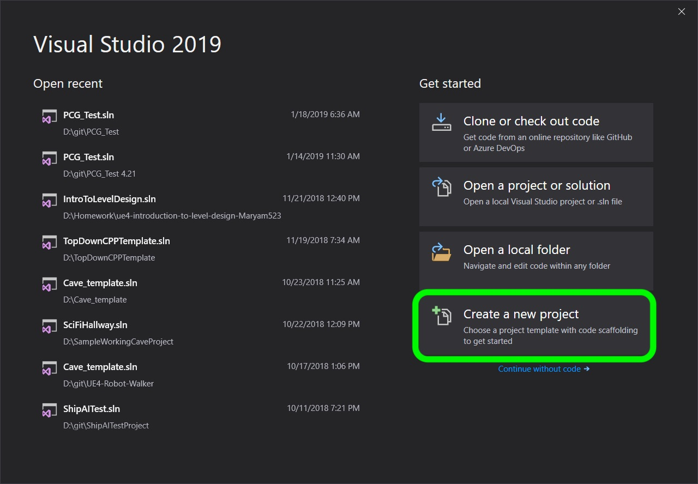

### Hello World

Print hello world to the console of visual studio.

[home](../README.md#user-content-ue5-cpp-overview) • [next](../)

Chapter introduction here.

 

---

##### `Step 1.`\|`CPPOVR`|:small_blue_diamond:

## Why C++

Out of all the modern programming languages why do we still use C++ for games?

* *Performance*. C++ is a high-performance lower level programing languag.  Games are very performance oriented and c++ allows user to use computer hardware efficiently.  Often higher level scripting languages are used for game play scripting. [Unity](https://answers.unity.com/questions/9675/is-unity-engine-written-in-monoc-or-c.html) game engine is written in c++ but you write all the game scripts in c#.

* *Compiles*. C++ is a compiled programming language.

* *Low Level*. C++ gives developers low-level access to the computer hardware, allowing them greater control and optimize harware usage. It is used extensively in lower level systems like rendering, audio and physics

* *Memory Management*. Manual memory management which avoids any issues with higher level languages not freeing up memory, or freeing up so much that it affects the performance of the game.

* *Optimizable*. Easier to optimize heavily used routines

* *Portability*. There is a C++ compiler available for all platforms, so is beneficial if you want to support PC's, consoles and mobile.

* *Language features*.  C++ had advanced features such as templates, memory management and object-oriented programming.

* *Existing libraries*. Many libaries such as Havok or Scaleform are written in C++.

* *CPP 17*. We will be using C++ 17 as this is supported by Unreal.

* *Industry standard*. C++ is one of the most widely used programming languages in the game industry, so developers can benefit from a large community of resources, libraries, and tools to create their games.

> Modern C++ Language Syntax
Unreal Engine is built to be massively portable to many C++ compilers, so we are careful to use features that are compatible with the compilers we might be supporting. Sometimes features are so useful that we will wrap them up in macros and use them pervasively. However, we usually wait until all of the compilers we might be supporting are up to the latest standard.  Unreal Engine requires a minimum language version of C++17 to build, and we use many modern language features that are well-supported across modern compilers. In some cases, we can wrap up usage of these features in preprocessor conditionals. However, sometimes we decide to avoid certain language features entirely, for portability or other reasons.  Unless specified below, as a modern C++ compiler feature we are supporting, you should not use compiler-specific language features unless they are wrapped in preprocessor macros or conditionals and used sparingly. - [UE5 Documentation](https://docs.unrealengine.com/5.0/en-US/epic-cplusplus-coding-standard-for-unreal-engine/#modernc++languagesyntax)

##### `Step 2.`\|`CPPOVR`|:small_blue_diamond: :small_blue_diamond: 

Open up [Visual Studio 19 Community](https://visualstudio.microsoft.com/downloads/) and you should be able to login with your LSU credentials. You should see a screen like this.  Click on the **Create a New Project** button:

##### `Step 3.`\|`CPPOVR`|:small_blue_diamond: :small_blue_diamond: :small_blue_diamond:

Select a **Console App** as we will only be working withing the console.

##### `Step 4.`\|`CPPOVR`|:small_blue_diamond: :small_blue_diamond: :small_blue_diamond: :small_blue_diamond:

Name the project and select a location to save it in and press the **Create** button.

##### `Step 5.`\|`CPPOVR`| :small_orange_diamond:

##### `Step 6.`\|`CPPOVR`| :small_orange_diamond: :small_blue_diamond:

##### `Step 7.`\|`CPPOVR`| :small_orange_diamond: :small_blue_diamond: :small_blue_diamond:

##### `Step 8.`\|`CPPOVR`| :small_orange_diamond: :small_blue_diamond: :small_blue_diamond: :small_blue_diamond:

##### `Step 9.`\|`CPPOVR`| :small_orange_diamond: :small_blue_diamond: :small_blue_diamond: :small_blue_diamond: :small_blue_diamond:

##### `Step 10.`\|`CPPOVR`| :large_blue_diamond:

##### `Step 11.`\|`CPPOVR`| :large_blue_diamond: :small_blue_diamond: 

##### `Step 12.`\|`CPPOVR`| :large_blue_diamond: :small_blue_diamond: :small_blue_diamond: 

##### `Step 13.`\|`CPPOVR`| :large_blue_diamond: :small_blue_diamond: :small_blue_diamond:  :small_blue_diamond: 

##### `Step 14.`\|`CPPOVR`| :large_blue_diamond: :small_blue_diamond: :small_blue_diamond: :small_blue_diamond:  :small_blue_diamond: 

##### `Step 15.`\|`CPPOVR`| :large_blue_diamond: :small_orange_diamond: 

##### `Step 16.`\|`CPPOVR`| :large_blue_diamond: :small_orange_diamond:   :small_blue_diamond: 

##### `Step 17.`\|`CPPOVR`| :large_blue_diamond: :small_orange_diamond: :small_blue_diamond: :small_blue_diamond:

##### `Step 18.`\|`CPPOVR`| :large_blue_diamond: :small_orange_diamond: :small_blue_diamond: :small_blue_diamond: :small_blue_diamond:

##### `Step 19.`\|`CPPOVR`| :large_blue_diamond: :small_orange_diamond: :small_blue_diamond: :small_blue_diamond: :small_blue_diamond: :small_blue_diamond:

##### `Step 20.`\|`CPPOVR`| :large_blue_diamond: :large_blue_diamond:

##### `Step 21.`\|`CPPOVR`| :large_blue_diamond: :large_blue_diamond: :small_blue_diamond:

<!--  -->

| [home](../README.md#user-content-ue5-cpp-overview) | [next](../)|
|---|---|
