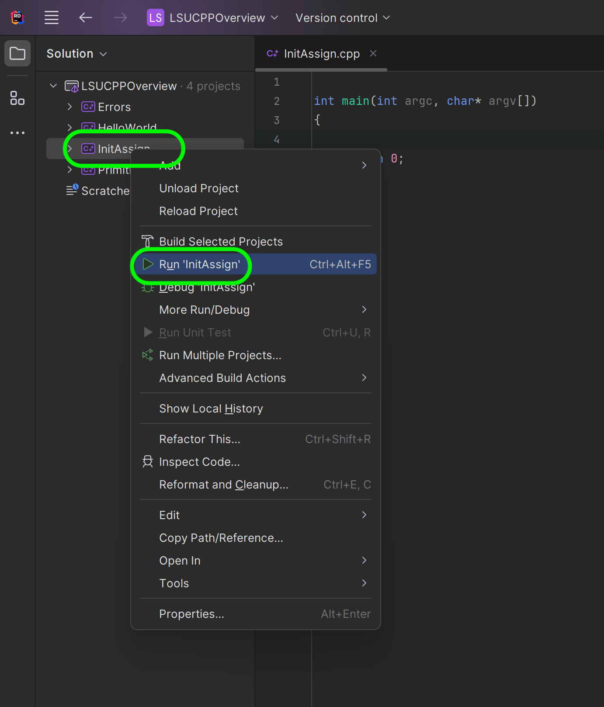

### Initialization

[previous](../bools/README.md#user-content-primitive-data-types---bools-and-unsigned-ints) • [home](../README.md#user-content-ue5-cpp-overview) • [next](../)

Assignment versus Initializing. 

In C++, assignment and initialization are two different ways of giving a value to a variable.

1. Initialization: Initialization is the process of giving an initial value to a variable when it is first created or declared. When you initialize a variable, you provide it with a value at the same time you declare it.

For example, if you have an `int` variable called `x` and you want to initialize it with a value of 5, you can write `int x = 5;`. This assigns the initial value of 5 to the variable `x` at the moment it is created.

Initialization is a one-time process that sets the initial value of the variable, and it can only be done when the variable is declared.

2. Assignment: Assignment, on the other hand, is the process of giving a new value to an existing variable. After a variable is initialized, you can assign new values to it at different points in your code.

For example, if you already have an `int` variable `X` that was previously initialized with a value of 5, you can change its value to `10` later in your program by using the assignment operator `=`. You would write `x = 10;`, and this assigns the new value of 10 to the variable `X`. Note that to initialize you need to include the type specifier, but when assigning you do not.

Assignment can be done as many times as you need throughout your program, allowing you to update the value of a variable.

In C++ 11 they introduced an initilization method using `{}` curly braces.  Lets look at both of these methods.

 

---

##### `Step 1.`\|`CPPOVR`|:small_blue_diamond:

Right click on the solution file and select **Add | New Project...**. Then select a C++ **Empty Project** and press the <kbd>Next</kbd> button. Call it `InitAssign` then press the <kbd>Create</kbd> button. 

##### `Step 2.`\|`CPPOVR`|:small_blue_diamond: :small_blue_diamond: 

Right click on the new **InitAssign** project and select **Set as StartUp Project**.

##### `Step 3.`\|`CPPOVR`|:small_blue_diamond: :small_blue_diamond: :small_blue_diamond:

##### `Step 4.`\|`CPPOVR`|:small_blue_diamond: :small_blue_diamond: :small_blue_diamond: :small_blue_diamond:

##### `Step 5.`\|`CPPOVR`| :small_orange_diamond:

##### `Step 6.`\|`CPPOVR`| :small_orange_diamond: :small_blue_diamond:

##### `Step 7.`\|`CPPOVR`| :small_orange_diamond: :small_blue_diamond: :small_blue_diamond:

##### `Step 8.`\|`CPPOVR`| :small_orange_diamond: :small_blue_diamond: :small_blue_diamond: :small_blue_diamond:

##### `Step 9.`\|`CPPOVR`| :small_orange_diamond: :small_blue_diamond: :small_blue_diamond: :small_blue_diamond: :small_blue_diamond:

##### `Step 10.`\|`CPPOVR`| :large_blue_diamond:

##### `Step 11.`\|`CPPOVR`| :large_blue_diamond: :small_blue_diamond: 

##### `Step 12.`\|`CPPOVR`| :large_blue_diamond: :small_blue_diamond: :small_blue_diamond: 

##### `Step 13.`\|`CPPOVR`| :large_blue_diamond: :small_blue_diamond: :small_blue_diamond:  :small_blue_diamond: 

##### `Step 14.`\|`CPPOVR`| :large_blue_diamond: :small_blue_diamond: :small_blue_diamond: :small_blue_diamond:  :small_blue_diamond: 

##### `Step 15.`\|`CPPOVR`| :large_blue_diamond: :small_orange_diamond: 

##### `Step 16.`\|`CPPOVR`| :large_blue_diamond: :small_orange_diamond:   :small_blue_diamond: 

##### `Step 17.`\|`CPPOVR`| :large_blue_diamond: :small_orange_diamond: :small_blue_diamond: :small_blue_diamond:

##### `Step 18.`\|`CPPOVR`| :large_blue_diamond: :small_orange_diamond: :small_blue_diamond: :small_blue_diamond: :small_blue_diamond:

##### `Step 19.`\|`CPPOVR`| :large_blue_diamond: :small_orange_diamond: :small_blue_diamond: :small_blue_diamond: :small_blue_diamond: :small_blue_diamond:

##### `Step 20.`\|`CPPOVR`| :large_blue_diamond: :large_blue_diamond:

##### `Step 21.`\|`CPPOVR`| :large_blue_diamond: :large_blue_diamond: :small_blue_diamond:

<!--  -->

| [previous](../bools/README.md#user-content-primitive-data-types---bools-and-unsigned-ints)| [home](../README.md#user-content-ue5-cpp-overview) | [next](../)|
|---|---|---|
