### Initialization

[previous](../bools/README.md#user-content-primitive-data-types---bools-and-unsigned-ints) • [home](../README.md#user-content-ue5-cpp-overview) • [next](../)

Assignment versus Initializing. 

In C++, assignment and initialization are two different ways of giving a value to a variable.

1. Initialization: Initialization is the process of giving an initial value to a variable when it is first created or declared. When you initialize a variable, you provide it with a value at the same time you declare it.

For example, if you have an `int` variable called `x` and you want to initialize it with a value of 5, you can write `int x = 5;`. This assigns the initial value of 5 to the variable `x` at the moment it is created.

Initialization is a one-time process that sets the initial value of the variable, and it can only be done when the variable is declared.

2. Assignment: Assignment, on the other hand, is the process of giving a new value to an existing variable. After a variable is initialized, you can assign new values to it at different points in your code.

For example, if you already have an `int` variable `X` that was previously initialized with a value of 5, you can change its value to `10` later in your program by using the assignment operator `=`. You would write `x = 10;`, and this assigns the new value of 10 to the variable `X`. Note that to initialize you need to include the type specifier, but when assigning you do not.

Assignment can be done as many times as you need throughout your program, allowing you to update the value of a variable.

In C++ 11 they introduced an initilization method using `{}` curly braces.  Lets look at both of these methods.

 

---

##### `Step 1.`\|`CPPOVR`|:small_blue_diamond:

Right click on the solution file and select **Add | New Project...**. Then select a C++ **Empty Project** and press the <kbd>Next</kbd> button. Call it `InitAssign` then press the <kbd>Create</kbd> button. 

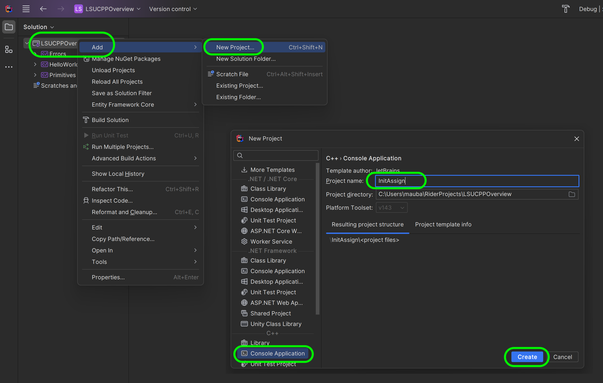

##### `Step 2.`\|`CPPOVR`|:small_blue_diamond: :small_blue_diamond: 

Right click on the new **InitAssign** project and select **Set as Startup Project**.

##### `Step 3.`\|`CPPOVR`|:small_blue_diamond: :small_blue_diamond: :small_blue_diamond:

Rigth click on **InitAssign** and select **Add | New Item...**.  Call it `InitAssign.cpp`. Press the <kbd>Add</kbd> button.

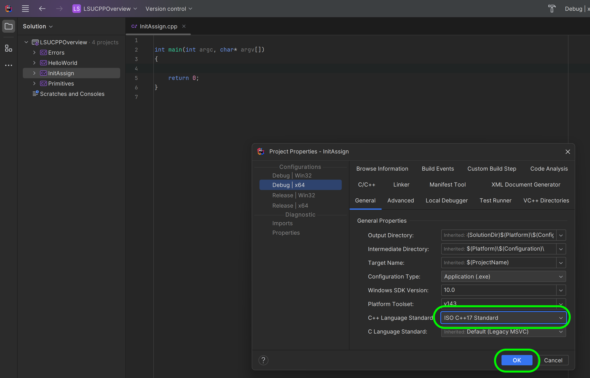

##### `Step 4.`\|`CPPOVR`|:small_blue_diamond: :small_blue_diamond: :small_blue_diamond: :small_blue_diamond:

Now when we first initialize a variable we need to include the type specifier.  So in this case we **initialize** `string FirstName` as `"Marc"`.  We then **assign** `"Phil"` to `FirstName` (no type specifier) so the variable now holds a new value. We output it to the output stream using `std::cout` and we see the lates value that was assigned **Phil** in cout.

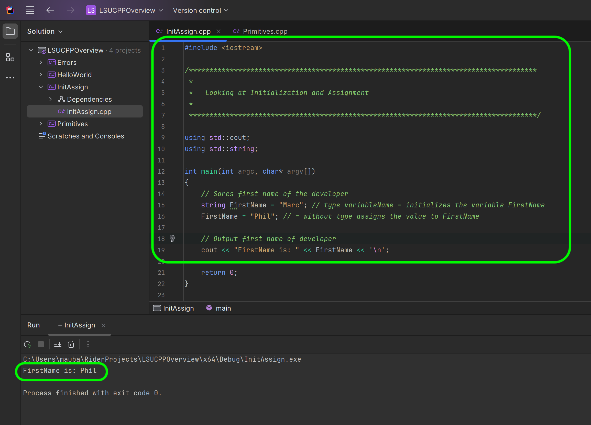

##### `Step 5.`\|`CPPOVR`| :small_orange_diamond:

Now in C++ 11, you can use braces {} to initialize variables with an initializer list. This feature is commonly referred to as "uniform initialization" or "brace initialization." This stops us from having the same symbol `=` for both initializing and assigning. In this example we initialize `LastName {"Aubanel"} without usign the equals sign.

##### `Step 6.`\|`CPPOVR`| :small_orange_diamond: :small_blue_diamond:

Notice that this is just for initializing.  If we try and assign with the {} initializer we get an error.

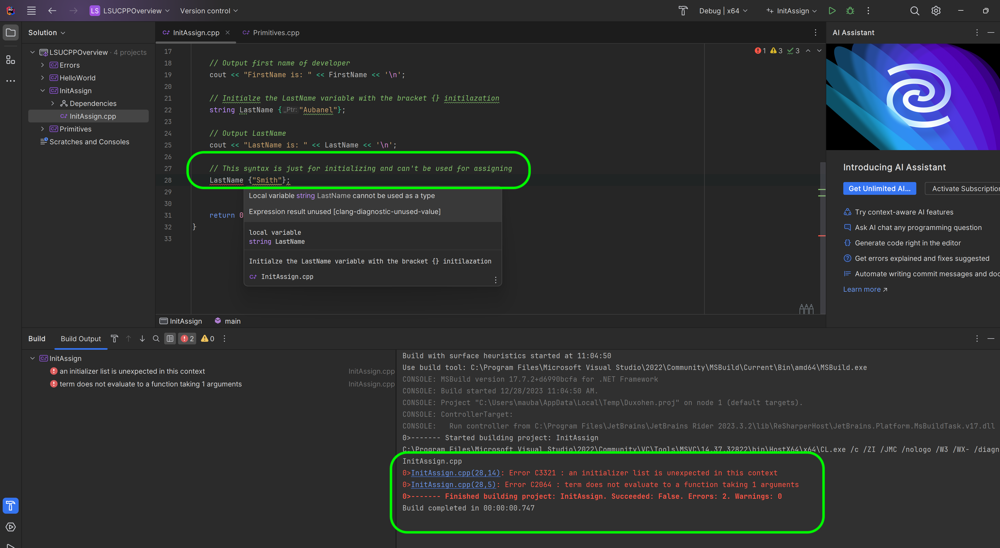

##### `Step 7.`\|`CPPOVR`| :small_orange_diamond: :small_blue_diamond: :small_blue_diamond:

Comment out the line that doesn't compile. We can still change the variable by assigning it a new value with the `=` assignment operator.  

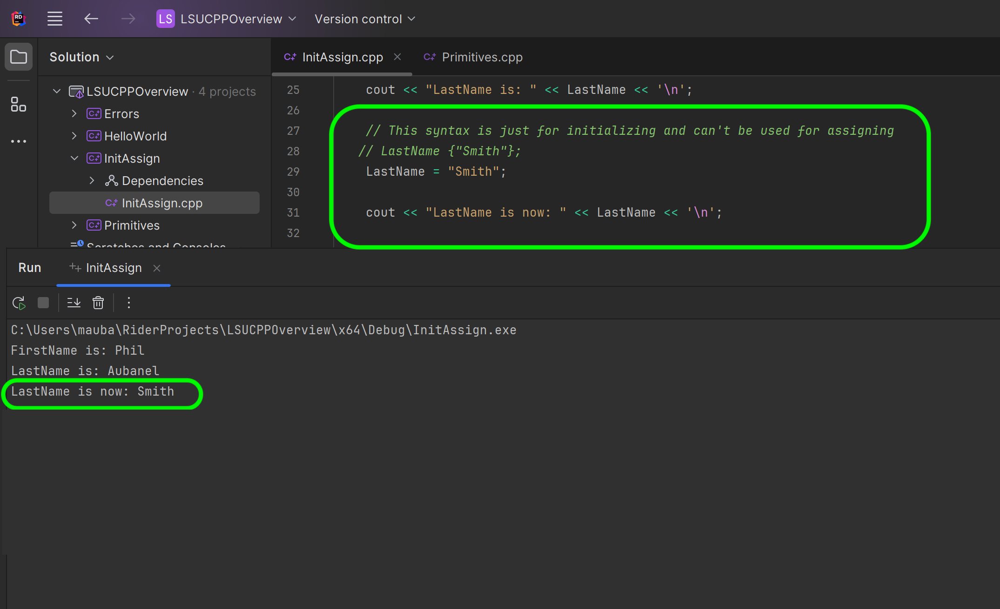

##### `Step 8.`\|`CPPOVR`| :small_orange_diamond: :small_blue_diamond: :small_blue_diamond: :small_blue_diamond:

Now we can also declare a variable without initializing it. So here we have a `double TemperatureUninit` without an initilalizer.  Now on line 34 when we go to output it to the console we get an error saying this was not initialized.  If this variable was accessed dynamically during a game it would crash the simulation.  So it is a good idea to always initialize the variable at the same time or close to where you declare it.

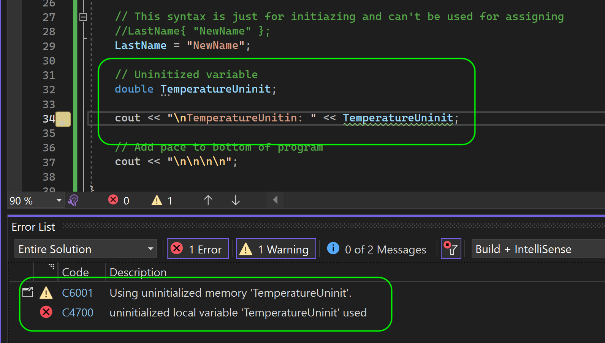

##### `Step 9.`\|`CPPOVR`| :small_orange_diamond: :small_blue_diamond: :small_blue_diamond: :small_blue_diamond: :small_blue_diamond:

Now even if we don't know yet what value to assign we can use the default initializer for the type `{}`.  For the numerical types this defaults the number to `0` (the compiler sets it for us).

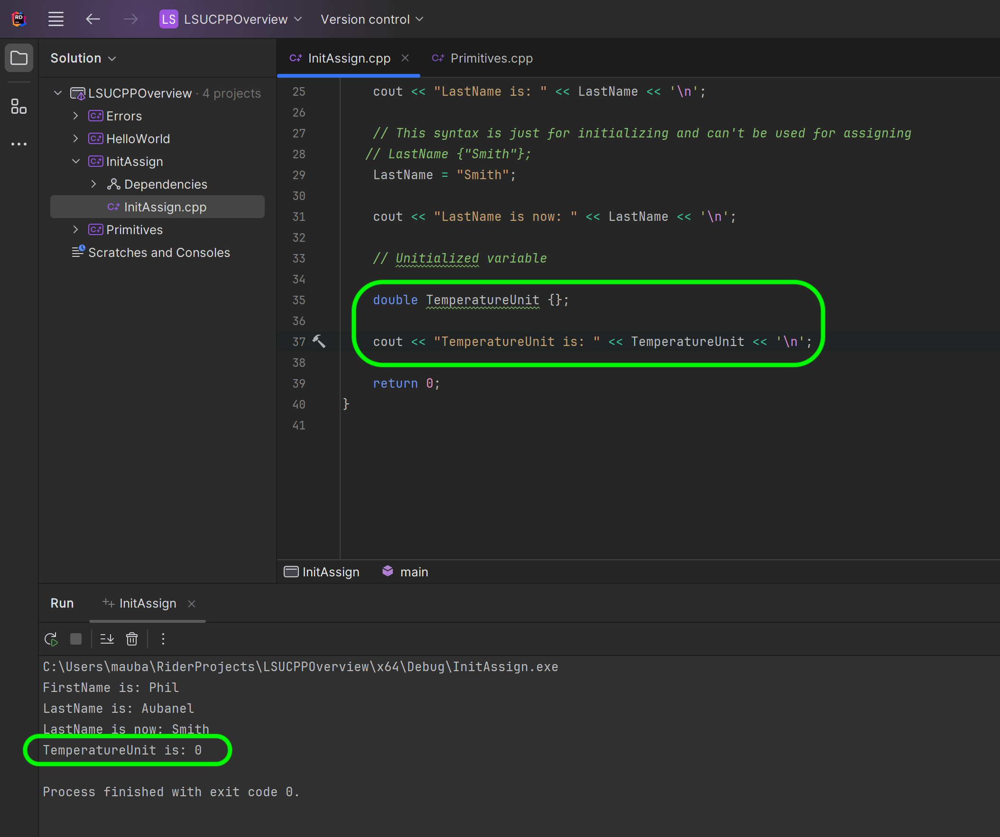

##### `Step 10.`\|`CPPOVR`| :large_blue_diamond:

We can use pretty much any literal inside the curly braces for the `{}` initializer.  So we can perform mathematical operations easily.

##### `Step 11.`\|`CPPOVR`| :large_blue_diamond: :small_blue_diamond: 

Why should we use this initializer (aside from being more intentional with our syntax)? Using {} for initialization offers several benefits, such as preventing narrowing conversions and enabling consistent initialization syntax across different types. It also helps avoid issues related to uninitialized variables.

The C++ compiler does not enforce type safety (legacy of being backwards compatible with C).  So it is up to us to make sure that that when we are initializing and assigning values between types, that we are doing it safely. 

Why are these conversions safe?

* bool to char 
* bool to int 
* bool to double 
* bool to float
* char to int 
* char to double 
* int to double

If the value is always converted to an equal or greater amount of memory (how many bytes) then it is a safe conversion.  So bool is either `0` or `1` which is represented in all forms of `char`, `int`, `uint`, `double` or `floats`. Also the largest `int` is not greater than 17 digits so it can be represented by a double. But as you noticed for very large integers it is possible that there could be a loss of precision on some computers - this is something we need to be aware of.

So in the below example we able to add a `bool` with a `char` and assign it to an `int` as these are safe conversions.

So in this case I am adding to **ascii** value of `65` (A) with a boolean of `1` (true) which will convert to `66` in the stream.

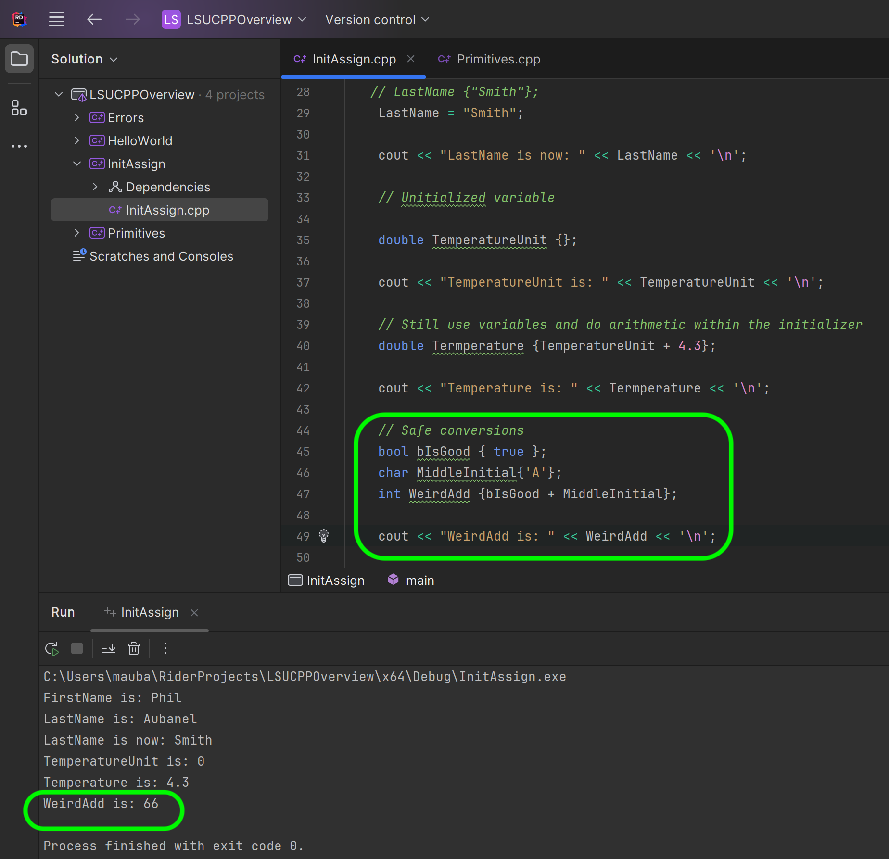

##### `Step 12.`\|`CPPOVR`| :large_blue_diamond: :small_blue_diamond: :small_blue_diamond: 

Why are these conversions unsafe?

* double to int 
* double to char 
* double to bool 
* int to char 
* int to bool 
* char to bool

Essentially we are trying to fit a gallon of liquid inside a cup.  The data type conversion is going from a larger container (number digits stored) to a smaller one.

So when we try to go from `int` to `bool` using the `=` initialization operator the compiler lets us and will convert it to `1`.  This is the downside of using `=` as the initializer.

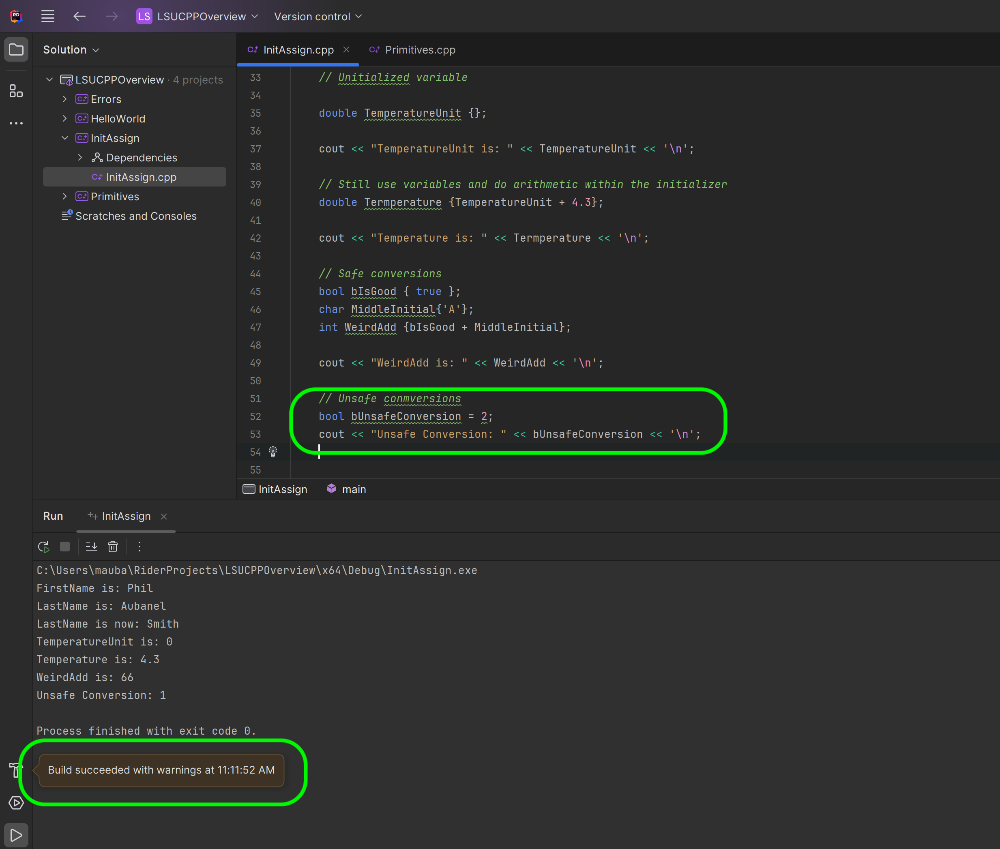

##### `Step 13.`\|`CPPOVR`| :large_blue_diamond: :small_blue_diamond: :small_blue_diamond:  :small_blue_diamond: 

So if we try and do the same things and set a `bool` using the `{}` initializer to an `int` literal of `2` - we get a compile error.  So the compiler will tell us that you are trying to make a narrowing conversion.  So it is safer to use the `{}` as the compiler will tell you when you are doing something that might not produce the result you want.

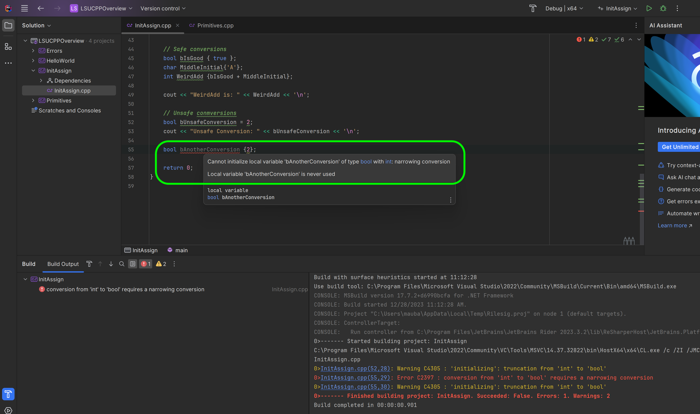

##### `Step 14.`\|`CPPOVR`| :large_blue_diamond: :small_blue_diamond: :small_blue_diamond: :small_blue_diamond:  :small_blue_diamond: 

So the safest way to initialize a variable is using the `{}` syntax as the compiler will prevent you from making a narrowing conversion at compile time.

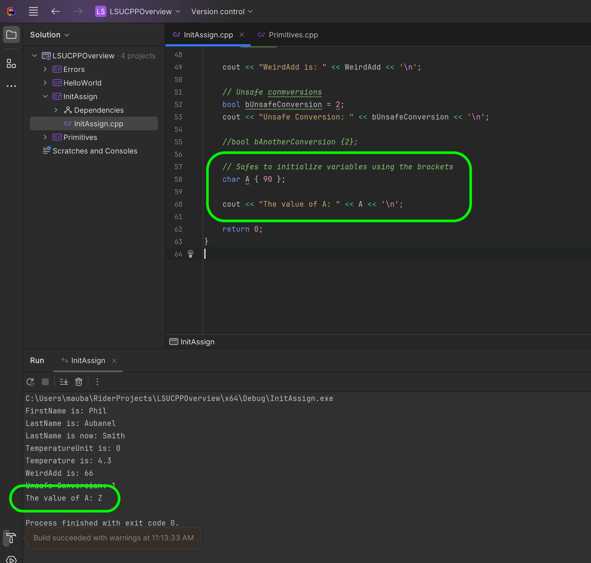

##### `Step 15.`\|`CPPOVR`| :large_blue_diamond: :small_orange_diamond: 

On the very first section where we looked at integers we could set them to a double.  Using the `{}` you will get a narrowing conversion error again, telling you that data will be lost in the initilization.

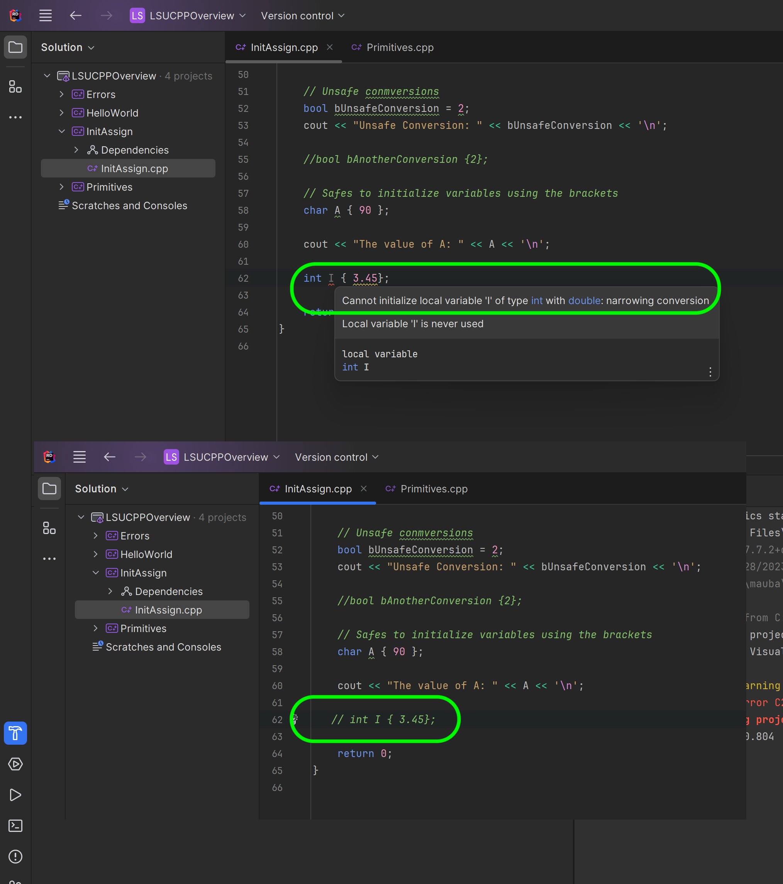

<!--  -->

| [previous](../bools/README.md#user-content-primitive-data-types---bools-and-unsigned-ints)| [home](../README.md#user-content-ue5-cpp-overview) | [next](../)|
|---|---|---|
