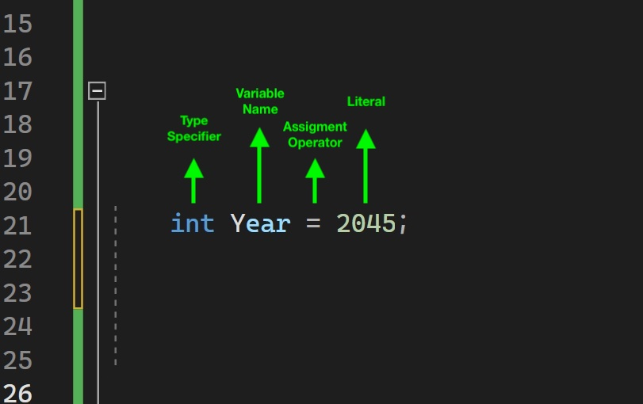
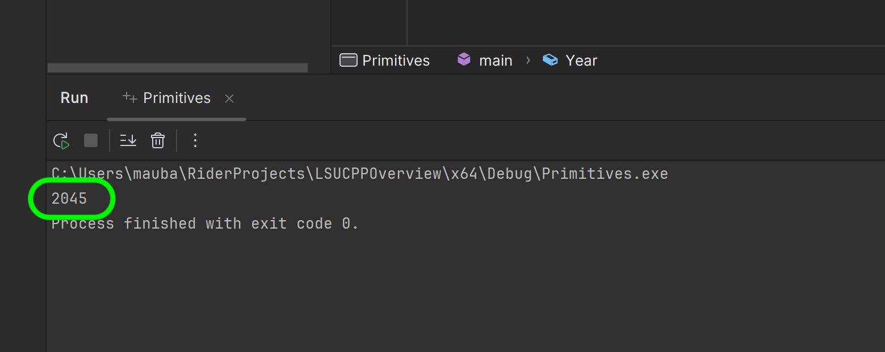
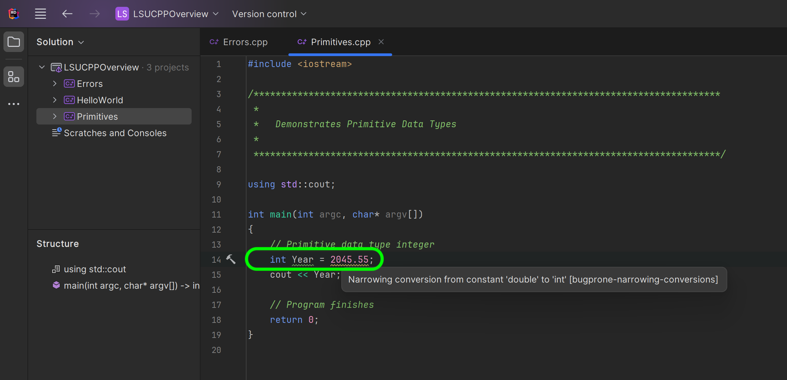
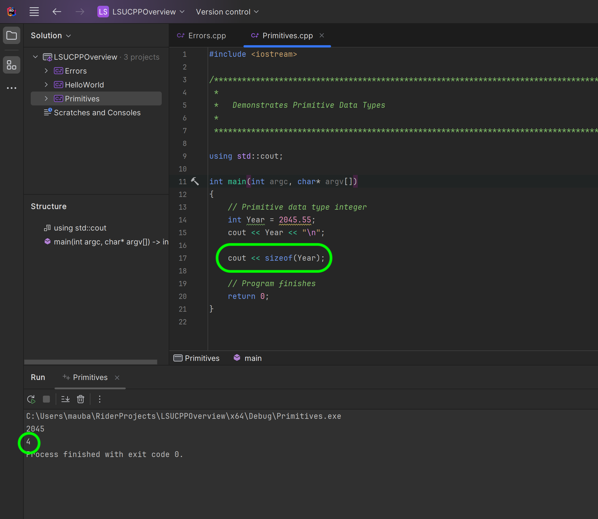

### Primitive Data Types - Integers

[previous](../errors/README.md#user-content-errors) • [home](../README.md#user-content-ue5-cpp-overview) • [next](../strings/README.md#user-content-primitive-data-types---chars--strings)

Information can be read and written from computer memory, that we see as RAM (Random Access Memory).  It needs to read from somewhere in memory.  It reads from a **place** called an **object** which is a region of memory of a specific size that holds information of a data type.

There are [primitive data types](https://www.geeksforgeeks.org/cpp-data-types/) that can be used natively in C++ without loading other libraries.  Let's look at a few of them.

### Integer

[Integers](https://www.mathsisfun.com/whole-numbers.html) are whole numbers without a fractional component.  This can include both negative and positive numbers. How do we read and write to this data type?  We name this object space with a **variable** then assign the variable with the assignment operator `=` a value (such as `2019`).  In a statement, this would look like `year = 2019;`.  We have a varible called `year` and it stores the **integer** `2019`.

How is `42` represented in a computer.  It is represented as a [binary](https://www.computerhope.com/jargon/b/binary.htm) value.  The system we use day to day is the decimal system which is base 10.  We start at 0, got 9 then add a digit 1 then start at 0 again (1, 2, 3, 4, 5, 6, 7, 8, 9, 10 etc..)

Binary is base 2 so it starts at 0 then goes to 1 then adds a digit 1 then goes back to 0.  

A bit represents a binary number of `0` or `1`.  A byte represents 8 bits (`00100100` is an example of a byte of data).

| Decimal &nbsp; &nbsp;| Binary &nbsp; &nbsp; &nbsp; &nbsp;|
| ----------| -------------|
| 0 | 0 |
| 1 | 1 | 
| 2 | 10 |
| 3 | 11 |
| 4 | 100 |
| 5 | 101 |

An integer *typically* requires 4 bytes (32 bits) of memory enough space to hold 2(4 * 8). or 232 which would represent a signed number of -`2147483648` to `2147483647`.

 

---

##### `Step 1.`\|`CPPOVR`|:small_blue_diamond:

Right click on the solution and select **Add | New Project...** and select an **Empty Project** that is in **C++**.  Press the <kbd>Next</kbd> button.

##### `Step 2.`\|`CPPOVR`|:small_blue_diamond: :small_blue_diamond: 

Name the project `Primitives` and put it in your working project folder.  Press the <kbd>Create</kbd> button.

##### `Step 3.`\|`CPPOVR`|:small_blue_diamond: :small_blue_diamond: :small_blue_diamond:

Right click on the **Primitives** project and **Add | New Item...** and call this item `Primitives.cpp`.  

##### `Step 4.`\|`CPPOVR`|:small_blue_diamond: :small_blue_diamond: :small_blue_diamond: :small_blue_diamond:

Add comments to the top.  Multiline comments use `/*` to start the comments and `*/` to end them.  This way we can clearly explain what the cpp file is supposed to do. Also, we need `std::cout` so lest `#include <iostream>` so we can use this object class.

##### `Step 5.`\|`CPPOVR`| :small_orange_diamond:

Nonw instead of always typing `std::cout` we can put before our **Main()** function a `using` directive to state that when we are using `cout` we mean `std::cout`.  This eliminates the ability to use this name in our project though. Then lets add a `main()` function that will run first and create an integer variable called `Year`.  Inside that we will assign the value `2045`. 

##### `Step 6.`\|`CPPOVR`| :small_orange_diamond: :small_blue_diamond:

In C++, a **variable** is a named storage location in memory that holds a value, which can change during the program's execution. It is a way to store data that can be used or manipulated later in the program.

Variable names are chosen to describe the type of data stored in them and are usually defined by the programmer. Examples of types of data stored in variables include integers, floating point numbers, characters and strings.

In C++ we need to define the type with a type specifier, then a variable name.  We then use the assignment operator `=` and assign a literal value to the variable.

So when we initialize a variable we need to have the following components, we are declaring and defining the variable in one step:

`type-specifier variable_name = literal_value;`

You can also just declare a variable without defining it.  But it will need to be defined before it is used.

`type-spedifier variable_name; `

Memory is alocated based on the size required by the type. So in the case of an integer, typtically 4 bytes.

* A variable cannot have spaces (but you can use underscore).
* The name cannot start with a number
* It can be up to 255 characters long
* It is caps sensitive, so `a` is different from `A`

Now each team uses a coding style so that makes it easier to work as a group.  In Unreal their [coding standards](https://docs.unrealengine.com/en-us/Programming/Development/CodingStandard) say:

> The first letter of each word in a name (such as type name or variable name) is capitalized, and there is usually no underscore between words. For example, `Health` and `UPrimitiveComponent` are correct, but not `lastMouseCoordinates` or `delta_coordinates`. - [Unreal Manual](https://docs.unrealengine.com/en-us/Programming/Development/CodingStandard#namingconventions)

##### `Step 7.`\|`CPPOVR`| :small_orange_diamond: :small_blue_diamond: :small_blue_diamond:

Before we run it we need to click on the project name **Primitives** and select **Set as Startup Project**.

##### `Step 8.`\|`CPPOVR`| :small_orange_diamond: :small_blue_diamond: :small_blue_diamond: :small_blue_diamond:

Now if you compile and run you will get it to print the literal value stored in the variable name. 

##### `Step 9.`\|`CPPOVR`| :small_orange_diamond: :small_blue_diamond: :small_blue_diamond: :small_blue_diamond: :small_blue_diamond:

Now when we do not use a `.`, the literal is type *integer*.  If we use a decimal points `2045.55` it is literal type *double*.  So what happens if we define our declared integer with a double value what happens?

##### `Step 10.`\|`CPPOVR`| :large_blue_diamond:

Run the program and you will notice that it only stores the *integer* portion of the *double* fractional value. So it only stores and prints to the stream the integer portion. So it is automatically casting from type double to type integer.

##### `Step 11.`\|`CPPOVR`| :large_blue_diamond: :small_blue_diamond: 

The compiler doesn't let us capitalize the data type.  You will see when we start programming in Unreal that they have declared their own data types.  Their data types start with capital letters.

So change `int` to `Int` and it will no longer compile.

##### `Step 12.`\|`CPPOVR`| :large_blue_diamond: :small_blue_diamond: :small_blue_diamond: 

Now the size of an integer is OS/Compiler specific so it is not consistent across all devices.  Normally it is 4 bytes. So lets print another line with `cout`.  We will use the escaped newline `"\n"` to perform a carriage return (new line).  Then we will pass the variable to the primitive function `size_of()` which will return us the size of the variable in **bytes** (remember 8 bits per byte). So on my PC, in C++ 17 in Windows 11 -  it is 4 bytes (but this size is not guaranteed).

<!--  -->

| [previous](../errors/README.md#user-content-errors)| [home](../README.md#user-content-ue5-cpp-overview) | [next](../strings/README.md#user-content-primitive-data-types---chars--strings)|
|---|---|---|
