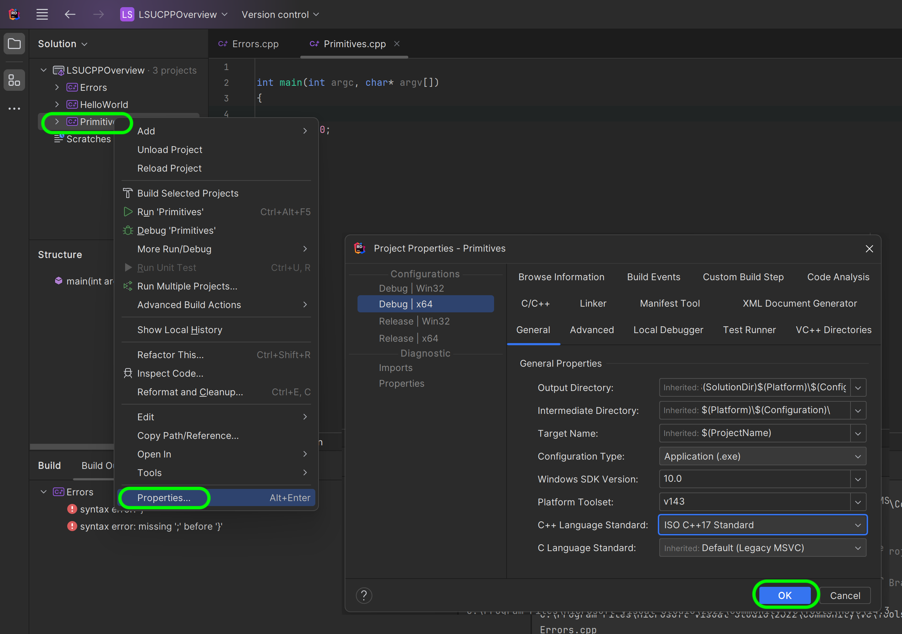

### Primitive Data Types - Integers

[previous](../errors/README.md#user-content-errors) • [home](../README.md#user-content-ue5-cpp-overview) • [next](../)

Information can be read and written from computer memory, that we see as RAM (Random Access Memory).  It needs to read from somewhere in memory.  It reads from a **place** called an **object** which is a region of memory of a specific size that holds information of a data type.

There are [primitive data types](https://www.geeksforgeeks.org/cpp-data-types/) that can be used natively in C++ without loading other libraries.  Let's look at a few of them.

### Integer

[Integers](https://www.mathsisfun.com/whole-numbers.html) are whole numbers without a fractional component.  This can include both negative and positive numbers. How do we read and write to this data type?  We name this object space with a **variable** then assign the variable with the assignment operator `=` a value (such as `2019`).  In a statement, this would look like `year = 2019;`.  We have a varible called `year` and it stores the **integer** `2019`.

How is `42` represented in a computer.  It is represented as a [binary](https://www.computerhope.com/jargon/b/binary.htm) value.  The system we use day to day is the decimal system which is base 10.  We start at 0, got 9 then add a digit 1 then start at 0 again (1, 2, 3, 4, 5, 6, 7, 8, 9, 10 etc..)

Binary is base 2 so it starts at 0 then goes to 1 then adds a digit 1 then goes back to 0.  

A bit represents a binary number of `0` or `1`.  A byte represents 8 bits (`00100100` is an example of a byte of data).

| Decimal &nbsp; &nbsp;| Binary &nbsp; &nbsp; &nbsp; &nbsp;|
| ----------| -------------|
| 0 | 0 |
| 1 | 1 | 
| 2 | 10 |
| 3 | 11 |
| 4 | 100 |
| 5 | 101 |

An integer *typically* requires 4 bytes (32 bits) of memory enough space to hold 2(4 * 8). or 232 which would represent a signed number of -`2147483648` to `2147483647`.

 

---

##### `Step 1.`\|`CPPOVR`|:small_blue_diamond:

Right click on the solution and select **Add | New Project...** and select an **Empty Project** that is in **C++**.  Press the <kbd>Next</kbd> button.

##### `Step 2.`\|`CPPOVR`|:small_blue_diamond: :small_blue_diamond: 

Name the project `Primitives` and put it in your working project folder.  Press the <kbd>Create</kbd> button.

##### `Step 3.`\|`CPPOVR`|:small_blue_diamond: :small_blue_diamond: :small_blue_diamond:

Right click on the **Primitives** project and **Add | New Item...** and call this item `Primitives.cpp`.  

##### `Step 4.`\|`CPPOVR`|:small_blue_diamond: :small_blue_diamond: :small_blue_diamond: :small_blue_diamond:

Add comments to the top.  Multiline comments use `/*` to start the comments and `*/` to end them.  This way we can clearly explain what the cpp file is supposed to do.

##### `Step 5.`\|`CPPOVR`| :small_orange_diamond:

##### `Step 6.`\|`CPPOVR`| :small_orange_diamond: :small_blue_diamond:

##### `Step 7.`\|`CPPOVR`| :small_orange_diamond: :small_blue_diamond: :small_blue_diamond:

##### `Step 8.`\|`CPPOVR`| :small_orange_diamond: :small_blue_diamond: :small_blue_diamond: :small_blue_diamond:

##### `Step 9.`\|`CPPOVR`| :small_orange_diamond: :small_blue_diamond: :small_blue_diamond: :small_blue_diamond: :small_blue_diamond:

##### `Step 10.`\|`CPPOVR`| :large_blue_diamond:

##### `Step 11.`\|`CPPOVR`| :large_blue_diamond: :small_blue_diamond: 

##### `Step 12.`\|`CPPOVR`| :large_blue_diamond: :small_blue_diamond: :small_blue_diamond: 

##### `Step 13.`\|`CPPOVR`| :large_blue_diamond: :small_blue_diamond: :small_blue_diamond:  :small_blue_diamond: 

##### `Step 14.`\|`CPPOVR`| :large_blue_diamond: :small_blue_diamond: :small_blue_diamond: :small_blue_diamond:  :small_blue_diamond: 

##### `Step 15.`\|`CPPOVR`| :large_blue_diamond: :small_orange_diamond: 

##### `Step 16.`\|`CPPOVR`| :large_blue_diamond: :small_orange_diamond:   :small_blue_diamond: 

##### `Step 17.`\|`CPPOVR`| :large_blue_diamond: :small_orange_diamond: :small_blue_diamond: :small_blue_diamond:

##### `Step 18.`\|`CPPOVR`| :large_blue_diamond: :small_orange_diamond: :small_blue_diamond: :small_blue_diamond: :small_blue_diamond:

##### `Step 19.`\|`CPPOVR`| :large_blue_diamond: :small_orange_diamond: :small_blue_diamond: :small_blue_diamond: :small_blue_diamond: :small_blue_diamond:

##### `Step 20.`\|`CPPOVR`| :large_blue_diamond: :large_blue_diamond:

##### `Step 21.`\|`CPPOVR`| :large_blue_diamond: :large_blue_diamond: :small_blue_diamond:

<!--  -->

| [previous](../errors/README.md#user-content-errors)| [home](../README.md#user-content-ue5-cpp-overview) | [next](../)|
|---|---|---|
