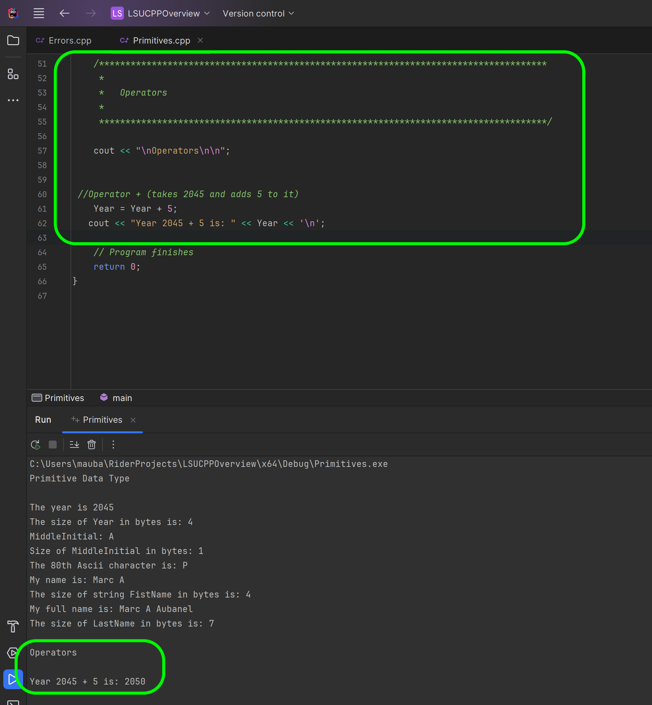
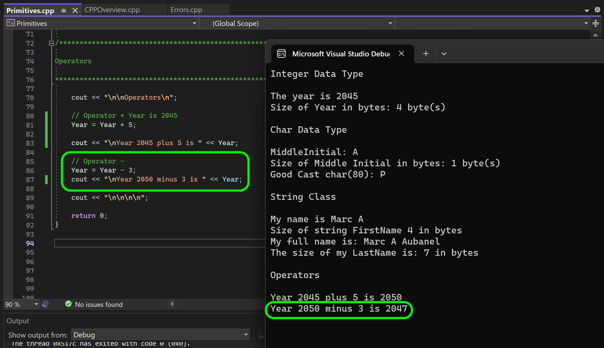

### Arithmetic Operators

[previous](../strings/README.md#user-content-primitive-data-types---chars--strings) • [home](../README.md#user-content-ue5-cpp-overview) • [next](../)

Arithmetic operators in C++ are symbols that allow you to perform mathematical calculations on numbers. They are used to add, subtract, multiply, divide, modulo and perform other operations on numeric values. Here are the common arithmetic operators in C++:

1. **Addition** (+): The addition operator is used to add two numbers together. For example, `2 + 3` would give the result of `5`.

2. **Subtraction** (-): The subtraction operator is used to subtract one number from another. For example, `5 - 2` would give the result of `3`.

3. **Multiplication** (*): The multiplication operator is used to multiply two numbers. For example, `2 * 3` would give the result of `6`.

4. **Division** (/): The division operator is used to divide one number by another. For example, `6 / 2` would give the result of `3`. 

5. **Modulo** (%): The modulo operator calculates the remainder (whole number) after division. For example, `7 % 3` would give the result of `1`, because 7 divided by 3 leaves a remainder of 1.

6. Increment (++) and Decrement (--): The increment operator `++` is used to increase the value of a variable by `1`, while the decrement operator `--` decreases it by `1`. For example, if x is initially 3, then `x++` would make x equal to `4`, and `x-- `would make it `2`.

These arithmetic operators allow you to perform basic mathematical operations in C++ and are commonly used in calculations, formulae, and other mathematical tasks in programming.

 

---

##### `Step 1.`\|`CPPOVR`|:small_blue_diamond:

Add an operator comment to separate the code then add a title `Operators` to the program.  The let's look at the addition operator.  Our `Year` variable is set to `2045`. So if we take the literal `Year + 5` and assign it to `Year` with the assignment operator `Year = Year + 5` we replace the old value with the addition of `2045 + 5` which should give us `2050`. Try it out yourself.

##### `Step 2.`\|`CPPOVR`|:small_blue_diamond: :small_blue_diamond: 

Now we can do the same thing with a subtraction operator so a literal of `2050 - 3` becomes `2047`. 

##### `Step 3.`\|`CPPOVR`|:small_blue_diamond: :small_blue_diamond: :small_blue_diamond:

##### `Step 4.`\|`CPPOVR`|:small_blue_diamond: :small_blue_diamond: :small_blue_diamond: :small_blue_diamond:

##### `Step 5.`\|`CPPOVR`| :small_orange_diamond:

##### `Step 6.`\|`CPPOVR`| :small_orange_diamond: :small_blue_diamond:

##### `Step 7.`\|`CPPOVR`| :small_orange_diamond: :small_blue_diamond: :small_blue_diamond:

##### `Step 8.`\|`CPPOVR`| :small_orange_diamond: :small_blue_diamond: :small_blue_diamond: :small_blue_diamond:

##### `Step 9.`\|`CPPOVR`| :small_orange_diamond: :small_blue_diamond: :small_blue_diamond: :small_blue_diamond: :small_blue_diamond:

##### `Step 10.`\|`CPPOVR`| :large_blue_diamond:

##### `Step 11.`\|`CPPOVR`| :large_blue_diamond: :small_blue_diamond: 

##### `Step 12.`\|`CPPOVR`| :large_blue_diamond: :small_blue_diamond: :small_blue_diamond: 

##### `Step 13.`\|`CPPOVR`| :large_blue_diamond: :small_blue_diamond: :small_blue_diamond:  :small_blue_diamond: 

##### `Step 14.`\|`CPPOVR`| :large_blue_diamond: :small_blue_diamond: :small_blue_diamond: :small_blue_diamond:  :small_blue_diamond: 

##### `Step 15.`\|`CPPOVR`| :large_blue_diamond: :small_orange_diamond: 

##### `Step 16.`\|`CPPOVR`| :large_blue_diamond: :small_orange_diamond:   :small_blue_diamond: 

##### `Step 17.`\|`CPPOVR`| :large_blue_diamond: :small_orange_diamond: :small_blue_diamond: :small_blue_diamond:

##### `Step 18.`\|`CPPOVR`| :large_blue_diamond: :small_orange_diamond: :small_blue_diamond: :small_blue_diamond: :small_blue_diamond:

##### `Step 19.`\|`CPPOVR`| :large_blue_diamond: :small_orange_diamond: :small_blue_diamond: :small_blue_diamond: :small_blue_diamond: :small_blue_diamond:

##### `Step 20.`\|`CPPOVR`| :large_blue_diamond: :large_blue_diamond:

##### `Step 21.`\|`CPPOVR`| :large_blue_diamond: :large_blue_diamond: :small_blue_diamond:

<!--  -->

| [previous](../strings/README.md#user-content-primitive-data-types---chars--strings)| [home](../README.md#user-content-ue5-cpp-overview) | [next](../)|
|---|---|---|
