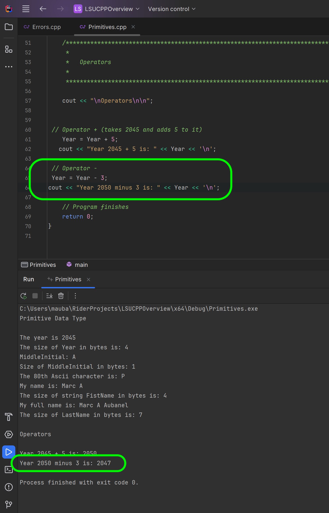
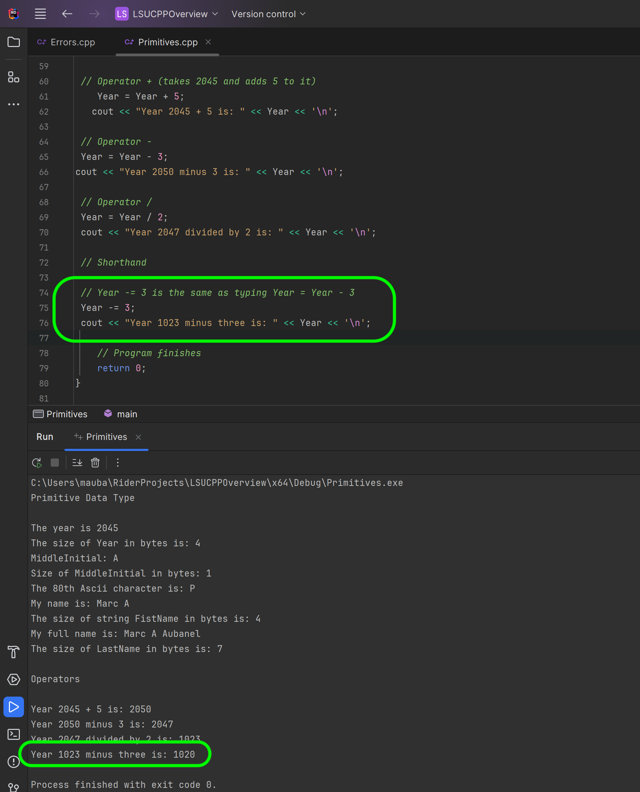
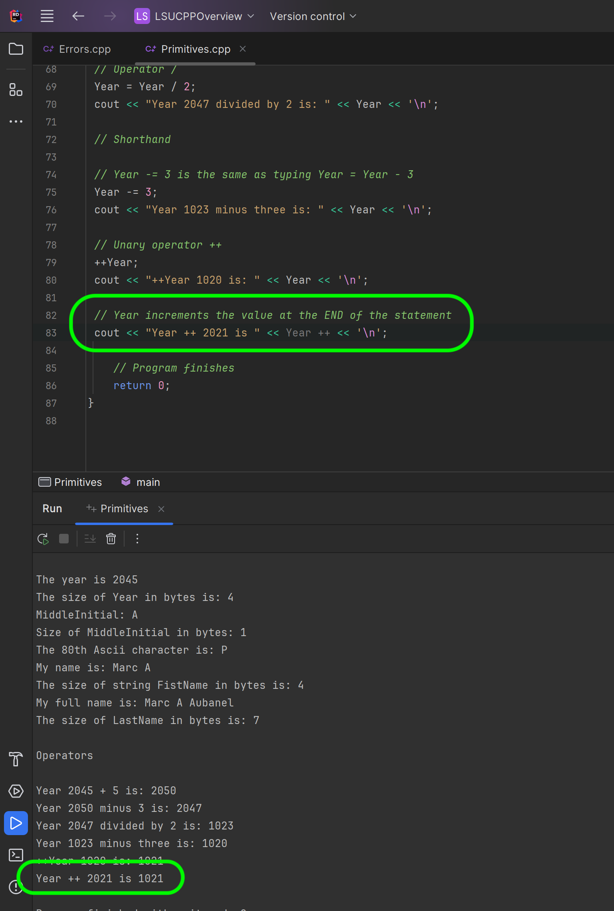
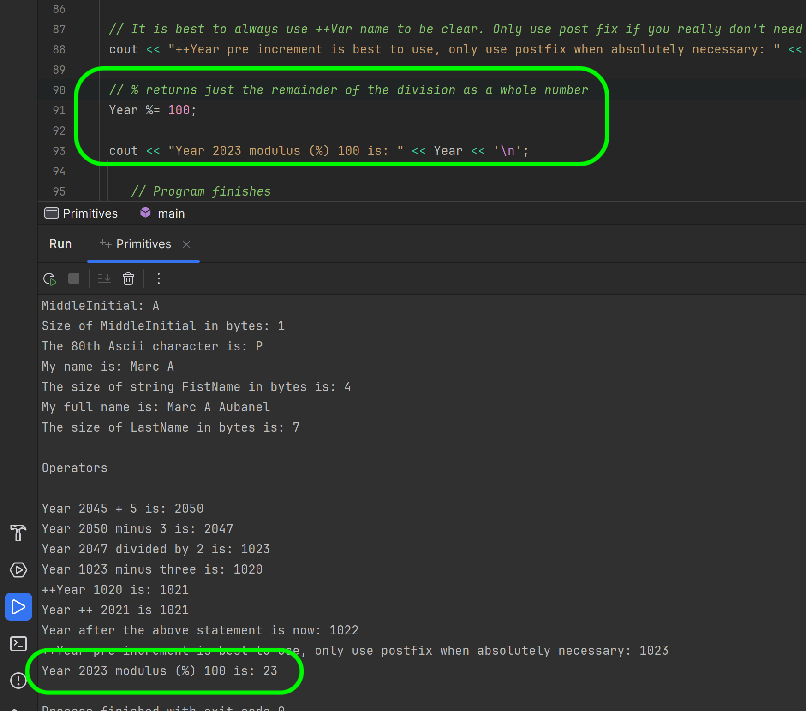

### Arithmetic Operators

[previous](../strings/README.md#user-content-primitive-data-types---chars--strings) • [home](../README.md#user-content-ue5-cpp-overview) • [next](../)

Arithmetic operators in C++ are symbols that allow you to perform mathematical calculations on numbers. They are used to add, subtract, multiply, divide, modulo and perform other operations on numeric values. Here are the common arithmetic operators in C++:

1. **Addition** (+): The addition operator is used to add two numbers together. For example, `2 + 3` would give the result of `5`.

2. **Subtraction** (-): The subtraction operator is used to subtract one number from another. For example, `5 - 2` would give the result of `3`.

3. **Multiplication** (*): The multiplication operator is used to multiply two numbers. For example, `2 * 3` would give the result of `6`.

4. **Division** (/): The division operator is used to divide one number by another. For example, `6 / 2` would give the result of `3`. 

5. **Modulo** (%): The modulo operator calculates the remainder (whole number) after division. For example, `7 % 3` would give the result of `1`, because 7 divided by 3 leaves a remainder of 1.

6. Increment (++) and Decrement (--): The increment operator `++` is used to increase the value of a variable by `1`, while the decrement operator `--` decreases it by `1`. For example, if x is initially 3, then `x++` would make x equal to `4`, and `x-- `would make it `2`.

These arithmetic operators allow you to perform basic mathematical operations in C++ and are commonly used in calculations, formulae, and other mathematical tasks in programming.

 

---

##### `Step 1.`\|`CPPOVR`|:small_blue_diamond:

Add an operator comment to separate the code then add a title `Operators` to the program.  The let's look at the addition operator.  Our `Year` variable is set to `2045`. So if we take the literal `Year + 5` and assign it to `Year` with the assignment operator `Year = Year + 5` we replace the old value with the addition of `2045 + 5` which should give us `2050`. Try it out yourself.

##### `Step 2.`\|`CPPOVR`|:small_blue_diamond: :small_blue_diamond: 

Now we can do the same thing with a subtraction operator so a literal of `2050 - 3` (Year - 3) becomes `2047`. 

##### `Step 3.`\|`CPPOVR`|:small_blue_diamond: :small_blue_diamond: :small_blue_diamond:

Now we take the literal `2047 / 2` and it returns `1023` because we are dividing two **integer literals** and assigning them to an **integer**.  So even though mathmatically `2047 / 2 = 1023.5` - the **integer** ignores the fractional part of the division.

##### `Step 4.`\|`CPPOVR`|:small_blue_diamond: :small_blue_diamond: :small_blue_diamond: :small_blue_diamond:

We can be more efficient with our sytax and express `Year = Year - 3` in a more compact form. Now we can accomplish the same result in a more compact for with the `-=` assignment operator. 

“-”:This operator is combination of ‘-’ arithmetic operator and ‘=’ assignment operator (no space inbetween). This operator first adds the current value of the variable on left to the value on right and then assigns the result to the variable on the left. 

This also works for `+=`, `*=`, `/=` and `%=`.

Press the run button and you will notice that this produces the exact same result in a terser form.

##### `Step 5.`\|`CPPOVR`| :small_orange_diamond:

C++ also has unary oparators.  These add or subtract `1` from the number. `++Variable` increments inline the value of the variable by `+1` so `50` would become `51`.  When you place the `++` before the variable name, this is called pre-increment variable. It increments the variable right away.

##### `Step 6.`\|`CPPOVR`| :small_orange_diamond: :small_blue_diamond:

Now if we place the `++` after the variable name it is a `post-increment` operator.  This will only the value in the variable **AFTER** the statement is run (after it reaches the `;`).  So in this case the year printed is not updating as it will happen **after** line 104 executes.

##### `Step 7.`\|`CPPOVR`| :small_orange_diamond: :small_blue_diamond: :small_blue_diamond:

So on the next line 105, the `Year` variable has now incremented by `1`.  The same rules apply to `--` you can try this on your own.

##### `Step 8.`\|`CPPOVR`| :small_orange_diamond: :small_blue_diamond: :small_blue_diamond: :small_blue_diamond:

The modulo operator (%) in C++ is used to calculate the remainder when one number is divided by another. It returns the remainder as the result as a whole number.

Let's say you have two numbers, a and b. When you perform the operation a % b, C++ divides a by b and gives you the remainder.

For example, let's consider `A = 7;` and `B = 3;`. When you calculate `A % B`, C++ **divides 7 by 3**, which gives you **2** with a remainder of **1.** Therefore, the result of `7 % 3` is `1`.

Similarly, if you have `A = 12; `and `B = 5;`, `A % B` will give you `2` because **12 divided by 5** is **2** with a remainder of **2**.

The modulo operator is often used in various applications. For example, you can use it to check if a number is divisible by another number. If the result of `A % B` is `0`, it means that A is evenly divisible by B. Otherwise, if the result is non-zero, it indicates that there is a remainder and A is not divisible by B.

Another common use of in games of the modulo operator is in a programming tasks that require cycling or wrapping around values. For instance, if you want to ensure that a number stays within a specific range, you can use the modulo operator to wrap it back to the range by taking the remainder.

Overall, the modulo operator provides a simple way to find the remainder of a division operation, and it has various practical applications in programming.

##### `Step 9.`\|`CPPOVR`| :small_orange_diamond: :small_blue_diamond: :small_blue_diamond: :small_blue_diamond: :small_blue_diamond:

##### `Step 10.`\|`CPPOVR`| :large_blue_diamond:

##### `Step 11.`\|`CPPOVR`| :large_blue_diamond: :small_blue_diamond: 

##### `Step 12.`\|`CPPOVR`| :large_blue_diamond: :small_blue_diamond: :small_blue_diamond: 

##### `Step 13.`\|`CPPOVR`| :large_blue_diamond: :small_blue_diamond: :small_blue_diamond:  :small_blue_diamond: 

##### `Step 14.`\|`CPPOVR`| :large_blue_diamond: :small_blue_diamond: :small_blue_diamond: :small_blue_diamond:  :small_blue_diamond: 

##### `Step 15.`\|`CPPOVR`| :large_blue_diamond: :small_orange_diamond: 

##### `Step 16.`\|`CPPOVR`| :large_blue_diamond: :small_orange_diamond:   :small_blue_diamond: 

##### `Step 17.`\|`CPPOVR`| :large_blue_diamond: :small_orange_diamond: :small_blue_diamond: :small_blue_diamond:

##### `Step 18.`\|`CPPOVR`| :large_blue_diamond: :small_orange_diamond: :small_blue_diamond: :small_blue_diamond: :small_blue_diamond:

##### `Step 19.`\|`CPPOVR`| :large_blue_diamond: :small_orange_diamond: :small_blue_diamond: :small_blue_diamond: :small_blue_diamond: :small_blue_diamond:

##### `Step 20.`\|`CPPOVR`| :large_blue_diamond: :large_blue_diamond:

##### `Step 21.`\|`CPPOVR`| :large_blue_diamond: :large_blue_diamond: :small_blue_diamond:

<!--  -->

| [previous](../strings/README.md#user-content-primitive-data-types---chars--strings)| [home](../README.md#user-content-ue5-cpp-overview) | [next](../)|
|---|---|---|
