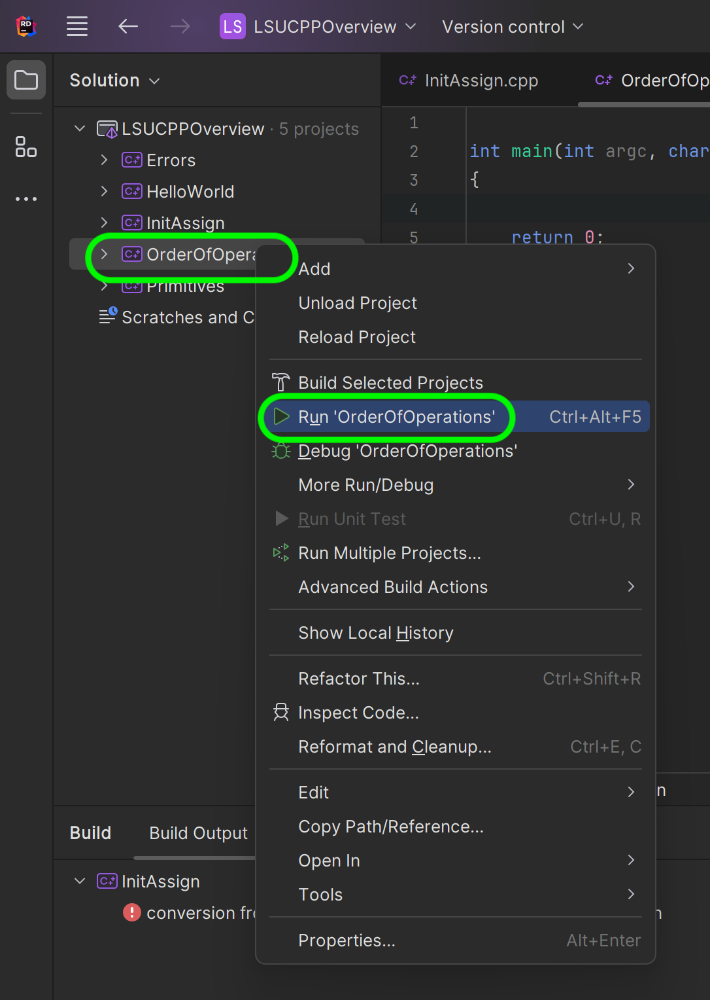
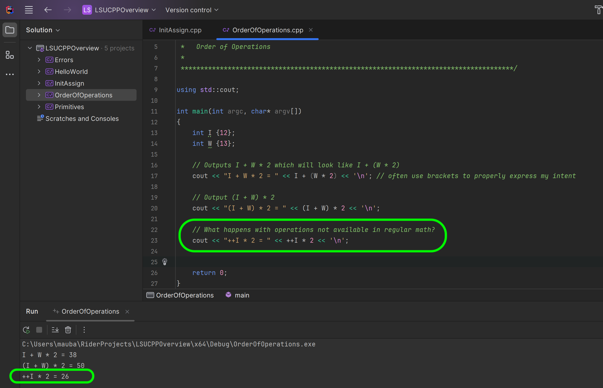

### Order of Operations

[previous](../init/README.md#user-content-initialization) • [home](../README.md#user-content-ue5-cpp-overview) • [next](../)

The C++ compiler will perform mathematical operations in the [correct order](https://en.cppreference.com/w/cpp/language/operator_precedence).  Look at the link to get a full description of what order of operations C++ uses on non-mathematical operations.

Operator precedence: C++ follows the standard mathematical operator precedence rules, such as multiplication and division being evaluated before addition and subtraction. However, if you have a complex expression with multiple operators, it's important to use parentheses to clarify the intended order of operations.
 

---

##### `Step 1.`\|`CPPOVR`|:small_blue_diamond:

Right click on the solution and select **Add | New Project...** then select a C++ **Empty Project** and press the <kbd>Next</kbd> button. Call the new project `OrderOfOps` and press the <kbd>Create</kbd> button.

##### `Step 2.`\|`CPPOVR`|:small_blue_diamond: :small_blue_diamond: 

*Right click* on **OrderOfOps** project and select **Add | New Item...** and call this new file `OrderOfOps.cpp`. Press the <kbd>Add</kbd> button to add this file to your **Source** folder.

##### `Step 3.`\|`CPPOVR`|:small_blue_diamond: :small_blue_diamond: :small_blue_diamond:

*Right click* on **OrderOfOps** project and select **Set as Startup Project** so this is the one that runs with the `main(){}` function.

##### `Step 4.`\|`CPPOVR`|:small_blue_diamond: :small_blue_diamond: :small_blue_diamond: :small_blue_diamond:

Add a comment at the top of the project and include <iostream> and add a `main(){}` function.  Then we will do the following arithmetic: `12 + 13 * 2`.  So C++ will follow mathematical order of operations and will multiply `13 * 2` first then add `12` which will give us a answer of `38`.

##### `Step 5.`\|`CPPOVR`| :small_orange_diamond:

In mathematics and programming, parentheses are used to indicate the grouping of operations and specify the order of evaluation. When an expression contains multiple sets of parentheses, the innermost parentheses are evaluated first, followed by the outer ones. This concept is known as the "order of operations" or "operator precedence."

The order of operations is typically represented by the acronym PEMDAS (or BODMAS), which stands for:

1. Parentheses: Operations within parentheses are evaluated first. Any expression enclosed in parentheses is treated as a separate unit and takes precedence over other operations.

2. Exponents (or Powers): After evaluating parentheses, exponents are calculated. Exponentiation involves raising a number to a power. For example, in the expression `2^3`, the exponentiation operation raises 2 to the power of 3, resulting in 8.

3. Multiplication and Division: After evaluating parentheses and exponents, multiplication and division operations are performed from left to right. These operations are given equal precedence, so they are evaluated in the order they appear in the expression.

4. Addition and Subtraction: Lastly, addition and subtraction operations are performed from left to right. Like multiplication and division, these operations have equal precedence and are evaluated in the order they appear.

It's important to note that parentheses can be nested, meaning that there can be multiple levels of parentheses within an expression. In such cases, the innermost set of parentheses is evaluated first, followed by the outer sets, moving outward until the entire expression is evaluated.

Here's an example to illustrate the order of operations using parentheses:

Expression: `(12 + 13) * 2`

1. Evaluate the innermost set of parentheses: `(12 + 13)` equals `25`.
2. Perform multiplication: `25 * 2` equals `50`.

By using parentheses to explicitly group operations, you can control the order in which they are evaluated, ensuring that your expressions are calculated correctly according to the intended logic. It is sometimes good to include parenthesis such as 12 + (13 * 2) even if not necessary to be very explicit about what you are doing.

##### `Step 6.`\|`CPPOVR`| :small_orange_diamond: :small_blue_diamond:

We have to be careful when using expressions as there are no standard mathematical rules for them.  When using expressions you may not get what you think.  So `++I * 2` when I is equal to `12` is not the equivalent of `I + 1 * 2` (which would be 24) but it resolves it as (I + 1) * 12 even though not expressed that way.  We get a result of `26`. 

##### `Step 7.`\|`CPPOVR`| :small_orange_diamond: :small_blue_diamond: :small_blue_diamond:

##### `Step 8.`\|`CPPOVR`| :small_orange_diamond: :small_blue_diamond: :small_blue_diamond: :small_blue_diamond:

##### `Step 9.`\|`CPPOVR`| :small_orange_diamond: :small_blue_diamond: :small_blue_diamond: :small_blue_diamond: :small_blue_diamond:

##### `Step 10.`\|`CPPOVR`| :large_blue_diamond:

##### `Step 11.`\|`CPPOVR`| :large_blue_diamond: :small_blue_diamond: 

##### `Step 12.`\|`CPPOVR`| :large_blue_diamond: :small_blue_diamond: :small_blue_diamond: 

##### `Step 13.`\|`CPPOVR`| :large_blue_diamond: :small_blue_diamond: :small_blue_diamond:  :small_blue_diamond: 

##### `Step 14.`\|`CPPOVR`| :large_blue_diamond: :small_blue_diamond: :small_blue_diamond: :small_blue_diamond:  :small_blue_diamond: 

##### `Step 15.`\|`CPPOVR`| :large_blue_diamond: :small_orange_diamond: 

##### `Step 16.`\|`CPPOVR`| :large_blue_diamond: :small_orange_diamond:   :small_blue_diamond: 

##### `Step 17.`\|`CPPOVR`| :large_blue_diamond: :small_orange_diamond: :small_blue_diamond: :small_blue_diamond:

##### `Step 18.`\|`CPPOVR`| :large_blue_diamond: :small_orange_diamond: :small_blue_diamond: :small_blue_diamond: :small_blue_diamond:

##### `Step 19.`\|`CPPOVR`| :large_blue_diamond: :small_orange_diamond: :small_blue_diamond: :small_blue_diamond: :small_blue_diamond: :small_blue_diamond:

##### `Step 20.`\|`CPPOVR`| :large_blue_diamond: :large_blue_diamond:

##### `Step 21.`\|`CPPOVR`| :large_blue_diamond: :large_blue_diamond: :small_blue_diamond:

<!--  -->

| [previous](../init/README.md#user-content-initialization)| [home](../README.md#user-content-ue5-cpp-overview) | [next](../)|
|---|---|---|
