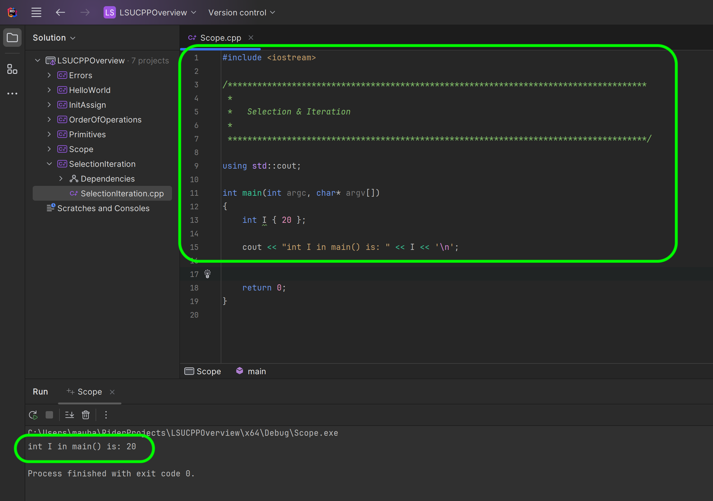
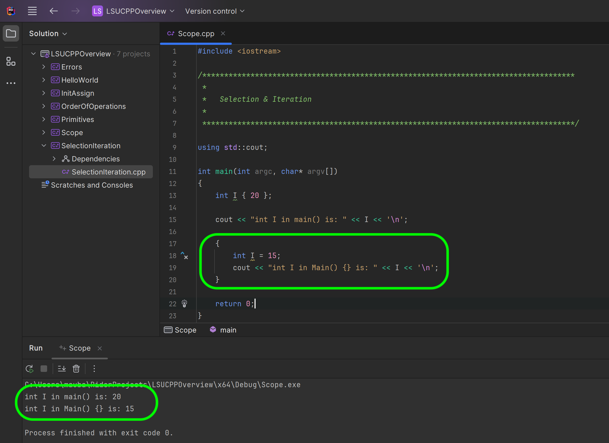

### Scope

<sub>[previous](../selection/README.md#user-content-selection-and-iteration) • [home](../README.md#user-content-ue5-cpp-overview)</sub>


Scope in C++ refers to the region or portion of code where a variable, function, or other named entity is visible and can be accessed. It defines the visibility and lifetime of an entity within a program. Here's a simple explanation of scope in C++:

Imagine a house with different rooms. Each room represents a scope in C++. Inside each room, you can have different objects like furniture, books, or toys. Similarly, in C++, variables and functions are like objects that exist within a specific scope.

We will be looking at **Block Scope**. A block is a portion of code enclosed within curly braces `{}`. Examples of blocks are if statements, for loops, or any set of braces. Variables declared inside a block have block scope and are only visible within that block. They are created when the block is entered and destroyed when the block is exited.

Nested scopes can also exist, where a block is inside another block or a function is inside another function. In such cases, the inner scope has access to entities in the outer scope, but the outer scope does not have access to entities in the inner scope.

The concept of scope helps in organizing code and preventing naming conflicts. It ensures that variables and functions are only accessible where they are needed and avoids unintended interactions between different parts of a program.

Understanding the scope of variables and functions is essential for writing maintainable and bug-free code in C++. It allows for better control over data visibility and lifetime throughout the program.

<br>

---

##### `Step 1.`\|`CPPOVR`|:small_blue_diamond:
Right click on the solution file and select **Add | New Project**.  Then select a C++ **Empty Project** and press <kbd>Next</kbd> button.  Call it `Scope` then press the <kbd>Create</kbd> button.  


##### `Step 2.`\|`CPPOVR`|:small_blue_diamond: :small_blue_diamond: 

Right click on the new **Scope** project and select `Set as Startup Project`.  


##### `Step 3.`\|`CPPOVR`|:small_blue_diamond: :small_blue_diamond: :small_blue_diamond:

Right click on the **Source** folder in the **Scope** project and *right click* and select **Add | Item...** and call it `Scope.cpp`.  Press the <kbd>Add</kbd> button.


##### `Step 4.`\|`CPPOVR`|:small_blue_diamond: :small_blue_diamond: :small_blue_diamond: :small_blue_diamond:

So lets initialize a variable `I` to `{20}`.  Now this is only accessible in the `main() {//I can only be accessed here}` function and will only be accessible between the parenthesis.  Once it returns 0 and leaves the function the memory is given back to the computer and is no longer used by the program. Remember variables are destroyed when the block is exited.




##### `Step 5.`\|`CPPOVR`| :small_orange_diamond:

Now if you remember we cannot reinitialize `I` within the same scope.  But we can put another set of `{}` to create a subscope and we can re-use the same variable name (but it will create a new piece of memory and will not overwirte the prior one).  So add:

```cpp
{
    int I { 15 };
    cout << "\nint I in main() {} is: " << I;
}
```

You will notice that it prints out the two values as expected.




##### `Step 6.`\|`CPPOVR`| :small_orange_diamond: :small_blue_diamond:

Now how can I prove that the original `I` is in scope after the subscope `I` exists.  Add a cout and see what `I` is set to.  If it is `15` thn it is one variable.  If it is `20`, then the previous I went out of scope and we see the one that is still in scope set above.


##### `Step 7.`\|`CPPOVR`| :small_orange_diamond: :small_blue_diamond: :small_blue_diamond:

Now a for loop since it uses curly braces `{}` is also in its own scope.  So we can create a third version of `I` variable that will be destryoyed when it exits the for loop.


##### `Step 8.`\|`CPPOVR`| :small_orange_diamond: :small_blue_diamond: :small_blue_diamond: :small_blue_diamond:
And again, we can print **I** after the loop and it is still set to `20` and was not affected by the lower scope in the **for** loop.


##### `Step 9.`\|`CPPOVR`| :small_orange_diamond: :small_blue_diamond: :small_blue_diamond: :small_blue_diamond: :small_blue_diamond:

If we look at the visibility of variables within nested scopes. When you have nested scopes, the innermost scope can access variables defined in the outer scopes, but the outer scopes cannot access variables defined in the inner scopes. This concept is often referred to as "lexical scoping" or "static scoping."

Lets create another nested scope to see if we can still see the **I** that is equal to `20`.


##### `Step 10.`\|`CPPOVR`| :large_blue_diamond:


##### `Step 11.`\|`CPPOVR`| :large_blue_diamond: :small_blue_diamond: 


##### `Step 12.`\|`CPPOVR`| :large_blue_diamond: :small_blue_diamond: :small_blue_diamond: 


##### `Step 13.`\|`CPPOVR`| :large_blue_diamond: :small_blue_diamond: :small_blue_diamond:  :small_blue_diamond: 


##### `Step 14.`\|`CPPOVR`| :large_blue_diamond: :small_blue_diamond: :small_blue_diamond: :small_blue_diamond:  :small_blue_diamond: 


##### `Step 15.`\|`CPPOVR`| :large_blue_diamond: :small_orange_diamond: 


##### `Step 16.`\|`CPPOVR`| :large_blue_diamond: :small_orange_diamond:   :small_blue_diamond: 


##### `Step 17.`\|`CPPOVR`| :large_blue_diamond: :small_orange_diamond: :small_blue_diamond: :small_blue_diamond:


##### `Step 18.`\|`CPPOVR`| :large_blue_diamond: :small_orange_diamond: :small_blue_diamond: :small_blue_diamond: :small_blue_diamond:


##### `Step 19.`\|`CPPOVR`| :large_blue_diamond: :small_orange_diamond: :small_blue_diamond: :small_blue_diamond: :small_blue_diamond: :small_blue_diamond:


##### `Step 20.`\|`CPPOVR`| :large_blue_diamond: :large_blue_diamond:


##### `Step 21.`\|`CPPOVR`| :large_blue_diamond: :large_blue_diamond: :small_blue_diamond:


<!--  -->


| [previous](../selection/README.md#user-content-selection-and-iteration)| [home](../README.md#user-content-ue5-cpp-overview) |
|---|---|
