### Selection and Iteration

<sub>[previous](../order/README.md#user-content-order-of-operations) • [home](../README.md#user-content-ue5-cpp-overview) • [next](../scope/README.md#user-content-scope)</sub>


In C++, there are selection and iteration operators that allow you to make decisions and repeat actions based on certain conditions. Here's a brief explanation of a selection of these operators:

**Selection Operators:**

* **if statement**: The if statement allows you to perform conditional execution of code. It evaluates a condition and executes a block of code if the condition is true. Optionally, you can include else and else if clauses to handle alternative conditions.

* pseudocode:
```cpp
if (ConditionIsTrue)
{
  //...Add logic to run if variable ConditionIsTrue is true
}
else if (anotherConditionIsTrue)
{
    //runs if first condition is false, can have as many else if's as we need
}
else
{
    // runs if all ifs and else ifs are false
}
```

* **switch statement**: The switch statement provides a way to select one of many code blocks to execute based on the value of a variable. It allows you to compare the variable against multiple cases and execute the code corresponding to the matching case. The switch statement also supports a default case for handling values that do not match any of the cases.

* pseudocode:
```cpp
switch(variable)
{
    case 1:
    // do something
    break;

    case 2: 
    // do something different
    break;

    default:
    // if none of the above cases apply always do the following
    break;
}
```

* **while loop**: The while loop repeatedly executes a block of code as long as a given condition remains true. It checks the condition before each iteration, and if the condition evaluates to true, the code block is executed. The loop continues until the condition becomes false.

* pseudocode:
```cpp
while(true)
{
    // do something
}
// the above will keep runing until the while statement changes to false

```

* **for loop**: The for loop allows you to repeatedly execute a block of code for a fixed number of iterations. It typically consists of an initialization statement, a condition for continuing the loop, an update statement, and the code to be executed in each iteration.

* pseudocode:
```cpp
for (startingpoint = some value; continue to run condition; increment startingpoint)
{
    // do something over and over until run condition above is false
}

```

<br>

---

##### `Step 1.`\|`CPPOVR`|:small_blue_diamond:

Start a brand new **Empty Project** in C++ by *right clicking* on the solution in Visual Studio 19. Call it `SelectionIteration` and press the <kbd>Create</kbd> button.

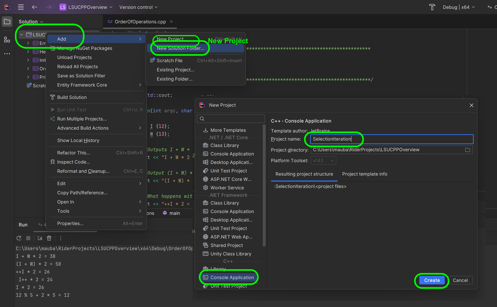


##### `Step 2.`\|`CPPOVR`|:small_blue_diamond: :small_blue_diamond: 

Right click on the **SelectionIteration** project and select **Set as Startup Project**.

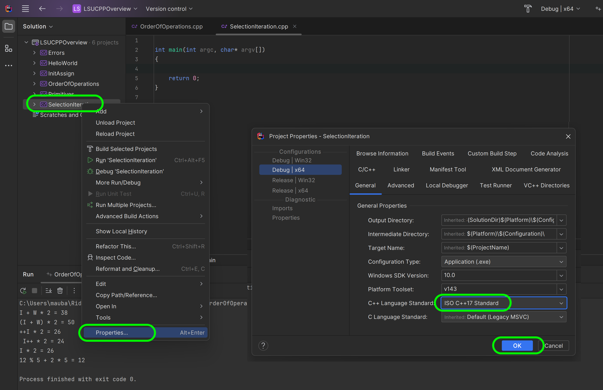


##### `Step 3.`\|`CPPOVR`|:small_blue_diamond: :small_blue_diamond: :small_blue_diamond:

Right click on the **Source** folder in the **SelectionIteration** project and right click and **Add | New Item...**.  Call it `SelectionIteration.cpp`.

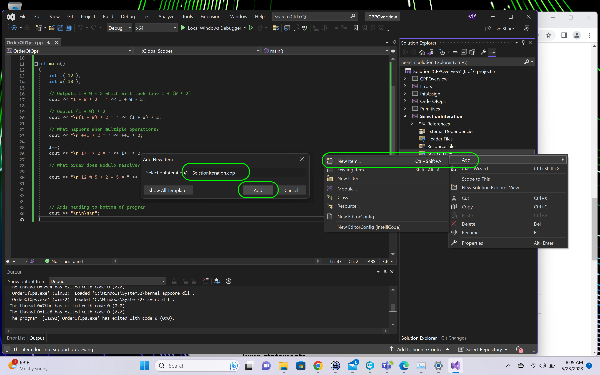


##### `Step 4.`\|`CPPOVR`|:small_blue_diamond: :small_blue_diamond: :small_blue_diamond: :small_blue_diamond:

In C++, comparison operators are used to compare two values or expressions and evaluate their relationship. These operators return a Boolean value (`true` or `false`) based on the result of the comparison. Here's a brief explanation of the common comparison operators in C++:

1. Equality Operator (`==`):
   - Checks if two values are equal.
   - Returns `true` if the values are equal, and `false` otherwise.
   - Note that unlike `=` an assignment operator, an equality `==` operator returns whether the left hand and right hand side operand are the same 
   
   Example:
   ```cpp
   int x = 5;
   int y = 7;
   bool result = (x == y);  // false
   ```

2. Inequality Operator (`!=`):
   - Checks if two values are not equal.
   - Returns `true` if the values are not equal, and `false` if they are equal.
   
   Example:
   ```cpp
   int X = 5;
   int Y = 7;
   bool result = X != Y;  // true
   ```

3. Greater Than Operator (`>`):
   - Checks if the left operand is greater than the right operand.
   - Returns `true` if the condition is true, and `false` otherwise.
   
   Example:
   ```cpp
   int X = 5;
   int Y = 7;
   bool result = (X > Y);  // false
   ```

4. Less Than Operator (`<`):
   - Checks if the left operand is less than the right operand.
   - Returns `true` if the condition is true, and `false` otherwise.
   
   Example:
   ```cpp
   int X = 5;
   int Y = 7;
   bool result = (X < Y);  // true
   ```

5. Greater Than or Equal To Operator (`>=`):
   - Checks if the left operand is greater than or equal to the right operand.
   - Returns `true` if the condition is true, and `false` otherwise.
   
   Example:
   ```cpp
   int X = 5;
   int Y = 7;
   bool result = (X >= Y);  // false
   ```

6. Less Than or Equal To Operator (`<=`):
   - Checks if the left operand is less than or equal to the right operand.
   - Returns `true` if the condition is true, and `false` otherwise.
   
   Example:
   ```cpp
   int X = 5;
   int Y = 7;
   bool result = (X <= Y);  // true
   ```
These comparison operators are used to make logical comparisons between variables, values, or expressions and help in decision-making within your program. The result of the comparison can be used in control structures like `if` statements and loops to determine the flow of execution based on specific conditions.

So in this **if statement** we are checking if `12 < 13`.  If this resolves to true (it will) then it will run all the code in the following curly braces.  Please note that this is not a statement so there is no `;` at the end of the `if`.  

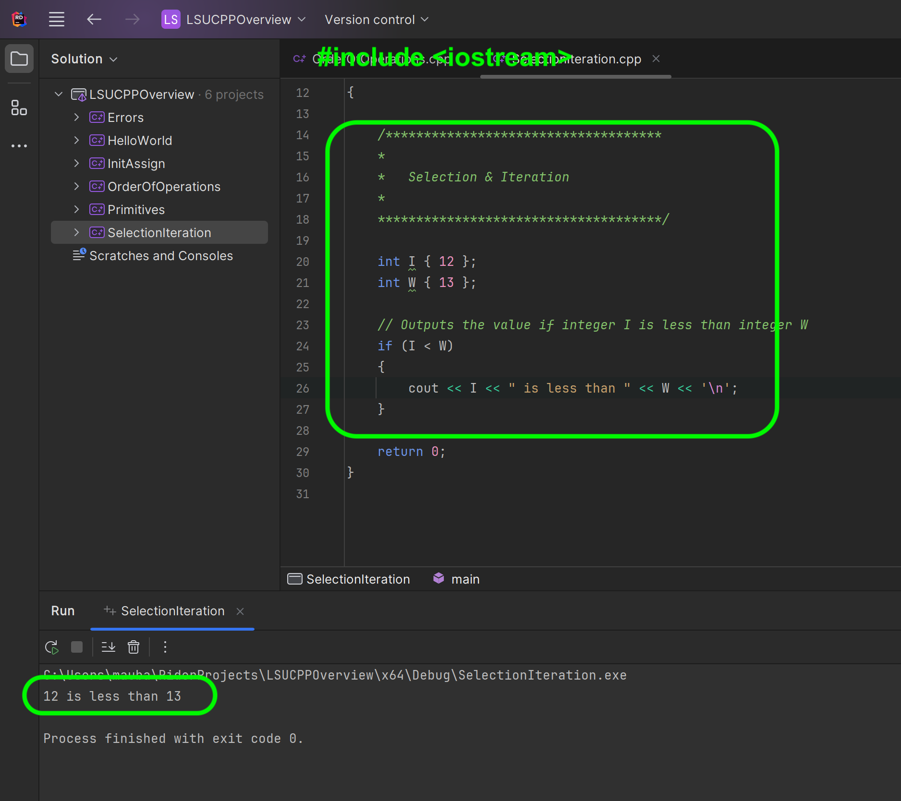


##### `Step 5.`\|`CPPOVR`| :small_orange_diamond:

Now if we make `I` equal `15` then `15 < 13` will return false and it will not run what is between the curly braces.  In this case it just ends the program by returning `0`.

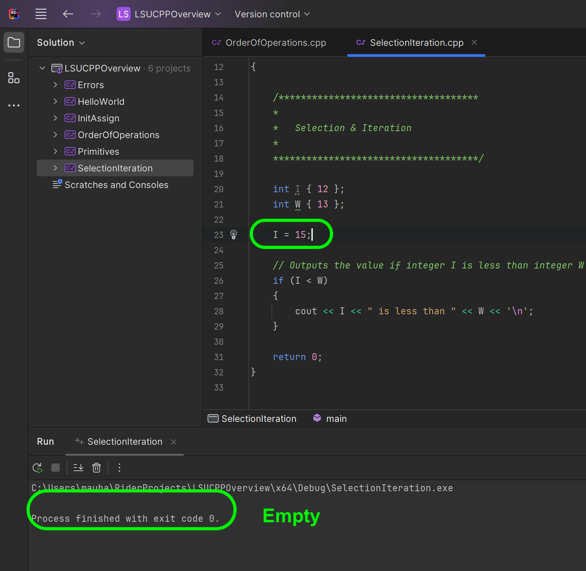


##### `Step 6.`\|`CPPOVR`| :small_orange_diamond: :small_blue_diamond:

Now if we add an `else` it will run the curly braces `{}` after if the **if statement** fails (condition is false).  So in this case it will print the opposite message.

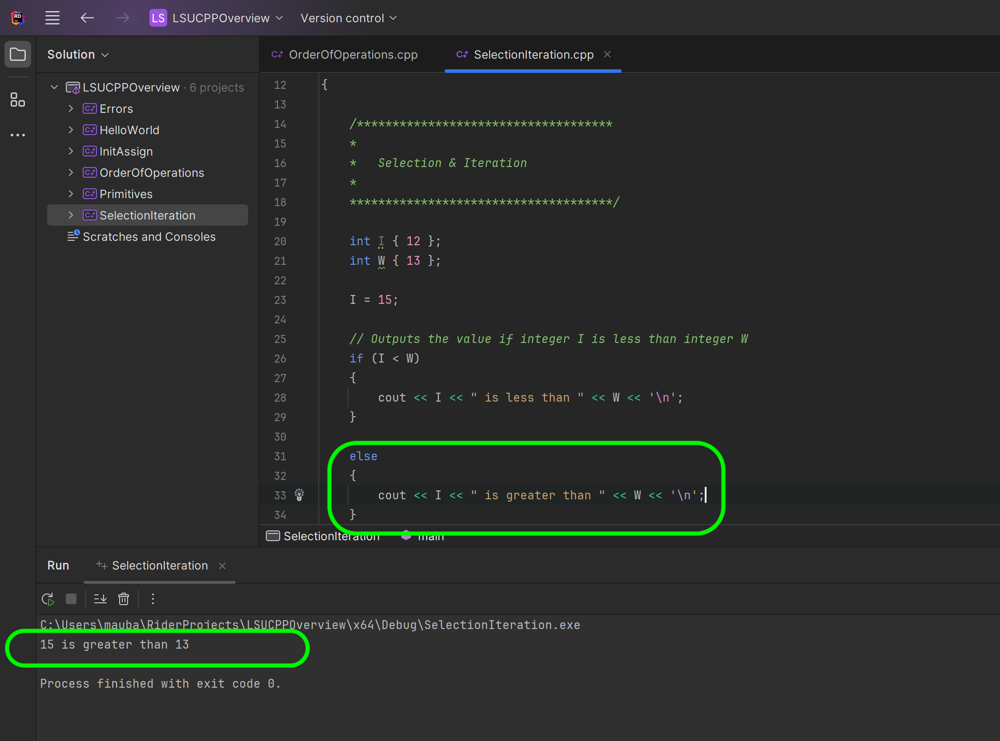


##### `Step 7.`\|`CPPOVR`| :small_orange_diamond: :small_blue_diamond: :small_blue_diamond:

We now have a potential bug with this logic.  What is I and W are the same value?  Then it is not larger nor smaller.  Make them the same and run the program.<br><br>You will notice that it fails the first `if` as `I` is not less than `W` so it runs the `else`.  The problem is that it runs fine but it is still a run-time error or bug.  We run the game and it is not correct. The program behaves correctly but what we are printing to the stream is incorrect (a bug!).

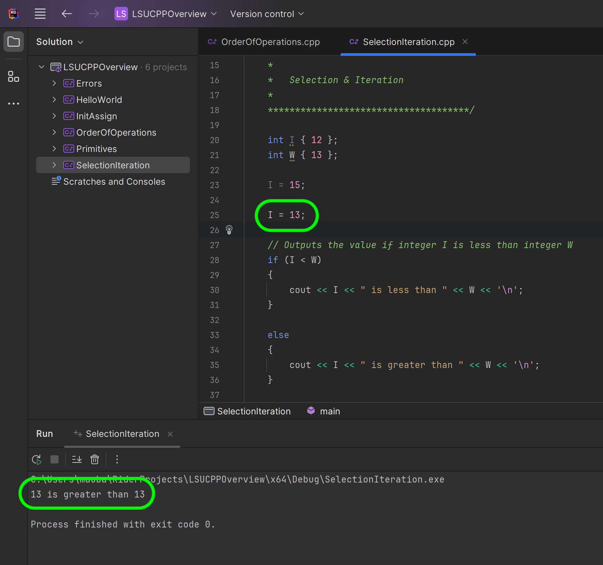


##### `Step 8.`\|`CPPOVR`| :small_orange_diamond: :small_blue_diamond: :small_blue_diamond: :small_blue_diamond:

We can fix it by adding a third condition in between.  Between the `if` and the `else` we can have as many `if else` statements as we need.  Here we will use one for now. Inbetween the **if** and the **else**, add the following statement and message.

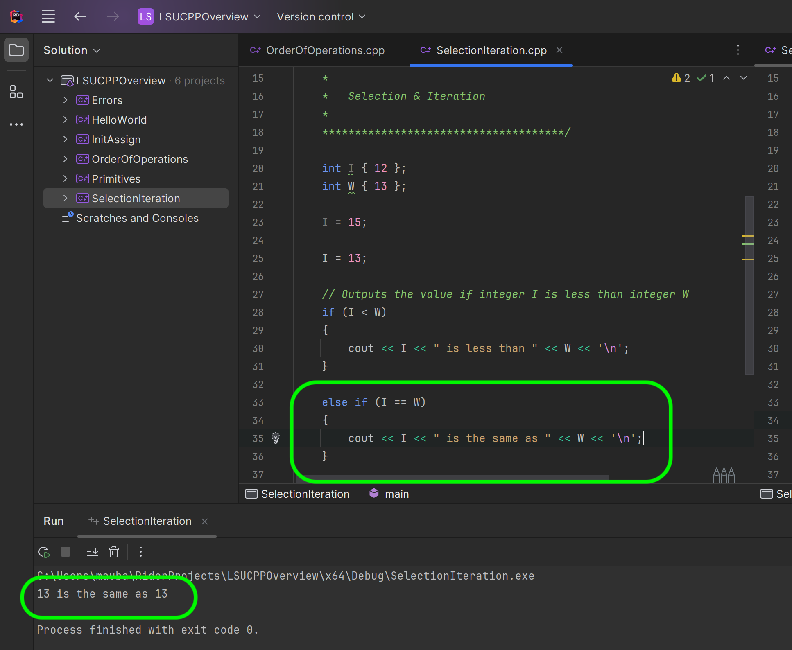


##### `Step 9.`\|`CPPOVR`| :small_orange_diamond: :small_blue_diamond: :small_blue_diamond: :small_blue_diamond: :small_blue_diamond:

Now we can string after an `if` statement as many `else if` statements as we need.  But we can only have one `if` and one `else` statement. No other statement can run between thm otherwise it will not compile.  So we can add another `else if` to check if `I` is twice the size of `W` and if so print a special message. Fool around with changing I and W to different values and see if it works correctly. Now don't forget once a condition is true it stops running and breaks out of the entire **if - else if - else** chain.

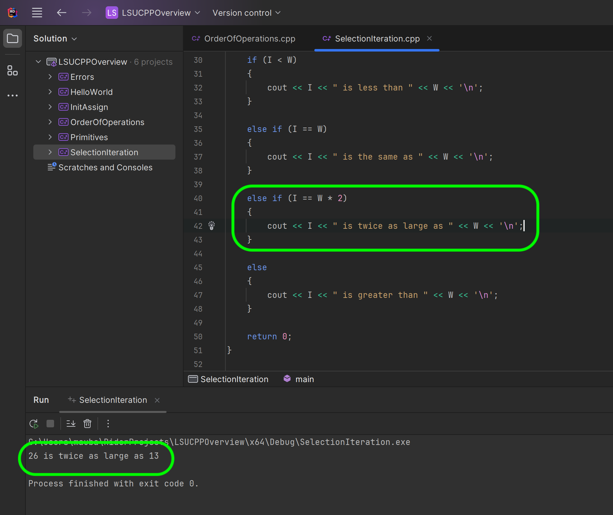


##### `Step 10.`\|`CPPOVR`| :large_blue_diamond:

Now lets look at the **switch statement**. First lets make sure we can use the shorthand for string by adding 

```cpp
using std::string
```

to the top of the program.

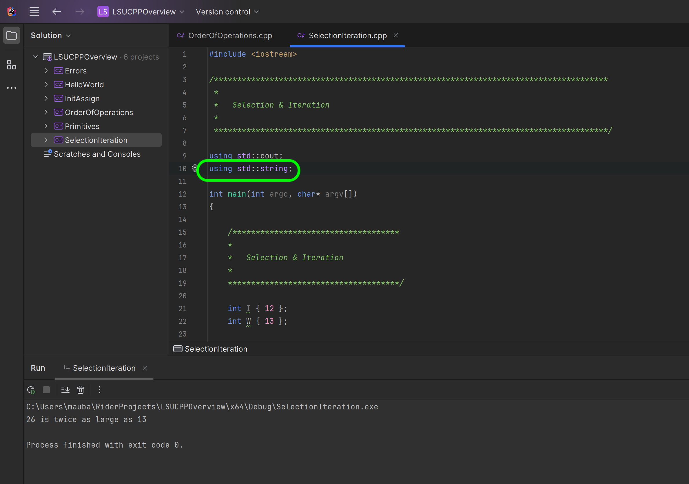


##### `Step 11.`\|`CPPOVR`| :large_blue_diamond: :small_blue_diamond: 

The **[switch](https://en.cppreference.com/w/cpp/language/switch)** statement is used a lot in video games especially for a **[finite state machines](https://en.wikipedia.org/wiki/Finite-state_machine)** for objects.  A switch statement always has a variable that is passed in the parenthesis.

We are going to switch on a `char State`.  We will have a coding where `b` will mean *busy*, `c` will mean *chase* and `h` will mean *hide*. We will start `State {'h'};`. We wil then switch on this variable and have the cases for each of the above letters.  We will have custom `MoodComment` string reflecting the state the player is in.

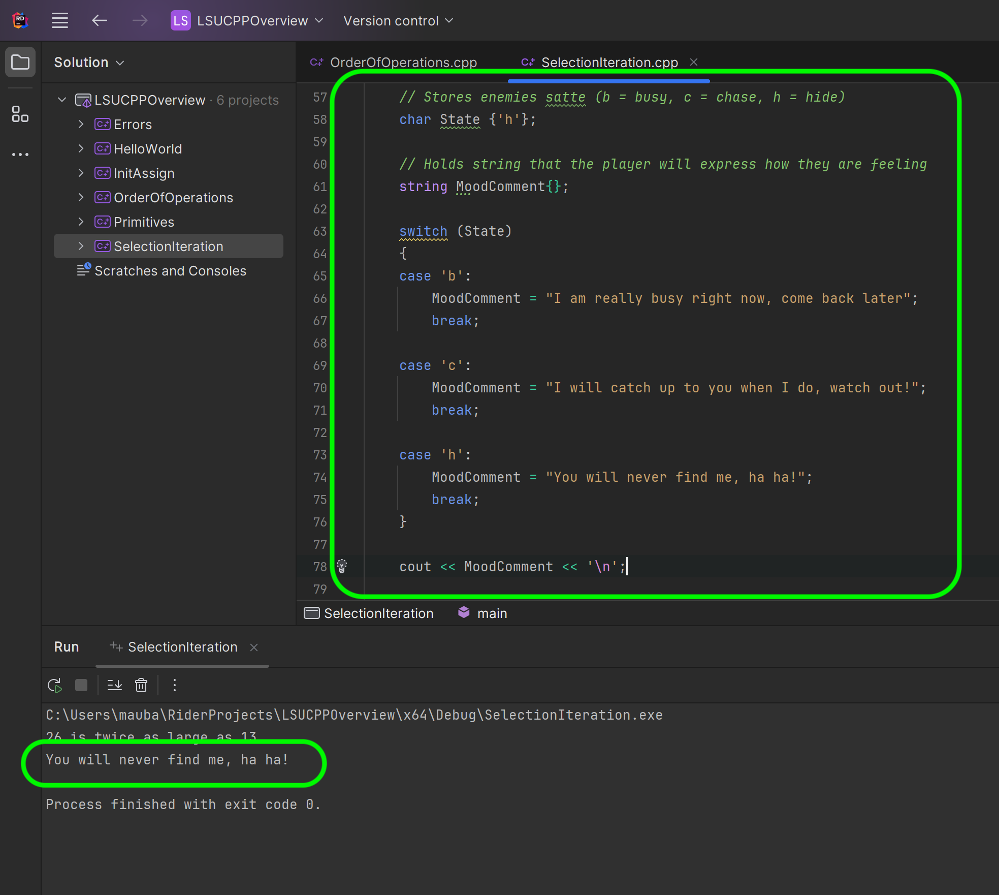


##### `Step 12.`\|`CPPOVR`| :large_blue_diamond: :small_blue_diamond: :small_blue_diamond: 

Now **Run** the program and you will see that it picks the `case `c`:` and performs the statements after until it gets to the `break`.

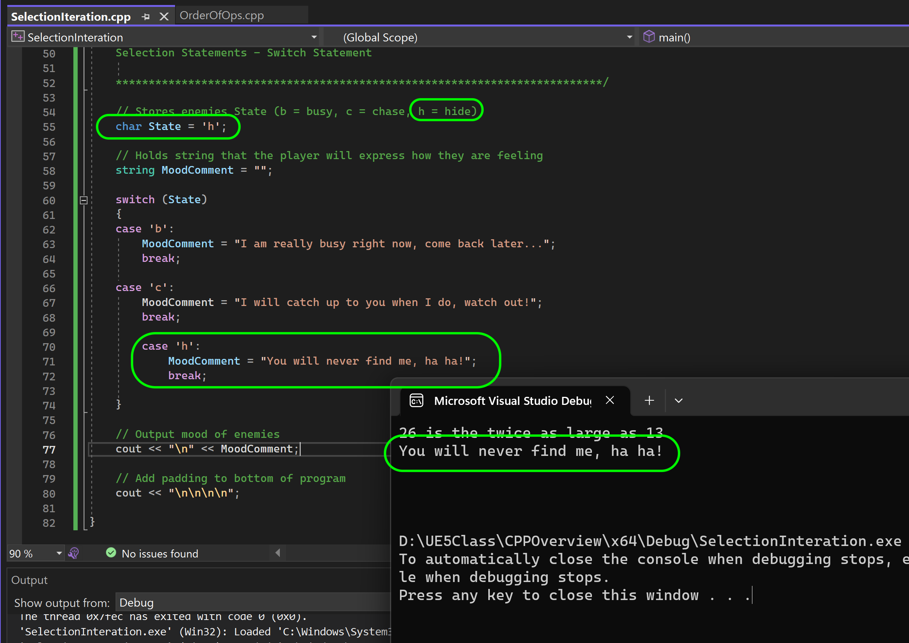


##### `Step 13.`\|`CPPOVR`| :large_blue_diamond: :small_blue_diamond: :small_blue_diamond:  :small_blue_diamond: 

Change the initilization of `State` to `char State {'b'}`. Now you will get the `b` case to set the **MoodComment** variable.  Give it a shot.

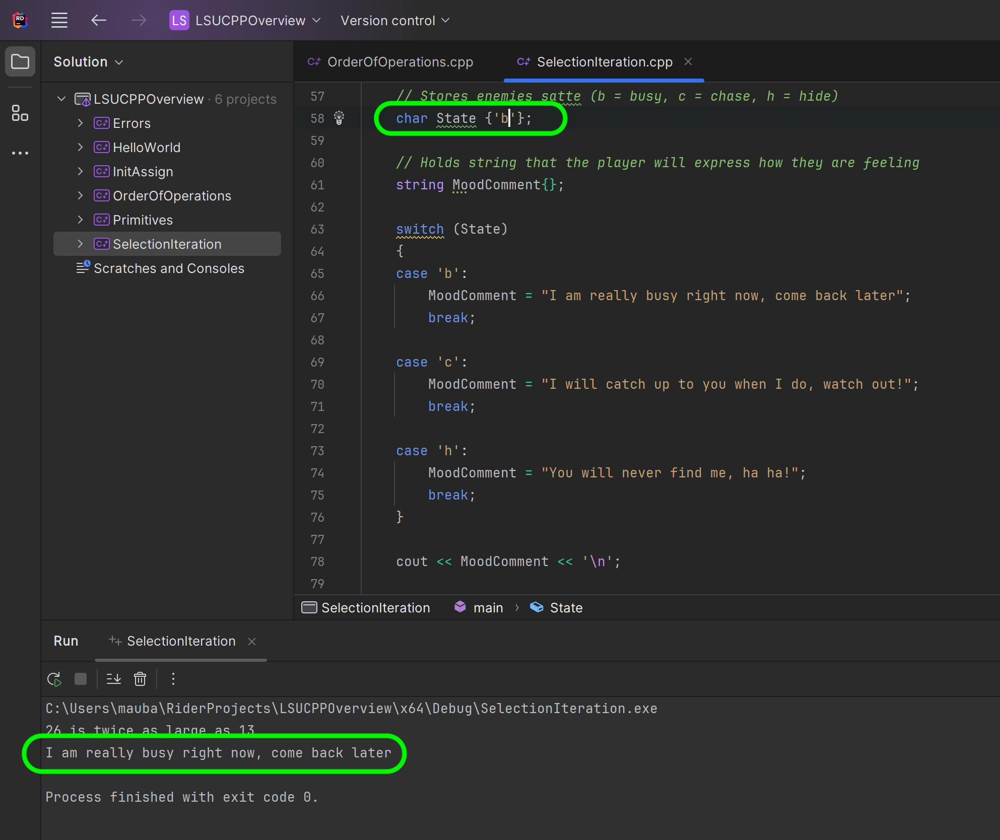


##### `Step 14.`\|`CPPOVR`| :large_blue_diamond: :small_blue_diamond: :small_blue_diamond: :small_blue_diamond:  :small_blue_diamond: 

Now change `State` to a value that is not in the switch statement.  I used `z`.  Now nothing prints as none of the cases are true.  How can we have the equivalent of an else for something to run if all cases fail?

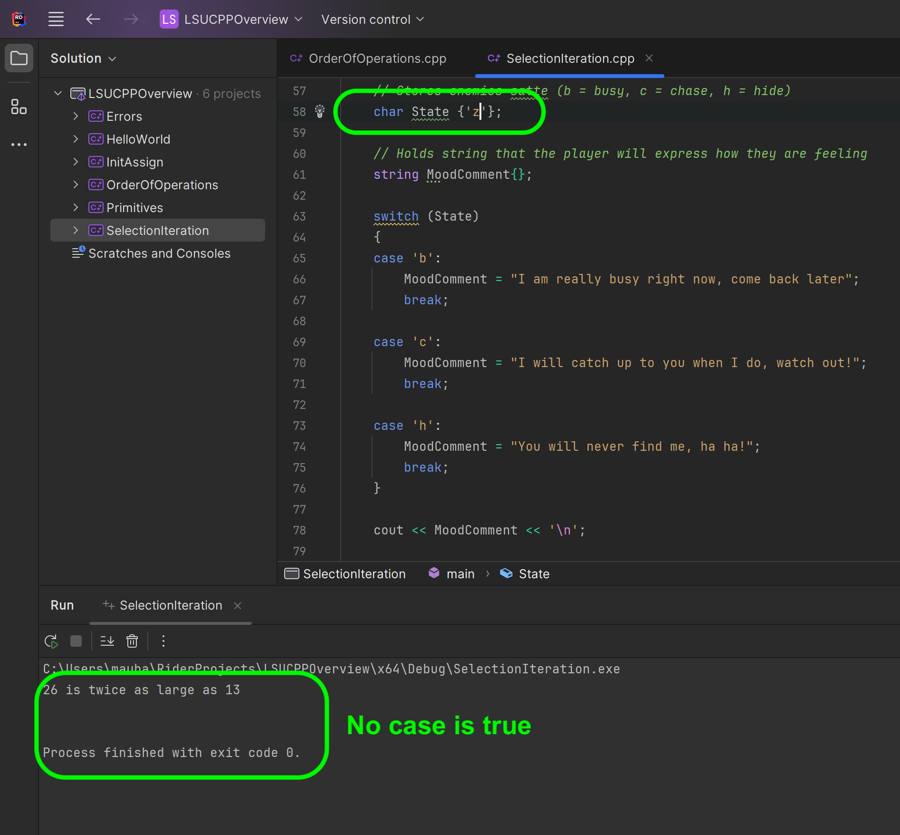


##### `Step 15.`\|`CPPOVR`| :large_blue_diamond: :small_orange_diamond: 

Now the `default:` case will run when all other cases fail, so it is the failsafe or `else` of the `switch` statement.


##### `Step 16.`\|`CPPOVR`| :large_blue_diamond: :small_orange_diamond:   :small_blue_diamond: 

Now lets move to the iteration statement **while** loop.  It will run what is after the statement as long as the **while** condition is true. So lets start and create an intege `int Countdown {10};`. So now while **Countdown > 0** it will continue looping and running the statement(s) between the curly braces.

So in this case the while statement runs:

1. `10 >= 0` is true, so it runs and prints "10" then a newline then it decrements `Countdown` by `1` so it is now equal `9`.
2. `9 >= 0` is true, so it runs and prints "9" then a newline then it decrements `Countdown` by `1` so it is now equal `8`.
3. `8 >= 0` is true, so it runs and prints "8" then a newline then it decrements `Countdown` by `1` so it is now equal `7`.
4. `7 >= 0` is true, so it runs and prints "7" then a newline then it decrements `Countdown` by `1` so it is now equal `6`.
5. `6 >= 0` is true, so it runs and prints "7" then a newline then it decrements `Countdown` by `1` so it is now equal `5`.
6. `5 >= 0` is true, so it runs and prints "5" then a newline then it decrements `Countdown` by `1` so it is now equal `4`.
7. `4 >= 0` is true, so it runs and prints "4" then a newline then it decrements `Countdown` by `1` so it is now equal `3`.
8. `3 >= 0` is true, so it runs and prints "3" then a newline then it decrements `Countdown` by `1` so it is now equal `2`.
9. `2 >= 0` is true, so it runs and prints "2" then a newline then it decrements `Countdown` by `1` so it is now equal `1`.
10. `1 >= 0` is true, so it runs and prints "1" then a newline then it decrements `Countdown` by `1` so it is now equal `0`.
11. `0 >= 0` is true, so it runs and prints "0" then a newline then it decrements `Countdown` by `1` so it is now equal `-1`.
12. `-1 >- 0` is false, so it stops looping and goes to line 98.

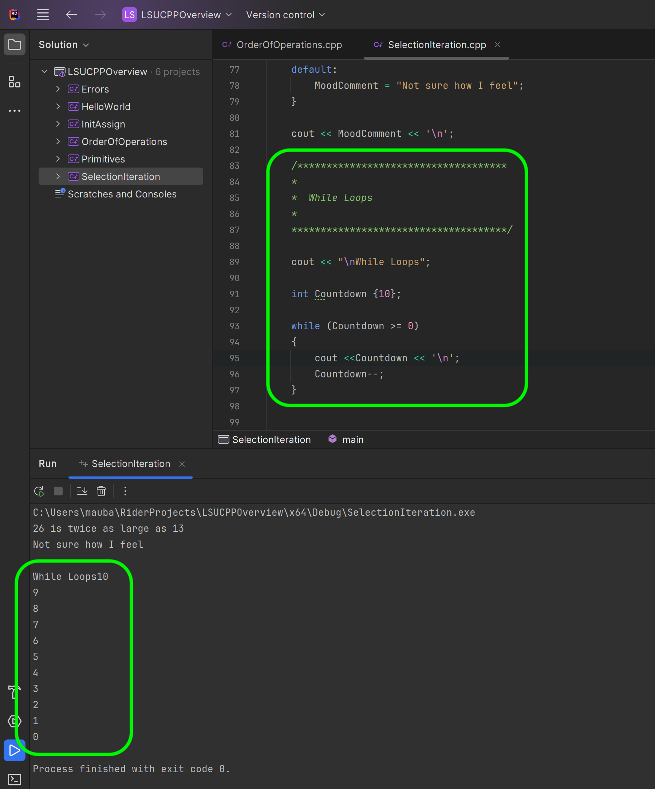


##### `Step 17.`\|`CPPOVR`| :large_blue_diamond: :small_orange_diamond: :small_blue_diamond: :small_blue_diamond:

The danger with `while` loops is to make sure we will ALWAYS hit an exit condition.  If we have a simple error such as incrementing `Countdown by 1` so it is always positive - then the program will never terminate and we will have an infinite loop.  Try it our yourself. We want to avoid this at all cost!

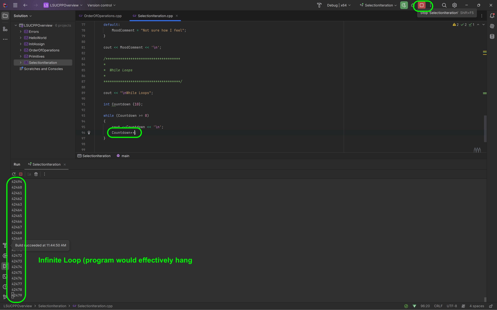


##### `Step 18.`\|`CPPOVR`| :large_blue_diamond: :small_orange_diamond: :small_blue_diamond: :small_blue_diamond: :small_blue_diamond:

Fix the bug and return it to normal.


##### `Step 19.`\|`CPPOVR`| :large_blue_diamond: :small_orange_diamond: :small_blue_diamond: :small_blue_diamond: :small_blue_diamond: :small_blue_diamond:

The above is a poor use of a while statement.  We would normally only us it when we do not know how many times we need to go in the loop before it exits.  So we might be moving out of a collision area when we enter it a cm at a time.

But when we just want to interate so many times, like this countdown timer then an iteration statement `for` loop is more appropriate.

The `for` loop is a control flow statement that allows you to repeatedly execute a block of code for a fixed number of iterations. It consists of three main components:

1. Initialization: You start by initializing a loop variable before the loop begins. This variable is typically used to control the number of iterations.

2. Condition: Next, you specify a condition that is checked before each iteration. If the condition evaluates to `true`, the loop continues. If it evaluates to `false`, the loop is terminated, and the program proceeds to the next line of code after the loop.

3. Update: After each iteration, an update statement is executed. It typically modifies the loop variable in some way, such as incrementing or decrementing its value.

The general syntax of the `for` loop in C++ is as follows:

```cpp
for (initialization; condition; update) {
    // Code to be executed in each iteration
}
```

Here's a simple example that prints the numbers from 1 to 5:

```cpp
for (int Countdown = 10; Coutndown >= 0; --Countdown) {
    cout << i << " ";
}
```

Explanation:
- Initialization: `int Countdown = 10` initializes the loop variable `Countdown` with the value 10.
- Condition: `Countdown >= 0` checks if `Countdown` is greater or equal to 0. If true, the loop continues; otherwise, it terminates.
- Update: `--Countdown` decrements the value of `Countdown` by 1 after each iteration.

In each iteration, the value of `Countdown` is printed using `cout`. The loop continues until `Countdown` reaches -1 (the condition `Countdown <>= 0` becomes false). Therefore, the output of the above code will be: 
```
10 
9 
8
7 
6 
5 
4 
3 
2 
1 
0
```

The `for` loop is widely used when you know the exact number of iterations you need to perform. It provides a concise way to control repetitive tasks in your program. Give it a try.

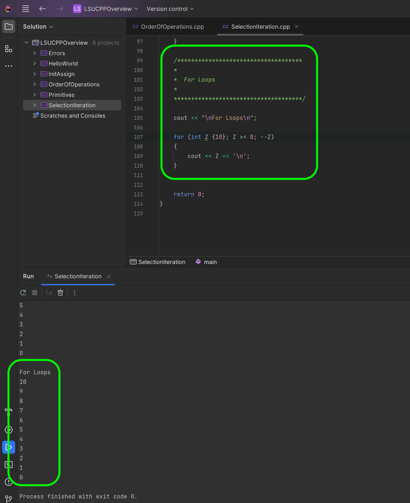


##### `Step 20.`\|`CPPOVR`| :large_blue_diamond: :large_blue_diamond:

If we change `>=` to `>` then the countdown stops at `1` as `0 > 0` is false.
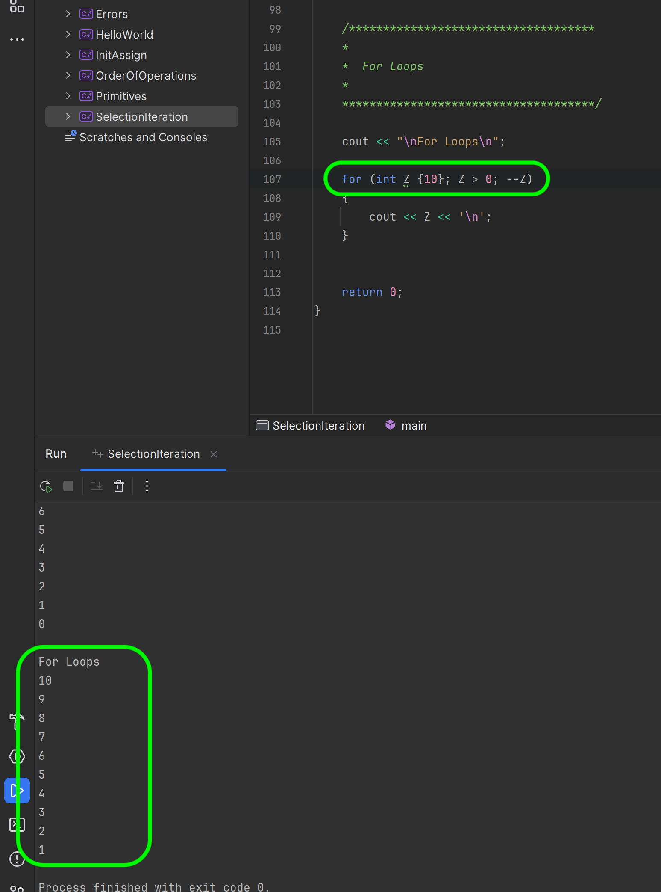


<!--  -->


| [previous](../order/README.md#user-content-order-of-operations)| [home](../README.md#user-content-ue5-cpp-overview) | [next](../scope/README.md#user-content-scope)|
|---|---|---|
