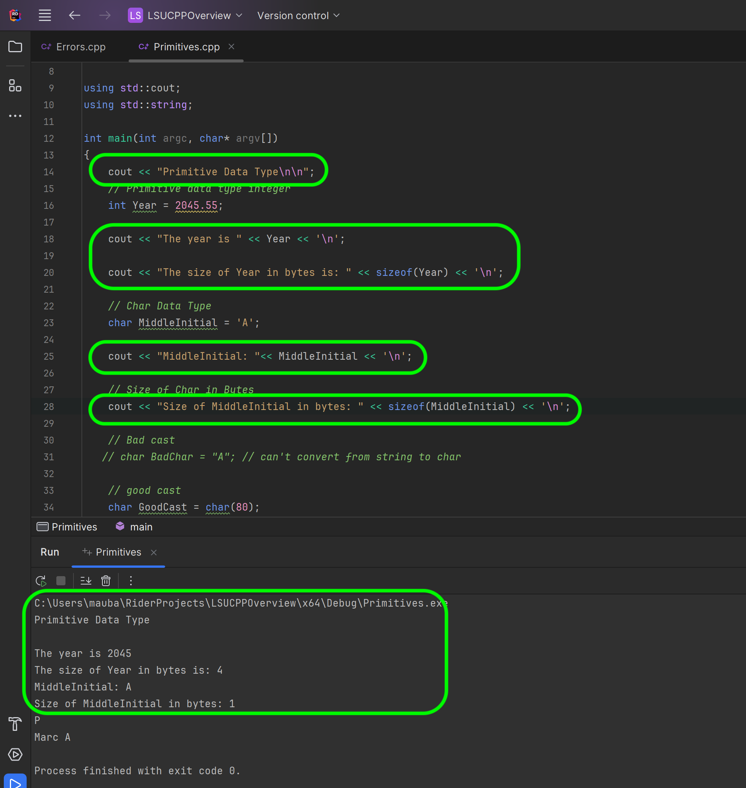
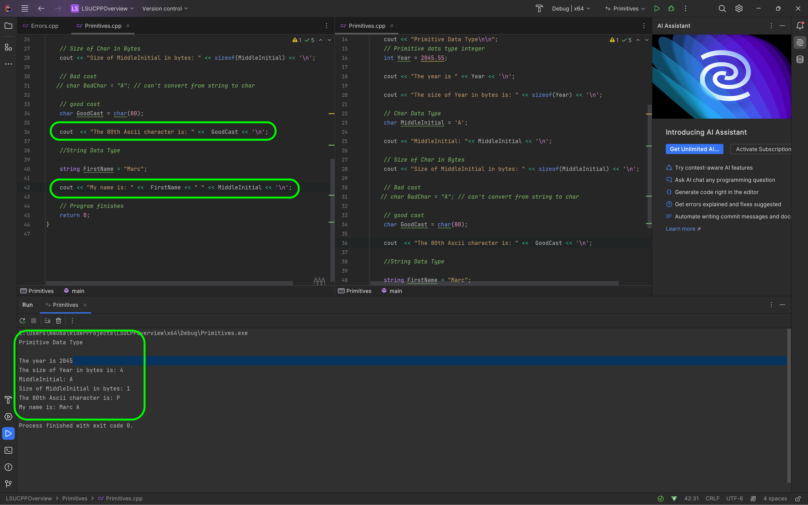
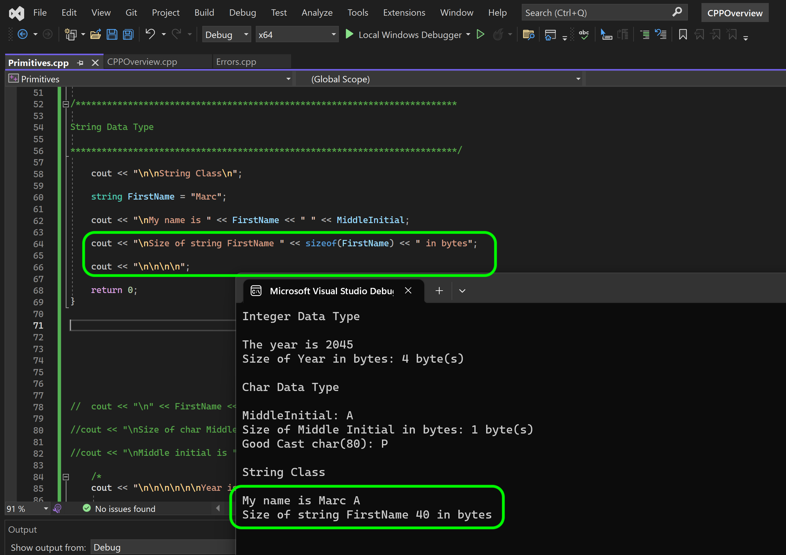

### Primitive Data Types - Chars & Strings

[previous](../integers/README.md#user-content-primitive-data-types---integers) • [home](../README.md#user-content-ue5-cpp-overview) • [next](../)

Now lets look at the character data type called [char](https://www.geeksforgeeks.org/c-data-types/). 

> Character: Character data type is used for storing characters. Keyword used for character data type is char. Characters typically requires 1 byte of memory space and ranges from -128 to 127 or 0 to 255. - [geeksforgeeks.org](https://www.geeksforgeeks.org/c-data-types/)

Now why are there two ranges.  I didn't tell you about integers that we can have **signed** and **unsigned** integers.  An `int` is by default unsigned.  A `uint` is unsigned which means it is only positive number `0` through `255`.  A regular **signed** `int` goes from `-128` to `127` with the same number of 256 distinct values (including `0`).

Also note that a `char` character is a single letter not a series of them.  So how do we know if it is a char or a string?  A char is surrounded by single quotes `'c'` and a string is surrounded by double quotation marks, `"c"`.

We will also look at **strings** which are not a primitive data type but a derived type. It is an **object** as its size is not fixed, it depends on the length of the string.

 

---

##### `Step 1.`\|`CPPOVR`|:small_blue_diamond:

So lets use a type `char` and call the variable `MiddleInitial` and use the literal `A`.  So this looks like when we declare and define cour characterr variable:

`char MiddleInitial = 'A';`

Then we will output it ot the stream with a newline espace character. 

Run the program and on the third line you should see an **A**.

##### `Step 2.`\|`CPPOVR`|:small_blue_diamond: :small_blue_diamond: 

Now you can see that it runs the program and prints the single character as we expected.  So it takes a single byte (proven when we print sizeof). It stores an `ascii` value which hods [128 characters](https://en.cppreference.com/w/cpp/language/ascii). So **A** would be ASCII value `97` in decimals. 

##### `Step 3.`\|`CPPOVR`|:small_blue_diamond: :small_blue_diamond: :small_blue_diamond:

Now `A` is a char literal and "A" is a string literal (or reference to an array of char pointers).  The compiler doesn't allow us to cast from a char to a string.

##### `Step 4.`\|`CPPOVR`|:small_blue_diamond: :small_blue_diamond: :small_blue_diamond: :small_blue_diamond:

Now we can cast from an integer to a char.  If we look at the [ascii chart](https://en.cppreference.com/w/cpp/language/ascii) the 80th (decimal) character is `P`. So if we call a c style cast of `char(integer literal)` we will cast from an integer to a char.  In this case it will be represented by the character P, which is confirmed when we run it.

##### `Step 5.`\|`CPPOVR`| :small_orange_diamond:

Now lets look at the character data type called [string](https://www.geeksforgeeks.org/c-string-class-and-its-applications/). 
> C++ string class internally uses char array to store character but all memory management, allocation and null termination is handled by string class itself that is why it is easy to use. The length of c++ string can be changed at runtime because of dynamic allocation of memory similar to vectors. - geeksforgeeks.org

Now this is not a primitive data type and is a class (we will get into classes later).  Unreal will give us their own string class but for now we will use the one that comes with the standard template libraries (by including the `<string>` class).  

So the *string* class comes with <iostream> so we do not need any other libarries.  We will just move it to our local namespace by adding `using std::string;` before the `main()` function.

##### `Step 6.`\|`CPPOVR`| :small_orange_diamond: :small_blue_diamond:

Now we can set the group of chars `"Marc"` to the *string* `FirstName`. We can then print the first name, a space, then a middle initial.  Each time we add to the stream `<<` it concatonates all of the outputs to the console.

##### `Step 7.`\|`CPPOVR`| :small_orange_diamond: :small_blue_diamond: :small_blue_diamond:

Now that we can concatonate, we should clean up and explain what our program is doing. Lets add a title then explain what each line is doing.

##### `Step 8.`\|`CPPOVR`| :small_orange_diamond: :small_blue_diamond: :small_blue_diamond: :small_blue_diamond:

When you run the program it should be a lot clearer to what we are trying to express.

##### `Step 9.`\|`CPPOVR`| :small_orange_diamond: :small_blue_diamond: :small_blue_diamond: :small_blue_diamond: :small_blue_diamond:

Lets continue to clean it up by adding some more descriptive strings.

##### `Step 10.`\|`CPPOVR`| :large_blue_diamond:

Now lets print the size of the string object.  It says it is `40` bytes. So maybe with 4 letters and a terminated character at the end it is 40/5 so maybe 8 bytes per character?

##### `Step 11.`\|`CPPOVR`| :large_blue_diamond: :small_blue_diamond: 

##### `Step 12.`\|`CPPOVR`| :large_blue_diamond: :small_blue_diamond: :small_blue_diamond: 

##### `Step 13.`\|`CPPOVR`| :large_blue_diamond: :small_blue_diamond: :small_blue_diamond:  :small_blue_diamond: 

##### `Step 14.`\|`CPPOVR`| :large_blue_diamond: :small_blue_diamond: :small_blue_diamond: :small_blue_diamond:  :small_blue_diamond: 

##### `Step 15.`\|`CPPOVR`| :large_blue_diamond: :small_orange_diamond: 

##### `Step 16.`\|`CPPOVR`| :large_blue_diamond: :small_orange_diamond:   :small_blue_diamond: 

##### `Step 17.`\|`CPPOVR`| :large_blue_diamond: :small_orange_diamond: :small_blue_diamond: :small_blue_diamond:

##### `Step 18.`\|`CPPOVR`| :large_blue_diamond: :small_orange_diamond: :small_blue_diamond: :small_blue_diamond: :small_blue_diamond:

##### `Step 19.`\|`CPPOVR`| :large_blue_diamond: :small_orange_diamond: :small_blue_diamond: :small_blue_diamond: :small_blue_diamond: :small_blue_diamond:

##### `Step 20.`\|`CPPOVR`| :large_blue_diamond: :large_blue_diamond:

##### `Step 21.`\|`CPPOVR`| :large_blue_diamond: :large_blue_diamond: :small_blue_diamond:

<!--  -->

| [previous](../integers/README.md#user-content-primitive-data-types---integers)| [home](../README.md#user-content-ue5-cpp-overview) | [next](../)|
|---|---|---|
