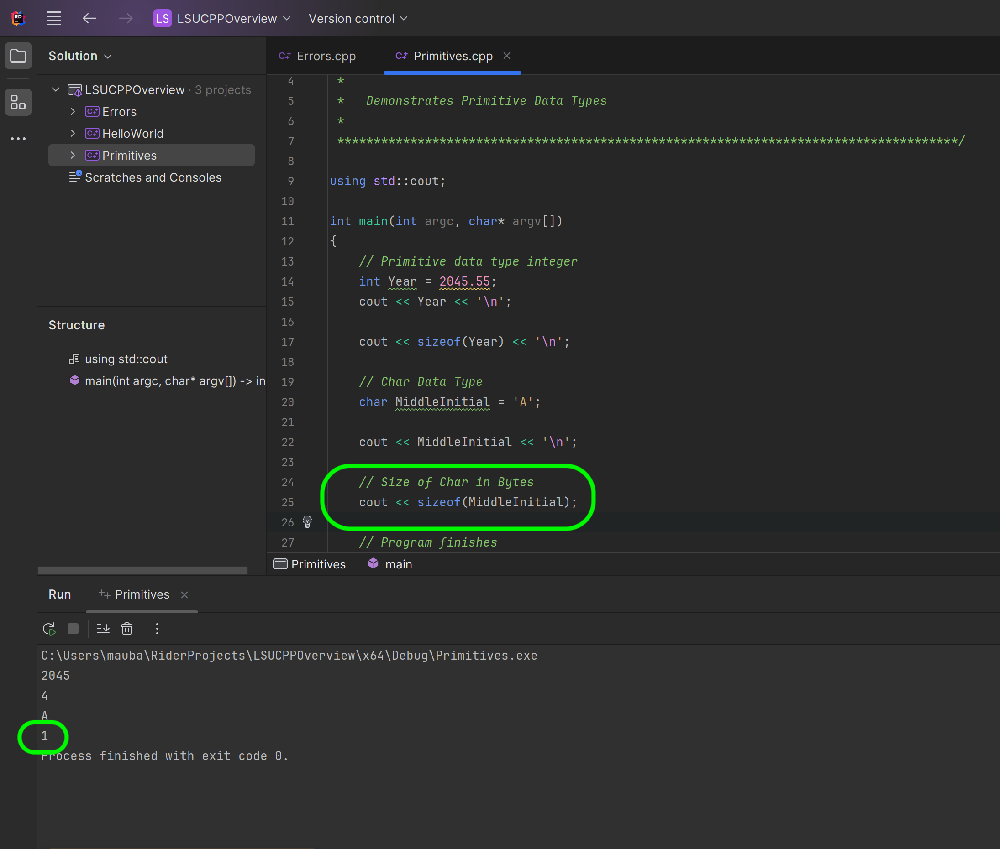

### Primitive Data Types - Chars & Strings

[previous](../integers/README.md#user-content-primitive-data-types---integers) • [home](../README.md#user-content-ue5-cpp-overview) • [next](../)

Now lets look at the character data type called [char](https://www.geeksforgeeks.org/c-data-types/). 

> Character: Character data type is used for storing characters. Keyword used for character data type is char. Characters typically requires 1 byte of memory space and ranges from -128 to 127 or 0 to 255. - [geeksforgeeks.org](https://www.geeksforgeeks.org/c-data-types/)

Now why are there two ranges.  I didn't tell you about integers that we can have **signed** and **unsigned** integers.  An `int` is by default unsigned.  A `uint` is unsigned which means it is only positive number `0` through `255`.  A regular **signed** `int` goes from `-128` to `127` with the same number of 256 distinct values (including `0`).

Also note that a `char` character is a single letter not a series of them.  So how do we know if it is a char or a string?  A char is surrounded by single quotes `'c'` and a string is surrounded by double quotation marks, `"c"`.

We will also look at **strings** which are not a primitive data type but a derived type. It is an **object** as its size is not fixed, it depends on the length of the string.

 

---

##### `Step 1.`\|`CPPOVR`|:small_blue_diamond:

So lets use a type `char` and call the variable `MiddleInitial` and use the literal `A`.  So this looks like when we declare and define cour characterr variable:

`char MiddleInitial = 'A';`

Then we will output it ot the stream with a newline espace character. 

Run the program and on the third line you should see an **A**.

##### `Step 2.`\|`CPPOVR`|:small_blue_diamond: :small_blue_diamond: 

What happens if we try and set a char with a string literal such as `"A"`. Try it?  Now this is a case where the error message may seem foreign to you.  A string is a set of char pointers but we will get into that at another point in time. For now, if you want a single char you use single quotation marks.

##### `Step 3.`\|`CPPOVR`|:small_blue_diamond: :small_blue_diamond: :small_blue_diamond:

Now you can see that it runs the program and prints the single character as we expected.  So it takes a single byte (proven when we print sizeof). It stores an `ascii` value which hods [128 characters](https://en.cppreference.com/w/cpp/language/ascii). So **A** would be ASCII value `97` in decimals. 

##### `Step 4.`\|`CPPOVR`|:small_blue_diamond: :small_blue_diamond: :small_blue_diamond: :small_blue_diamond:

##### `Step 5.`\|`CPPOVR`| :small_orange_diamond:

##### `Step 6.`\|`CPPOVR`| :small_orange_diamond: :small_blue_diamond:

##### `Step 7.`\|`CPPOVR`| :small_orange_diamond: :small_blue_diamond: :small_blue_diamond:

##### `Step 8.`\|`CPPOVR`| :small_orange_diamond: :small_blue_diamond: :small_blue_diamond: :small_blue_diamond:

##### `Step 9.`\|`CPPOVR`| :small_orange_diamond: :small_blue_diamond: :small_blue_diamond: :small_blue_diamond: :small_blue_diamond:

##### `Step 10.`\|`CPPOVR`| :large_blue_diamond:

##### `Step 11.`\|`CPPOVR`| :large_blue_diamond: :small_blue_diamond: 

##### `Step 12.`\|`CPPOVR`| :large_blue_diamond: :small_blue_diamond: :small_blue_diamond: 

##### `Step 13.`\|`CPPOVR`| :large_blue_diamond: :small_blue_diamond: :small_blue_diamond:  :small_blue_diamond: 

##### `Step 14.`\|`CPPOVR`| :large_blue_diamond: :small_blue_diamond: :small_blue_diamond: :small_blue_diamond:  :small_blue_diamond: 

##### `Step 15.`\|`CPPOVR`| :large_blue_diamond: :small_orange_diamond: 

##### `Step 16.`\|`CPPOVR`| :large_blue_diamond: :small_orange_diamond:   :small_blue_diamond: 

##### `Step 17.`\|`CPPOVR`| :large_blue_diamond: :small_orange_diamond: :small_blue_diamond: :small_blue_diamond:

##### `Step 18.`\|`CPPOVR`| :large_blue_diamond: :small_orange_diamond: :small_blue_diamond: :small_blue_diamond: :small_blue_diamond:

##### `Step 19.`\|`CPPOVR`| :large_blue_diamond: :small_orange_diamond: :small_blue_diamond: :small_blue_diamond: :small_blue_diamond: :small_blue_diamond:

##### `Step 20.`\|`CPPOVR`| :large_blue_diamond: :large_blue_diamond:

##### `Step 21.`\|`CPPOVR`| :large_blue_diamond: :large_blue_diamond: :small_blue_diamond:

<!--  -->

| [previous](../integers/README.md#user-content-primitive-data-types---integers)| [home](../README.md#user-content-ue5-cpp-overview) | [next](../)|
|---|---|---|
